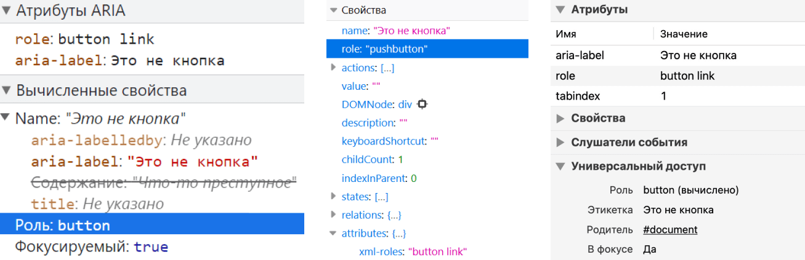
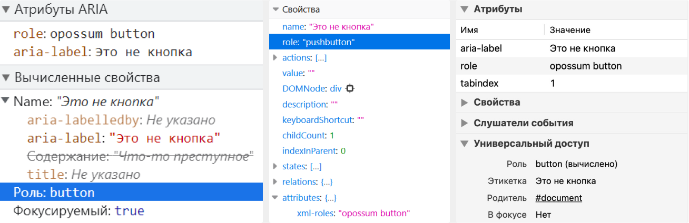
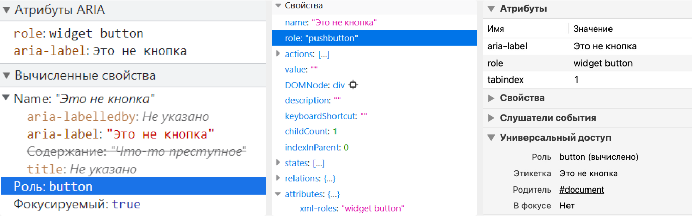

Recently, I discovered by chance that the `role` attribute may contain more than one value. This was very unexpected, at least for me.

So, I wrote this post out of research interest, so it doesn't contain much practical advice. In fact, some of it's better not put into practice.

## Background on roles

_[Roles](https://www.w3.org/TR/wai-aria-1.2/#dfn-role)_ contain information on functions of elments, and how it can be interacted with. For example, screen readers will announce that the `button` element has the `button` role which means that this element is clicable.

Elements can have either implicit or explicit roles. The latter are specified in the `role` attribute.

There are many [categories of roles](https://www.w3.org/TR/wai-aria-1.2/#role_definitions), each with clear rules for their explicit usage. For instance, you can't change roles during interaction with an element, or set [abstract roles](https://www.w3.org/TR/wai-aria-1.2/#abstract_roles), such as `landmark`, `section`, `widget`, etc. There are also roles that assume nested elements. For example, an element with `role="menu"` must have at least one `menuitem` element nested within it. However, the main rule is to set roles explicitly as rarely as possible, especially to avoid overriding semantics of elements.

## What standards and specifications say?

In WAI-ARIA (Web Accessibility Initiative - Accessible Rich Internet Applications), as the most obvious source about roles, there are no examples with two values for the attribute. I had to look up information about the multiple values in this case.

### WAI-ARIA

[Clause 7.1 Role Attribute](https://www.w3.org/TR/wai-aria-1.1/#host_general_role) in WAI-ARIA 1.1 contains the characteristics of the `role` attribute that should be considered in a host languages:

> - The attribute name MUST be `role`;
> - The attribute value MUST allow a token list as the value;
> - The appearance of the name literal of any concrete WAI-ARIA [role](https://www.w3.org/TR/wai-aria-1.1/#dfn-role) as one of these tokens MUST NOT in and of itself make the attribute value illegal in the host-language syntax; and
> - The first name literal of a non-abstract WAI-ARIA role in the list of tokens in the role attribute defines the role according to which the user agent MUST process the element. User Agent processing for roles is defined in the [Core Accessibility API Mappings 1.1](https://www.w3.org/TR/core-aam-1.1/).

Clauses 8.1 Role Attribute of WAI-ARIA versions 1.2 and 1.3 provides almost the same description:

> - The attribute value MUST allow a token list as the value;
> - The appearance of the name literal of any concrete WAI-ARIA [role](https://www.w3.org/TR/wai-aria-1.2/#dfn-role) as one of these tokens MUST NOT in and of itself make the attribute value illegal in the host-language syntax; and
> - The first name literal of a non-abstract WAI-ARIA role in the list of tokens in the role attribute defines the role according to which the user agent MUST process the element. User Agent processing for roles is defined in the [Core Accessibility API Mappings 1.2](https://www.w3.org/TR/core-aam-1.2/).

Since all versions of WAI-ARIA refers to other documentation, let is read it now.

### Core Accessibility API Mappings

Core Accessibility API Mappings (Core-AAM for short) is a specification for browsers and other user agents. It describes how they must interact with Accessibility API.

Clause [5.4 Role mapping](https://www.w3.org/TR/core-aam-1.1/#mapping_role) of Core-AAM 1.1 says what we want to find out:

> Traditionally Accessibility API platforms have a limited set of predefined [roles](https://www.w3.org/TR/core-aam-1.1/#dfn-role) that are expected by [assistive technologies](https://www.w3.org/TR/core-aam-1.1/#dfn-assistive-technology) on that platform, and only one or two roles can be provided. In contrast, WAI-ARIA allows multiple roles to be specified as an ordered set of valid role tokens separated by spaces. Additional roles are fallback for other roles, which is similar to the concept of specifying multiple fonts in case the first font type isn't supported.

This part of the document collects rules for roles themselves.

> 1. The user agent MUST use the first token in the sequence of tokens in the role [attribute](https://www.w3.org/TR/core-aam-1.1/#dfn-attribute) value which matches the name of any non-abstract WAI-ARIA role according to rules that are specified in the [Role Mapping Table](https://www.w3.org/TR/core-aam-1.1/#mapping_role_table) below. Note that when WAI-ARIA roles override host language semantics, there are no changes in the DOM, only in the [accessibility tree](https://www.w3.org/TR/core-aam-1.1/#dfn-accessibility-tree).
> 2. User agents MUST NOT map roles defined in the WAI-ARIA specification as "abstract" via the standard role mechanism of the accessibility API.

In [Core-AAM 1.2](https://www.w3.org/TR/core-aam-1.2/#mapping_role) you find almost the same information, but also more details about roles supporting by different Accessibility APIs.

### HTML standard

A long time ago in HTML standard there was Clause 3.2.7.3.1 ARIA Role Attribute. It described the ability to add multiple roles for one element:

> Every HTML element may have an ARIA role attribute specified. This is an ARIA Role attribute as defined by ARIA Section 5.4 Definition of Roles.
> The attribute, if specified, must have a value that is a set of space-separated tokens representing the various WAI-ARIA roles that the element belongs to.
> The WAI-ARIA role that an HTML element has assigned to it is the first non-abstract role found in the list of values generated when the role attribute is split on spaces.

This clause doesn't exist anymore, but [the Internet never forgets](https://www.tpgi.com/notes-on-use-of-multiple-aria-role-attribute-values/).

### Put it simple

What conclusions can be drawn after exploring the specifications?

- Multiple values can be specified for `role`
- Multiple values are listed with spaces between them
- Multiple roles are needed for fallback. If the first role isn't supported or doesn't exist, the second one is applied, and so on
- If it is an abstract role, browsers and screen readers will ignore it.

## Let is testing

Now we are going to check what browsers and screen readers will do with two values for `role`. We will experiment in Chrome 97, Firefox 96, and Safari 14 with NVDA 2021.2 and desktop version of VoiceOver.

By the way, [in old browsers and screen readers](https://act-rules.github.io/rules/674b10#accessibility-support), this cannot be tested. They simply ignore `role=""` with multiple values. Keep this in mind.

The markup I will be testing might be scary. This is a test of the single attribute, so I decided to use forbidden techniques at least once in my life 😀. In real projects, it's better never to do this. This is a terrible anti-pattern (and can be consider as a crime, ha-ha.)

### Two valid values

```html
<div
  role="button link"
  aria-label="This is not a button"
  tabindex="1"
>
  Something criminal is going on here
</div>
```

- NVDA with Chrome: ″Button, this is not a button″
- NVDA with Firefox: ″Button″
- VoiceOver with Safari: ″This is not a button″.

In all three browsers, `aria-label` provides the accessibility name ″This is not a button″. In Chrome and Safari, the `div` element with `role="button link"` received the `button` role, while in Firefox it received the `pushbutton` one.

<figure class="article__image">
  
  <figcaption class="article__image-caption">
    Accessibility tree preview in Chrome, Firefox and Safari.
  </figcaption>
</figure>

**Conclusion**: When two values are valid, the first one is included into accessibility tree.

### One invalid value, one valid value

```html
<div
  role="opossum button"
  aria-label="This is not a button"
  tabindex="1"
>
  Something criminal is going on here
</div>
```

- NVDA with Chrome: ″Button, this is not a button″
- NVDA with Firefox: ″Button″
- VoiceOver with Safari: ″This is not a button″.

Again, the element name is ″This is not a button″. Its calculated roles are `button` in Chrome and Safari and `pushbutton` in Firefox.

<figure class="article__image">
  
  <figcaption class="article__image-caption">
    Accessibility tree preview in Chrome, Firefox and Safari.
  </figcaption>
</figure>

**Conclusion**: When one of values are invalid and the second one is valid, the valid value is included into accessibility tree.

### One abstract role, one non-abstract

```html
<div
  role="widget button"
  aria-label="This is not a button"
  tabindex="1"
>
  Something criminal is going on here
</div>
```

- NVDA with Chrome: ″Button, this is not a button″
- NVDA with Firefox: ″Button″
- VoiceOver with Safari: ″This is not a button″.

In Chrome and Safari, `<div>` with `role="widget button"` attribute received the non-abstract `button` role, while in Firefox, it received the `pushbutton` role.

In all three browsers, `aria-label` provides the accessibility name ″This is not a button″. The computed roles for it are `button` and `pushbutton`.

<figure class="article__image">
  
  <figcaption class="article__image-caption">
    Chrome, Firefox and Safari.
  </figcaption>
</figure>

**Conclusion**: When there is an abstract role, it's ignored. The other (non-abstract) role is applied.

### Two wrong values

```html
<div
  role="tapir opossum"
  aria-label="This is not a button"
  tabindex="1"
>
  Something criminal is going on here
</div>
```

- NVDA with Chrome has nothing to announced
- NVDA with Firefox has nothing to announced
- VoiceOver with Safari announced ″This is not a button″. So, only the content of the `aria-label` attribute is announced.

In Chrome, for the `div` element with `role="tapir opossum"`, the computed role is `generic`. In Firefox, it's the `leaf` role. In Safari, no suitable role is found.

`generic` is the implicit role of any `div`s. This means it's a nameless container for elements without semantic meaning. A `text leaf` role indicates some kind of textual content.

In all three browsers, `aria-label` provides the accessibility name ″This is not a button″, the computed roles are `generic`, `text leaf`, in one case ″No suitable ARIA roles″.

<figure class="article__image">
  
  <figcaption class="article__image-caption">
    DevTools accessibility tree preview from Chrome, Firefox and Safari.
  </figcaption>
</figure>

**Conclusion**: If both values are invalid, either the element's implicit role is a part of accessibility tree, or nothing is computed. It depends on the browser.

## Wrapping up

All this time, WAI-ARIA has allowed the role attribute to have more than one value, but it has not particularly advertised this feature.

I don't think this is a terrible oversight in the specification. It's hard to imagine which roles would need fallbacks in all modern browsers. Moreover, the `role` attribute is already easy to get confused with. When you have the ability to assign an infinite number of roles, it further complicates the markup and can lead to unexpected errors.

## Read more

- [WAI-ARIA 1.1](https://www.w3.org/TR/wai-aria-1.1/)
- [WAI-ARIA 1.2](https://www.w3.org/TR/wai-aria-1.2/)
- [WAI-ARIA 1.3](https://www.w3.org/TR/wai-aria-1.3/)
- [Core Accessibility API Mappings 1.1](https://www.w3.org/TR/core-aam-1.1/)
- [Core Accessibility API Mappings 1.2](https://www.w3.org/TR/core-aam-1.2/)
- [`role` attribute has valid value](https://act-rules.github.io/rules/674b10) by ACT-Rules Community
- [Notes on use of multiple ARIA `role` attribute values](https://www.tpgi.com/notes-on-use-of-multiple-aria-role-attribute-values/) by Steve Faulkner
