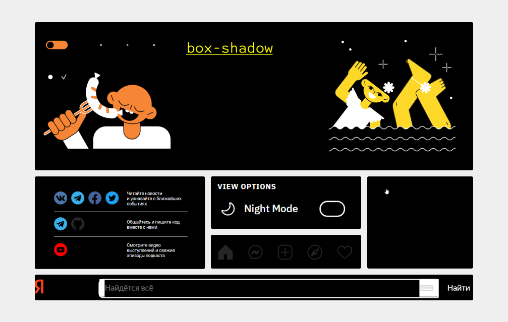

When people talk about accessibility and CSS, they often mean properties that affect the accessibility tree and screen readers. But there's another ally in the battle for accessibility interfaces — media features.

Media feature is a condition for the @media CSS directive. It indicates a specific characteristic of the device or browser. For example, screen orientation (`orientation`) or display mode (`display-mode`).

In this article, I'll talk about a few media features: `prefers-reduced-motion`, `prefers-colour-scheme`, `inverted-colors`, `forced-colors`, `ms-high-contrast`, `prefers-contrast` and `prefers-reduced-transparency`. They track operating system settings. The settings are changed by users who aren't satisfied with the default behaviour of the system. For example, people with special needs and those who are uncomfortable with the default design.

For example, users with epileptic seizures disable animations because they can trigger a seizure. Some people with astigmatism choose a dark theme and reduce contrast to avoid eye pain.

Considering user preferences will make the site's interface more flexible and personalised. This will not only help improve its accessibility but can also increase conversion rates. It's always nice to use products that cater to your preferences.

Most customisations apply only to the operating system. Many of them, the same animations and contrast levels, don't change website interfaces. It all depends on whether the developers have taken them into account. This is where media features come in handy.

You can also track user settings with JavaScript, but I don't want to bloat this post any further. I'll just focus on CSS features.

## Custom Settings

Let's first look at what system settings can be considered in web interfaces now or in the future.

### Animation

Animation settings allow you to change its speed or disable it completely in the system. Does not affect sites unless there are special styles.

Who uses the setting:

- Users with vestibular disorders and epileptic seizures.
- People with cognitive disabilities. Especially users with attention deficit disorder.

This setting is found in most operating systems.

### Colour scheme

Users can also change the colour scheme settings and select the colours that will dominate the system. These are either light or dark shades. The setting does not affect sites if they do not support colour schemes.



Who uses the setting:

- People with visual features. For example, people with reduced vision, eye pain, and hypersensitivity to light.
- Users with cognitive disabilities. For example, with attention deficit disorder.
- All other users due to aesthetic preferences, habits or light levels.

Schemes can be selected in all popular operating systems. In macOS and iOS, there is an optional automatic theme. If selected, a light theme is applied during the day and a dark theme at night.

### Invert Colours

Inverted colours mode replaces the system colours with opposite colours, as in the negative. It refers to the on-screen filter mode.

Colours are changed not only in the system but also in browser tabs. So users can choose this mode instead of dark theme.

<figure>
  
  <figcaption>Doka guide with inversion in Vivaldi on Windows 10.</figcaption>
</figure>

Who uses the setting:

- People with visual features. For example, people with glaucoma or eye pain.
- People with migraines and headaches.
- Other users because of habits or lighting.

Most operating systems have this setting. On iOS, there are even two types of inversion, Smart Invert and Classic Invert. In Smart Invert, pictures and videos are not inverted. In Classic Invert, all content is inverted.

### Colour mode

The forced colours mode limits the number of colours to increase the readability of text by changing the contrast between text and background. Colours with high contrast are mainly used. This mode changes the colours in both the system and sites.

Who uses the setting:

- Users with visual peculiarities.
- People with migraines and headaches.
- People with photosensitive epilepsy.
- Users who need to reduce visual noise to concentrate.

For now, the colour mode can only be selected in Windows. In Windows 10 and earlier, it's Windows High Contrast Mode (WHCM for short). In Windows 11, it's Contrast Themes.

High Contrast Mode has several ready-made colour sets:

- High Contrast Black mode (High Contrast Black);
- High Contrast White;
- High Contrast 1 and 2.

The colour palette replacement technology depends on the browser. It differs in Chromium, Firefox (Quantum), Internet Explorer (Trident) and older versions of Edge (EdgeHTML).

<figure>
  
  <figcaption>"Web Standards" with high contrast black mode in Vivaldi on Windows 10.</figcaption>
</figure>

<figure>
  
  <figcaption>This is how Firefox's default high-contrast black mode on Windows 10 is interpreted. The default behaviour can be changed. You need to select the "Use system colours" option in the Language and Appearance settings.</figcaption>
</figure>

In Windows 11, the set of contrasting themes has changed:

- Aquatic.
- Desert.
- Dusk.
- Night sky.

<figure>
  
  <figcaption>"Web Standards" in Night Sky Mode in Vivaldi on Windows 11.</figcaption>
</figure>

If the ready-made themes are not suitable, you can customise them yourself. This includes reducing the contrast.

### Contrast

Users can separately increase or decrease the contrast level in the system without changing the screen brightness.

Who uses the setting:

- People with visual features. For example, people with glaucoma.
- People with migraines and headaches.
- Users with old or poor-quality displays.
- Other users who lack contrast levels due to lighting.

macOS and iOS have an Increased Contrast Mode. It increases the difference between shades of grey and makes the borders of elements clearer.

Settings affect the appearance of the system and web interfaces. Unlike system windows, only the contrast level is changed on websites. Of course, the borders of elements do not become clearer by themselves.

<figure>
  
  <figcaption>In the high contrast mode, strangely enough, everything became more contrasty. Black frames appeared around the window and controls.</figcaption>
</figure>

### Transparency

Users can switch background transparency on or off. Opaque backgrounds are often chosen by those who want to increase contrast.

A transparent background can increase cognitive load and reduce the readability of text. Therefore, this setting is used by:

- People with visual features. For example, with astigmatism or reduced vision.
- Users with cognitive disabilities. For example, people with dyslexia or attention deficit disorder.
- People with migraines and headaches.

Transparency is customisable on Windows and macOS.

These settings only affect transparency in the system interface.

<figure>
  
  <figcaption>This is how the transparency setting works in Windows 10. The navigation background of the first window is semi-transparent, and the second one is opaque and monochrome.</figcaption>
</figure>

## A word about media types

The `@media` directive has several media types. They describe the device on which the document is displayed.

- `all`. All devices. It is set automatically if no other type is specified.
- `screen`. Devices with screens. For example, phones and laptops.
- `print`. Devices with preview and print functions. The same as printers.
- `speech`. Devices with speech synthesis. For example, screen readers and voice assistants.

The `speech` media type may be interesting from the point of view of accessibility. So far it is not supported by browsers. It used to be supported by Opera browser on Presto engine but stopped after switching to Blink.

In the future, it may be useful for special styles for screen readers. For example, to apply [CSS properties for speech synthesis devices](https://drafts.csswg.org/css-speech-1/) to necessary elements.

## Media Features

And now let's move on to media features that help to make web interfaces more accessible.

Some of them don't have very impressive support yet. Something may change in the future with the development of CSS. In any case, it's good to know about them. You might even want to experiment with these media features in a small pet project now.

### prefer-reduced-motion

Tracks whether animation settings are selected to reduce animation intensity.

There are two values:

- `no-preference`, the default animation settings.
- `reduce`, the modified animation settings.

[Prefers-reduced-motion has good browser support](https://caniuse.com/prefers-reduced-motion) at 91.75%.

It can be useful for any animation on the site. You can slow it down or disable it completely.

Setting `animation: none` to elements with animation will stop it completely.

```css
@media (prefers-reduced-motion: reduce) {
  .danger-animation {
    animation: none;
  }
}
```

Another example. The site uses `scroll-behaviour` to scroll smoothly to blocks. If there is a lot of content on the page, this animation can make you sick. In this case, you can animate scrolling when no animation is configured in the system.

```css
@media (prefers-reduced-motion: no-preference) {
  html {
    scroll-behavior: smooth;
  }
}
```

Parallax often makes users feel nauseous and vertigo. To make sure no one gets sick of an image with `position: sticky`, you can replace the value with `relative`.

```css
.parallax-scrolling-image {
  position: sticky;
}

@media (prefer-reduced-motion: reduce) {
  .parallax-scrolling-image {
    position: relative;
  }
}
```

Animation can also be an important part of a website. Therefore, it is better to build off the content. You can always slow down animations so that they are not dangerous for users or distracting.

I wrote more about this media feature and animation requirements in [post about accessibility for people with vestibular disorders and epileptic seizures](https://tatiana-fokina-blog.ru/articles/how-to-protect-users-with-epilepsy-and-vd/).


#### Preference-reduced-motion testing

A quick test can be done in the browser inspector on Chromium. Go to More tools, select the Rendering tab and turn on Emulate CSS media feature CSS prefers-reduce-motion.

You can also change the animation settings manually.

- Windows 10: <samp>Settings</samp> → <samp>Ease of Access</samp> → <samp>Display</samp> → <samp>Show animations in Windows</samp>.
- Windows 11: <samp>Settings</samp> → <samp>Accessibility</samp> → <samp>Visual effects</samp> → <samp>Animation effects</samp>.
- macOS: <samp>System Preferences</samp> → <samp>Accessibility</samp> → <samp>Display</samp> → <samp>Reduce Motion</samp>.
- iOS: <samp>Settings</samp> → <samp>Accessibility</samp> → <samp>Motion</samp> → <samp>Reduce Motion</samp>.
- Android: <samp>Settings</samp> → <samp>Accessibility</samp> → <samp>Display</samp> → <samp>Remove animations</samp>.

### prefers-color-scheme

Specifies the selected colour scheme.



Available values:

- `light`, for a light scheme.
- `dark`, for a dark scheme.

[prefers-color-scheme-high global support](https://caniuse.com/prefers-color-scheme) has 91.68%.

Developers can control all styles when working with dark site themes. It is especially important to pay attention to the colours:

- backgrounds,
- texts,
- interactive elements in different states,
- icons and images,
- other decorative elements.

For example, pictures in a dark theme can be made less contrasty by using `filter`, and also by changing the values of `background-colour` and `color`.

```css
.body {
  color: black;
  background-color: white;
}

@media (prefers-color-scheme: dark) {
  .body {
    color: white;
    background-color: black;
  }

  .image {
    filter: brightness(.8) contrast(1.2);
  }
}
```

In the example, I use pure black and white for code readability. In the real world, such contrasting colours are best avoided. White text on a black background is usually harder to read for most users.

#### Testing prefers-colour-scheme

A quick test can be done in the browser inspector on Chromium. Find the "Rendering" tab in "More tools" and select the dark theme in the "Emulate CSS media feature prefers-colour-scheme" option.

In Firefox, themes are in the first tab with the inspector. The switches are located above the styles. The switch with the moon icon enables the dark scheme simulation, and the one with the sun enables the light scheme simulation.


In Safari, dark scheme emulation is enabled in the web inspector under the "Elements" tab. The switch is called "Force Dark Appearance" and is located in the bar below the tabs.

.

You can switch the scheme manually as well.

- Windows: <samp>Settings</samp> → <samp>Personalization</samp> → <samp>Colors</samp> → <samp>«Dark»</samp> in a point about the application mode.
- macOS: <samp>System Preferences</samp> → <samp>General</samp> → <samp>«Dark»</samp> or <samp>“Automatically”</samp> in a section about appearance.
- iOS: <samp>Settings</samp> → <samp>Display and Brightness</samp> → <samp>"Dark"</samp> in a point about appearance.
- Android: <samp>Settings</samp> → <samp>Display</samp> → <samp>Dark Theme</samp>.

### inverted-colors

Отслеживает режим инвертированных цветов.

There are two values:

- `none`, the mode is not selected, and the system displays the default colours.
- `inverted`, inverted-colours mode is selected.

[Global support for inverted-colors](https://caniuse.com/mdn-css_at-rules_media_inverted-colors) - 17.56%. So far only supported in desktop and mobile Safari.

Normally no additional styles are required for this mode, other than cancelling inverted colours for videos and pictures. This can be done with `filter`.

```css
@media (inverted-colors: inverted) {
  img,
  video {
    filter: invert(100%);
  }
}
```

#### Testing inverted-colors

You can only test styles for invert mode manually.

- macOS: <samp>System Preferences</samp> → <samp>Accessibility</samp> → <samp>Display</samp> → <samp>Invert colors</samp>.
- iOS: <samp>Settings</samp> → <samp>Accessibility</samp> → <samp>Display & Text Size</samp> → <samp>«Smart Invert»</samp> or <samp>«Classic Invert»</samp>.

### forced-colors

Tracks forced colour mode. For example, the high contrast mode in Windows 10.

[Support for forced-colors](https://caniuse.com/mdn-css_at-rules_media_forced-colors) is low at 31.6%. The media feature is available in Firefox since version 89, Chrome since 89 and Edge since 79. Recommended to use newer versions of Edge instead of the deprecated `ms-high-contrast`.

Currently under active development and subject to change.

The media feature has two values:

- `none`, forced colour mode is not selected. The colour palette is unrestricted.
- `active`, forced colour mode is enabled.

Combines well with `prefers-colour-scheme`.

When the browser learns that forced colour mode has been selected, it limits the colour palette to a small set of colours. It cancels some values altogether.

For the following properties, static colours (developer-defined) are replaced by dynamic (system-defined) colours:

- `color`.
- `background-color`.
- `border-color`.
- `outline-color`.
- `column-rule-color`.
- `text-decoration-color`.
- `text-emphasis-color`.
- `webkit-tap-highlight-color`.
- `fill`.
- `stroke`.
- `flood-color`.
- `stop-color`.
- `lighting-color`.

These properties are forced to have different values:

- `colour-scheme` is `light dark`.
- `background-image` without `url` gets the value `none` if it is an interactive element. The exception is buttons. This is how it works in Internet Explorer and legacy Edge.
- `box-shadow` - `none`.
- `text-shadow` - `none`.
- `scrollbar-colour` - `auto`.

In the case of high-contrast mode it is better to switch off the internal designer. People need it not for the sake of aesthetics, but to increase the readability of content. So the media feature should be used wisely and only when you really need it. Basically, the browser itself copes with this task.

The main rule for working with styles in this mode is to use dynamic colours instead of static ones. They can be set using special [CSS system colour keywords](https://www.w3.org/TR/css-color-3/#css-system) (CSS system colour keywords). For example, `Window` for window background, `ButtonText` for button text colour and `WindowText` for text colour. This way we let the system know what colour to replace our static colour with.

Another important feature of the mode is that browsers decide to apply system styles based on element semantics. When a site has a wild layout, the browser will apply plain text styles to all elements. This applies to elements with ARIA roles as well. For example, `<div role="link">` is not a real link, so the system link text colours will not be applied to the element.

If text is placed on top of a picture, a black backplate will appear under it. Its styles cannot be controlled.

<figure>.
    
    <figcaption>The first screenshot is the original Xbox website interface in Vivaldi on Windows 10. In the second, it's in black high contrast mode. A black background has appeared underneath the text. A piece of Master Cheef says hello.</figcaption>
</figure>

If everything is fine with semantics and you want to optimise your site for high contrast mode, you should pay attention to just a few things. These are SVG, images with transparent backgrounds, checkboxes and radio buttons, as well as elements with `box-shadow`. They most often need to be fine-tuned.

In the picture I've collected elements from different sites, with which users of high contrast mode may have difficulties.

Buttons and links with SVG icons merge with the background or become less contrasty. A black logo or a dark image with a transparent background can also blend into the background. In case of a checkbox or radio button, it is not clear whether it is selected or not.

<figure>.
    
    <figcaption>The main Doka guide, the "Web Standards" footer, the theme switcher on Reddit, the Instagram menu, the button with the icon to open the menu on the Zara website, the Yandex search.</figcaption>
</figure>.

In this example, enhance the buttons with icons in high contrast mode with the `buttonText` keyword. This way they will get the system colour of the button text.

```css
@media (forced-colors: active) {
  .button__svg {
    fill: buttonText;
  }
}
```

You can check how this works on Windows in [demo with button c inline SVG](https://codepen.io/tatiana-fokina/pen/VwzmRVP).

While `forced-colors` support is not that high, and `-ms-high-contrast` is already deprecated. So now it's better to set styles for high contrast mode without media expressions.

For example, this is how we set styles for the focus indicator in both `box-shadow` and `outline`.

```css
.button {
  border: 1px solid transparent;
}

.button:focus {
  box-shadow: 0 0 4px 1px darkslateblue;
  outline: 2px solid transparent;
}
```

In high contrast mode, the `outline` properties will be applied instead of the `box-shadow` properties cancelled by the system. In normal mode only `box-shadow` will be visible.

For monochrome SVG icons, it is better to use the `currentColor` keyword for `fill` and `stroke`. This way they will inherit the system colour of the parent.

Let's imagine that we have a link with an inline SVG-icon.

```css
/* In normal mode, the link colour is indigo */
/* In high contrast mode it will be overridden by the system */
.link {
  color: indigo;
}

/* SVG inherits indigo colour in normal mode */
/* In high contrast mode inherits the system colour */
.link__svg {
  fill: currentColor;
}
```

Let's take this [demo with Twitter link](https://codepen.io/tatiana-fokina/pen/GRvNzbZ) as an example. If we turn on black high contrast mode, the link text and icon will turn system yellow.

Unfortunately, last year this [behaviour broke](https://bugs.chromium.org/p/chromium/issues/detail?id=1164162) in browsers on Chromuim. This was due to changes in the CSS specification. So now SVGs with `currentColor` remain static colour in forced colour mode.

A temporary solution to the problem is the `forced-colour-adjust` property.

If we apply `forced-color-adjust` with a value of `auto` to an SVG, it will inherit the parent element's colour when switched to high contrast mode.

```css
.link {
  color: indigo;
}

.link__svg {
  fill: currentColor;
  /* Fix for high contrast mode */
  forced-color-adjust: auto;
}
```

You can check how the hack works in [demo with fix with Twitter link](https://codepen.io/tatiana-fokina/pen/dyzOrQO).

Another option is the `preserve-parent-colour` value. It helps an element to inherit the value of its parent if no other methods are used. For example, `inherit` or `currentColor`. In normal mode, it behaves like a `none` value. So far [in Chromium](https://bugs.chromium.org/p/chromium/issues/detail?id=1242706) they are working on its implementation.

Another `forced-colour-adjust` value is `none`. It cancels replacing static colours with dynamic colours. In most cases, it is not recommended to use it. It will come in handy in situations where it is important to preserve colours. A good example can be seen in [demo with colour palettes](https://codepen.io/somelaniesaid/pen/eYZEorP).

#### Testing forced-colors

There are several ways to switch on high contrast mode.

- Windows 10: <samp>Settings</samp> → <samp>Ease of Access</samp> → <samp>High Contrast</samp>.
- Windows 11: <samp>Settings</samp> → <samp>Accessibility</samp> → <samp>Contrast themes</samp>.
- Shortcut - <kbd><kbd>Alt</kbd> + <kbd>Left Shift</kbd> + <kbd>PrintScreen</kbd></kbd>.

### ms-high-contrast

Tracks whether the user has selected High Contrast mode. Corresponds to high contrast themes in Windows before version 11.

Medafiche is non-standard and already obsolete. A more modern `forced-colors` analogue is better to use instead. May be needed when you need to support Internet Explorer and Edge version 18 and below.

Available values:

- `black-on-white`, for a mode with black text on a white background.
- `white-on-black`, for white text on black background.
- `active`, for all other colour combinations.

When working with styles, consider everything the same as for `forced-colors`.

The only peculiarity is that the media feature removes `background-image` from interactive elements. In the example, we change this behaviour:

```css
@media (-ms-high-contrast: black-on-white) {
  .interactive-element {
    background-image: url("bg-image.png");
  }
}
```

### prefers-contrast

Determines the selection of settings that reduce or increase the contrast difference between colours.

For now, `prefers-contrast' does not necessarily track high contrast levels, as in high contrast mode. But it is worth bearing in mind that the media feature may be more closely related to it in the future.

Available values:

- `no-preference`, no setting selected.
- `high`, contrast is increased. Suggested replacement with [more](https://drafts.csswg.org/mediaqueries-5/#valdef-media-prefers-contrast-more).
- `low`, contrast is decreased. Suggested replacement is [less](https://drafts.csswg.org/mediaqueries-5/#valdef-media-prefers-contrast-less).
- `forced`, forced colour mode is selected on the system. For example, Windows high contrast mode. Suggested replacement is [custom](https://drafts.csswg.org/mediaqueries-5/#valdef-media-prefers-contrast-custom).

[Global support for prefers-contrast](https://caniuse.com/mdn-css_at-rules_media_prefers-contrast) is not as high - 13.37%. It is supported in mobile and desktop Safari and in Chrome since version 96.

With this mode taken into account, you can add any styles that will improve the user experience.

In this example, change the `border` of the element to make the styles visible at high contrast.

```css
.image {
  border: 3px dashed lightpink;
}

/* Styles for increased contrast */
@media (prefers-contrast: more) {
  .image {
    border: 3px solid black;
  }
}
```

And this is where all media expressions define the high contrast mode.

```css
@media (forced-colors: active) {
  /* Styles */
}

@media (prefers-contrast: forced) {
  /* Styles */
}

@media (prefers-contrast: custom) {
  /* Styles */
}
```

You can see `forced-colors` in action now in Safari in [demo with cute otter](https://codepen.io/tatiana-fokina/pen/rNzjBXZ).

#### Testing prefers-contrast

To test the media feature, you need to enable the contrast enhancement setting.

- macOS: <samp>System Preferences</samp> → <samp>Accessibility</samp> → <samp>Display</samp> → <samp>Increase Contrast</samp>.
- iOS: <samp>Settings</samp> → <samp>Accessibility</samp> → <samp>Display & Text Size</samp> → <samp>Increase Contrast</samp>.

### prefers-reduced-transparency

Tracks whether transparency is disabled or reduced on the system.

Media feature values:

- `no-preference`, the user has not changed the transparency setting.
- `reduce`, transparency has been reduced or disabled.

For now, `prefers-reduced-transparency` is experimental. It is not supported by any browser.

In the future, this is how you can override `opacity` on elements.

```css
.transparency-bg {
  opacity: 0.5;
}

@media (prefers-reduced-transparency: reduce) {
  .transparency-bg {
    opacity: 1;
  }
}
```

## What I didn't tell you about

In this article, I didn't cover only one media feature for custom settings - `prefers-reduced-data`. It is needed to keep track of the volume settings for data retrieval.

It's related to performance and will also be useful for accessibility. More details in ["Creating websites with prefers-reduced-data"](https://polypane.app/blog/creating-websites-with-prefers-reduced-data/).

## Conclusions

CSS media features give us the ability to account for customisation on websites. With a few lines of code, they can be used to improve the user experience and make the interface more accessible and secure.

It is already safe to use `prefers-reduced-motion` and `prefers-colour-scheme`. `forced-colors`, `inverted-colors` and `prefers-contrast` are not so well supported yet, but their support is gradually being extended. `prefers-reduced-transparency` probably still has a long way to go. And `ms-high-contrast` is deprecated, so it's better not to set styles for high contrast mode in modern browsers.

## Что почитать и посмотреть

- [CSS Color Adjustment Module Level 1](https://www.w3.org/TR/css-color-adjust-1/).
- [Media Queries Level 5](https://www.w3.org/TR/mediaqueries-5/).
- [Operating System and Browser Accessibility Display Modes](https://www.a11yproject.com/posts/operating-system-and-browser-accessibility-display-modes/), Eric Bailey.
- [A Complete Guide to CSS Media Queries](https://css-tricks.com/a-complete-guide-to-css-media-queries/?utm_source=pocket_mylist), Andrés Galante.
- [Revisiting prefers-reduced-motion, the reduced motion media query](https://css-tricks.com/revisiting-prefers-reduced-motion/), Eric Bailey.
- [Respecting Users’ Motion Preferences](https://www.smashingmagazine.com/2021/10/respecting-users-motion-preferences/), Michelle Barker.
- [Reduced motion auto-playing videos and background animations](https://www.scottohara.me/note/2019/07/12/reduced-motion-video.html), Scott O'Hara.
- [thoughtbot.com, dark mode, and other user preferences](https://ericwbailey.design/writing/thoughtbot-com-dark-mode-and-other-user-preferences/), Eric Bailey.
- [A Complete Guide to Dark Mode on the Web](https://css-tricks.com/a-complete-guide-to-dark-mode-on-the-web/), Adhuham.
- [Светлая и тёмная темы на CSS: кастомные свойства, подключение, фолбэк для старых браузеров](https://www.youtube.com/watch?v=Qwuyeo7iuNY), video by Vadim Makeev.
- [Using JavaScript to detect high contrast and dark modes](https://www.scottohara.me/note/2021/10/01/detect-high-contrast-and-dark-modes.html), Scott O'Hara.
- [The CSS prefers-color-scheme user query and order of preference](https://www.sarasoueidan.com/blog/prefers-color-scheme-browser-vs-os/), Sara Soueidan.
- [Using the Increased Contrast Mode CSS media query](https://www.tempertemper.net/blog/using-the-increased-contrast-mode-css-media-query), Martin Underhill.
- [OS: High Contrast versus Inverted Colors](https://adrianroselli.com/2017/11/os-high-contrast-versus-inverted-colors.html), Adrian Roselli.
- [Working with High Contrast Mode](https://noti.st/ericwbailey/3HM9en), Eric Bailey. Presentation.
- [WHCM and System Colors](https://adrianroselli.com/2021/02/whcm-and-system-colors.html), Adrian Roselli.
- [Finessing forced-colors: tailoring the High Contrast experience](https://www.w3.org/2019/09/Meetup/speaker-melanie.html), Melanie Richards' presentation from the W3C Developer Meetup.
- [Styling for Windows high contrast with new standards for forced colors](https://blogs.windows.com/msedgedev/2020/09/17/styling-for-windows-high-contrast-with-new-standards-for-forced-colors/), Melanie Richards and Alison Maher.
- [Quick Tips for High Contrast Mode](https://sarahmhigley.com/writing/whcm-quick-tips/), Sarah Higley.
- [CurrentColor SVG in forced colors modes](https://melanie-richards.com/blog/currentcolor-svg-hcm/), Melanie Richards.

***

Thanks again to [Vasily Dudin](https://twitter.com/vasiliy_dudin) for help with editing.