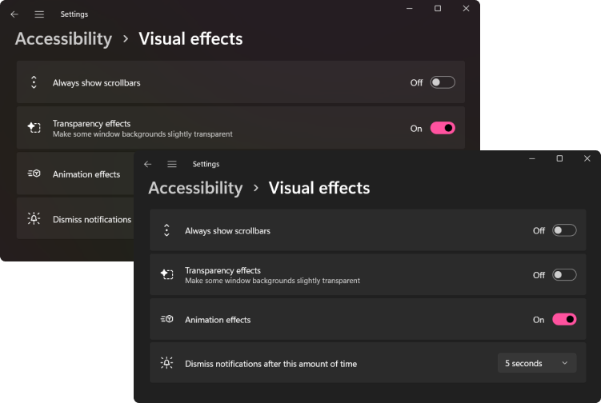

When people talk about accessibility and CSS, they often mean properties that affect the accessibility tree and screen readers. But there's another ally in the battle for accessibility interfaces — media features.

Media feature is a condition for the @media CSS directive. It indicates a specific characteristic of the device or browser. For example, screen orientation (`orientation`) or display mode (`display-mode`).

In this article, I'll talk about a few media features: `prefers-reduced-motion`, `prefers-colour-scheme`, `inverted-colors`, `forced-colors`, `ms-high-contrast`, `prefers-contrast` and `prefers-reduced-transparency`. They track operating system settings. The settings are changed by users who aren't satisfied with the default behaviour of the system. For example, people with special needs and those who are uncomfortable with the default design.

For example, users with epileptic seizures disable animations because they can trigger a seizure. Some people with astigmatism choose a dark theme and reduce contrast to avoid eye pain.

Considering user preferences will make the site's interface more flexible and personalised. This will not only help improve its accessibility but can also increase conversion rates. It's always nice to use products that cater to your preferences.

Most customisations apply only to the operating system. Many of them, the same animations and contrast levels, don't change website interfaces. It all depends on whether the developers have taken them into account. This is where media features come in handy.

You can also track user settings with JavaScript, but I don't want to bloat this post any further. I'll just focus on CSS features.

## Custom Settings

Let's first look at what system settings can be considered in web interfaces now or in the future.

### Animation

Animation settings allow you to change its speed or disable it completely in the system. Does not affect sites unless there are special styles.

Who uses the setting:

- Users with vestibular disorders and epileptic seizures.
- People with cognitive disabilities. Especially users with attention deficit disorder.

This setting is found in most operating systems.

### Colour scheme

Users can also change the colour scheme settings and select the colours that will dominate the system. These are either light or dark shades. The setting does not affect sites if they do not support colour schemes.



Who uses the setting:

- People with visual impairments. For example, people with reduced vision, eye pain, and hypersensitivity to light.
- Users with cognitive disabilities. For example, with attention deficit disorder.
- All other users due to aesthetic preferences, habits or light levels.

Schemes can be selected in all popular operating systems. In macOS and iOS, there is an optional automatic theme. If selected, a light theme is applied during the day and a dark theme at night.

### Invert Colours

Inverted colours mode replaces the system colours with opposite colours, as in the negative. It refers to the on-screen filter mode.

Colours are changed not only in the system but also in browser tabs. So users can choose this mode instead of dark theme.

<figure>
	
	<figcaption>Doka guide with inversion in Vivaldi on Windows 10.</figcaption>
</figure>

Who uses the setting:

- People with visual impairments. For example, people with glaucoma or eye pain.
- People with migraines and headaches.
- Other users because of habits or lighting.

Most operating systems have this setting. On iOS, there are even two types of inversion, Smart Invert and Classic Invert. In Smart Invert, pictures and videos are not inverted. In Classic Invert, all content is inverted.

### Colour mode

The forced colours mode limits the number of colours to increase the readability of text by changing the contrast between text and background. Colours with high contrast are mainly used. This mode changes the colours in both the system and sites.

Who uses the setting:

- People with visual impairments.
- People with migraines and headaches.
- People with photosensitive epilepsy.
- Users who need to reduce visual noise to concentrate.

For now, the colour mode can only be selected in Windows. In Windows 10 and earlier, it's Windows High Contrast Mode (WHCM for short). In Windows 11, it's Contrast Themes.

High Contrast Mode has several ready-made colour sets:

- High Contrast Black mode;
- High Contrast White;
- High Contrast 1 and 2.

The colour palette replacement technology depends on the browser. It differs in Chromium, Firefox (Quantum), Internet Explorer (Trident) and older versions of Edge (EdgeHTML).

<figure>
	
	<figcaption>"Web Standards" with high contrast black mode in Vivaldi on Windows 10.</figcaption>
</figure>

<figure>
	
	<figcaption>This is how Firefox's default high-contrast black mode on Windows 10 is interpreted. The default behaviour can be changed. You need to select the "Use system colours" option in the Language and Appearance settings.</figcaption>
</figure>

In Windows 11, the set of contrasting themes has changed:

- Aquatic.
- Desert.
- Dusk.
- Night sky.

<figure>
	
	<figcaption>"Web Standards" in Night Sky Mode in Vivaldi on Windows 11.</figcaption>
</figure>

If the ready-made themes are not suitable, you can customise them yourself. This includes reducing the contrast.

### Contrast

Users can separately increase or decrease the contrast level in the system without changing the screen brightness.

Who uses the setting:

- People with visual impairments. For example, people with glaucoma.
- People with migraines and headaches.
- Users with old or poor-quality displays.
- Other users who lack contrast levels due to lighting.

macOS and iOS have an Increased Contrast Mode. It increases the difference between shades of grey and makes the borders of elements clearer.

Settings affect the appearance of the system and web interfaces. Unlike system windows, only the contrast level is changed on websites. Of course, the borders of elements do not become clearer by themselves.

<figure>
	
	<figcaption>In the high contrast mode, strangely enough, everything became more contrasty. Black frames appeared around the window and controls.</figcaption>
</figure>

### Transparency

Users can switch background transparency on or off. Opaque backgrounds are often chosen by those who want to increase contrast.

A transparent background can increase cognitive load and reduce the readability of text. Therefore, this setting is used by:

- People with visual impairments. For example, with astigmatism or reduced vision.
- Users with cognitive disabilities. For example, people with dyslexia or attention deficit disorder.
- People with migraines and headaches.

Transparency is customisable on Windows and macOS.

These settings only affect transparency in the system interface.

<figure>
	
	<figcaption>This is how the transparency setting works in Windows 10. The navigation background of the first window is semi-transparent, and the second one is opaque and monochrome.</figcaption>
</figure>

## A word about media types

The `@media` directive has several media types. They describe the device on which the document is displayed.

- `all`. All devices. It is set automatically if no other type is specified.
- `screen`. Devices with screens. For example, phones and laptops.
- `print`. Devices with preview and print functions. The same as printers.
- `speech`. Devices with speech synthesis. For example, screen readers and voice assistants.

The `speech` media type may be interesting from the point of view of accessibility. So far it is not supported by browsers. It used to be supported by Opera browser on Presto engine but stopped after switching to Blink.

In the future, it may be useful for special styles for screen readers. For example, to apply [CSS properties for speech synthesis devices](https://drafts.csswg.org/css-speech-1/) to necessary elements.

## Media Features

And now let's move on to media features that help to make web interfaces more accessible.

Some of them don't have very impressive support yet. Something may change in the future with the development of CSS. In any case, it's good to know about them. You might even want to experiment with these media features in a small pet project now.

### prefer-reduced-motion

Tracks whether animation settings are selected to reduce animation intensity.

There are two values:

- `no-preference`, the default animation settings.
- `reduce`, the modified animation settings.

[Prefers-reduced-motion has good browser support](https://caniuse.com/prefers-reduced-motion) at 91.75%.

It can be useful for any animation on the site. You can slow it down or disable it completely.

Setting `animation: none` to elements with animation will stop it completely.

```css
@media (prefers-reduced-motion: reduce) {
  .danger-animation {
	animation: none;
  }
}
```

Another example. The site uses `scroll-behaviour` to scroll smoothly to blocks. If there is a lot of content on the page, this animation can make you sick. In this case, you can animate scrolling when no animation is configured in the system.

```css
@media (prefers-reduced-motion: no-preference) {
  html {
	scroll-behavior: smooth;
  }
}
```

Parallax often makes users feel nauseous and vertigo. To make sure no one gets sick of an image with `position: sticky`, you can replace the value with `relative`.

```css
.parallax-scrolling-image {
  position: sticky;
}

@media (prefer-reduced-motion: reduce) {
  .parallax-scrolling-image {
	position: relative;
  }
}
```

Animation can also be an important part of a website. Therefore, it is better to build off the content. You can always slow down animations so that they are not dangerous for users or distracting.

I wrote more about this media feature and animation requirements in [post about accessibility for people with vestibular disorders and epileptic seizures](https://tatiana-fokina-blog.ru/articles/how-to-protect-users-with-epilepsy-and-vd/).


#### Preference-reduced-motion testing

A quick test can be done in the browser inspector on Chromium. Go to More tools, select the Rendering tab and turn on Emulate CSS media feature CSS prefers-reduce-motion.

You can also change the animation settings manually.

- Windows 10: <samp>Settings</samp> → <samp>Ease of Access</samp> → <samp>Display</samp> → <samp>Show animations in Windows</samp>.
- Windows 11: <samp>Settings</samp> → <samp>Accessibility</samp> → <samp>Visual effects</samp> → <samp>Animation effects</samp>.
- macOS: <samp>System Preferences</samp> → <samp>Accessibility</samp> → <samp>Display</samp> → <samp>Reduce Motion</samp>.
- iOS: <samp>Settings</samp> → <samp>Accessibility</samp> → <samp>Motion</samp> → <samp>Reduce Motion</samp>.
- Android: <samp>Settings</samp> → <samp>Accessibility</samp> → <samp>Display</samp> → <samp>Remove animations</samp>.
