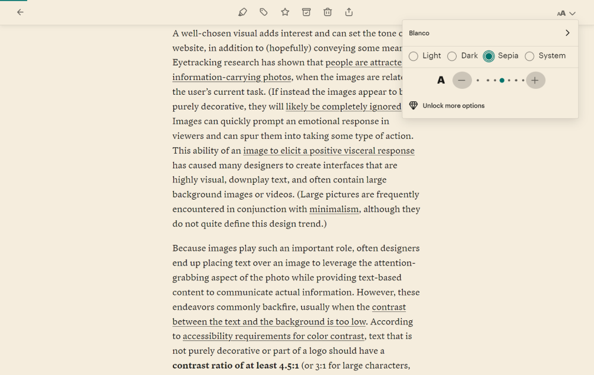

I like Pocket. Actually, no: I _love_ Pocket. It helps me keep many articles and posts I'm curious about in one place. Sometimes I have too many articles to read, so I start procrastinating, but that's my problem, not Pocket's.

If you're unfamiliar with Pocket, it's a service for storing web bookmarks less chaotically, unlike collecting hundreds of tabs in your browser.

Another reason to appreciate Pocket is its consistent reading experience. I deal with only one font type, size, column width, and color theme. There are no distracting animations or unpredictable readability issues caused by creative designers' choices (that's not something bad.) With a Premium account, you can customize everything without compromising readability.

I also enjoy using the Pocket app. It has an offline mode; you need to synchronize your data beforehand.

You might think, ″Are you advertising this service to us?″ If so, it's free promotion 😅. But no, I want to share my humble opinion (or should I say demure?) and the accessibility barrier I surprisingly encountered.

The disclaimer: This is my **personal** opinion and experience and doesn't reflect everyone else's. Of course, I'm not blaming anyone, especially the team that created one of my favorite web services and mobile apps. Cheers!

## Personal barrier

I opened the Pocket app for the first time in a few months and realized that the dark theme was set by default. It was strange because I always use the sepia theme both on the web and in the app. I went to the settings to change the theme again, but there was no sepia. Only dark, light, and system colors were available.

<figure class="article__image">
  
  <figcaption class="article__image-caption">
    The mobile app.
  </figcaption>
</figure>

At the exact moment when I opened the app, went to an article, and started to read, I realized how painful it was. It didn't just strain my eyes; I couldn't concentrate on reading. Words and lines of text blurred together, and it was impossible to find the next line. Why? I have astigmatism, and sometimes this condition doesn't work well with specific dark themes and color contrast.

Of course, Pocket provides me with a choice. I can update my account to Premium and enjoy reading again. But I have a question: Is the sepia theme as essential for users as dark and light?

## It's astigmatism, hi

**Astigmatism** (uh-STIG-muh-tiz-um) is a common and generally treatable imperfection in the curvature of the eye blah blah blah… In other words, some people's eyes have an egg-shaped or football-shaped cornea instead of a perfectly round one.

Your vision is the outcome of light that passes through the front part of the eye (cornea) and hits the back of the eyeball (retina). After that, the optic nerve and brain finish the job.

The eyes of people with astigmatism can't produce a clear image at the retina because light doesn't focus on a single point as it should. As a result, the objects you're looking at may appear blurry, distorted, and partly out of focus.

By default, without corrective lenses, everything around people with astigmatism appears slightly doubled (diplopia) and blurred at close and far distances. It's as if two nearly identical images on semi-transparent paper don't align perfectly when you place one on the other.

<figure class="article__image">
  
  <figcaption class="article__image-caption">
    My blog logo simulates astigmatism.
  </figcaption>
</figure>

People may also experience eyestrain due to certain stimuli. These stimuli include bright lights, flashes, glossy surfaces, and high color contrast.

Other possible symptoms of astigmatism can include light sensitivity, difficulty with night vision, headaches, fatigue, and halos around lights.

Halos are an annoying symptom that some people with astigmatism experience. Halation is essentially what you might imagine – it's when you see a ″halo″ or glow around illuminated objects. This effect can occur with physical light sources and digital content. Because of this, it can be challenging to read neon signs in the dark, see clearly on streets with many lights (especially when it's rainy), or read from screens in situations, such as when using dark mode.

A long time ago, I was curious why my eyes seemed to struggle when using dark themes for reading and coding. I did some research and found the culprit. The main reason for the unhealthy relationship between my eyes and dark themes is related to how the pupils (the black round spots in eyes) works.

Imagine a professional, fancy camera. When you take a picture in poorly lit spaces, your camera needs more light. As a true professional, you can adjust the aperture on the camera lens. In this situation, without proper lighting, you need to open the aperture wide. This means increasing how wide the hole between the metal blades that form the diaphragm. Conversely, when there's too much light, you need to reduce the amount of it entering the camera by closing the aperture.

If you're not into photography, think of it this way: In a dark room, your eye's pupils becomes larger. In bright sunlight, the pupil's opening becomes smaller.

When you read black text on a white background, your eyes receive more light, causing your pupils to become smaller. In reverse, when reading white text on a black background, your eyes receive less light,and your pupils become bigger.

People with astigmatism may be more affected by light levels than those without this condition. It can be more challenging to see clearly in the dark. It's often easier for individuals with astigmatism to focus on objects when they're bright because their pupils are small, which can somewhat reduce the symptoms of astigmatism.

## Sepia mood

As mentioned earlier, people with astigmatism may find it hard to read white text on a black background, and this difficulty can worsen when experiencing halation. This is noticeable in dark mode.

When you experience halation, using dark mode can lead to a halation effect.

The **halation effect** is a visual distortion where white letters appear to have a halo behind them, making them seem to shine, blur, or blend with each other. This can make text appear foggy and difficult to read.

Let's simulate the halation effect. The first screen shows how the text looks by default in the Pocket app. For you, it possibly doesn't look so bad. Words are easy-to-read and lines have clear borders.

The second picture shows how I see the text in the app. It's blurred and doubled simultaneously, so I can't read every line and word on the screen well.

<figure class="article__image">
  
  <figcaption class="article__image-caption">
    Life is hard sometimes.
  </figcaption>
</figure>

The easiest way to deal with doubled and shining text is sepia mode.

**Sepia** is a reddish-brown color that is neither too dark nor too bright, making it unlikely to create high contrast with black text. By the point, it's a calm color that reminds me of the hue of old book pages. I almost smell the scent of aged paper when looking at the color!

Actually, the web version of Pocket includes a sepia mode. There is a sepia option in the display settings, along with font size adjustments and other color modes.

<figure class="article__image">
  
  <figcaption class="article__image-caption">
    I feel relieved.
  </figcaption>
</figure>

Sepia mode helps me to read long texts. For many people, including me, it's easier to read black text on a sepia or shades of beige background. In fact, it's not just a matter of comfort. With a sepia background, I'm not fighting with severe eyestrain for days after reading.

## Other factors

Of course, dark mode is not the only factor affecting reading comfort for people with astigmatism. Comfortable reading experiences also depend on text readability and legibility.

**Readability** refers to how easy it is to read texts. It includes font family, font size, line spacing and length, color, and contrast.

**Legibility** refers to how clear and distinguishable individual characters and letters are. It involves font type, character shapes, weight and width, letter spacing, and stroke width.

If you combine poor readability, legibility, and dark mode, someone with astigmatism won't appreciate it 😩.

Let's consider an example. Two texts are pure white and placed on a bright black background.

For the first, wider column, I use IBM Plex Serif font with a size of 17 pixels. I also set different weights: Semi-bold, bold, thin, light, italic, thin italic, and so on. The line height is set to auto, which results in 22 pixels.

For the second, narrower column, I use IBM Plex Sans with a size of 21 pixels and regular weight. I also increased the line height to 34 pixels.

<figure class="article__image">
  
  <figcaption class="article__image-caption">
    Let's play with fonts.
  </figcaption>
</figure>

Personally, it's easier to read the text in the second column, even though it's a high-contrast white-on-black theme.

## To be, or not to be

[Approximately 40% of the adult population has astigmatism](https://www.ncbi.nlm.nih.gov/pmc/articles/PMC10045990/). This means about 1 (one) in 3 (three) people have astigmatism. It makes this eye condition one of the most common worldwide. This means about 1 (one) in 3 (three) people have astigmatism.

Dark themes save battery life on devices with certain types of screens, look aesthetically pleasing, and make interfaces more accessible for users with light sensitivity, glaucoma, etc. You can easily find [statistics and research that confirm users prefer dark mode](https://worldmetrics.org/dark-mode-usage-statistics/). Business loves numbers.

To draw objective conclusions from research, it's important to interpret the data and consider the details correctly. Studies about users of dark themes don't always answer all questions:

- how many users with astigmatism are among those who prefer dark interfaces;
- why people don't use light themes more actively;
- is the dark theme selected both in the system and the browser?

Don't forget about people with Attention Deficit Hyperactivity Disorder (ADHD), dyslexia, or other neurodivergences. Users who avoid dark modes don't always have astigmatism. Possibly statistics don't reflect the number of neurodivergent people.

Perhaps developers and designers _believed_ that dark color mode was the only alternative to a light theme. In reality, there is no single correct solution. While dark mode fixes some problems, it sometimes creates accessibility barriers instead.

I can't force everyone to implement multiple themes or settings everywhere. That's good news for managers, haha. However, it's a good idea to think about dark mode critically and not make a decision that is accessible by default.

At least you have the power to avoid using bright black and white. In this world, we have different colors, not only black and white. What about something between these two opposite sides? There are at least light gray and beige.

## Further reading

- ″[Why ‘dark mode’ causes more accessibility issues than it solves](https://medium.com/@h_locke/why-dark-mode-causes-more-accessibility-issues-than-it-solves-d2f8359bb46a)″ by H Locke
- ″[Are dark themes really better for your eyes and battery?](https://www.maketecheasier.com/are-dark-themes-better-for-eyes-battery/)″ by Andrew Braun
- ″[Dark mode vs. light mode: Which is better?](https://www.nngroup.com/articles/dark-mode/)″ on NN/g
- ″[Alternatives to using pure black (#000000) for text and backgrounds](https://uxplanet.org/alternatives-to-using-pure-black-000000-for-text-and-backgrounds-54ef0e733cdb)″ by Dmitry Sergushkin
- [Sensory perception and interaction research group at the University of British Columbia](http://www.cs.ubc.ca/labs/spin/)
- ″[Astigmatism and dark mode](https://www.lkhrs.com/blog/2023/astigmatism-and-dark-mode/)″ by Luke Wild.
