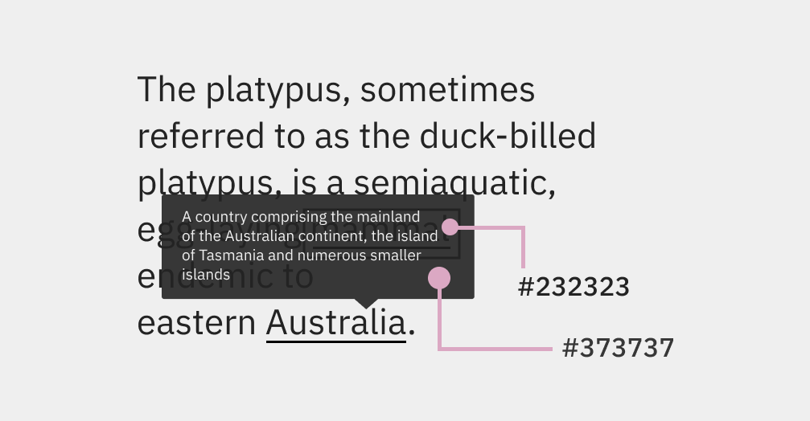
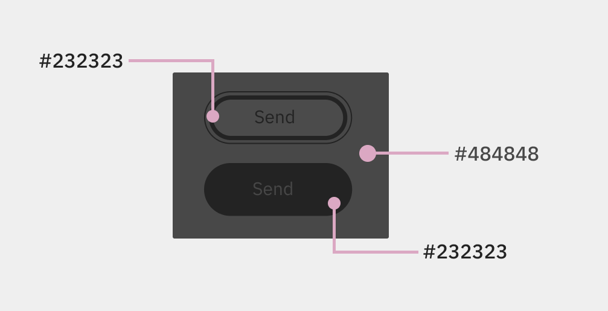
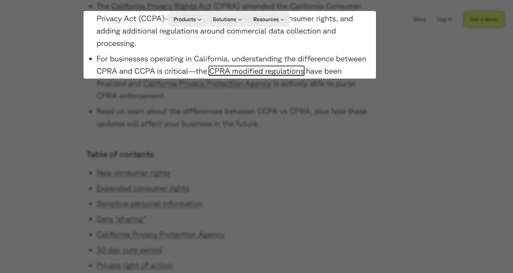
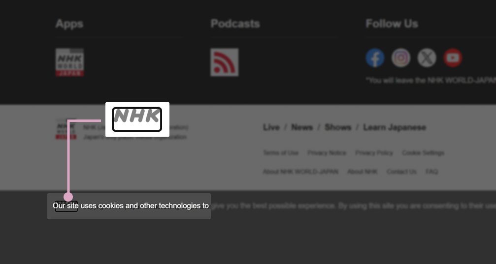
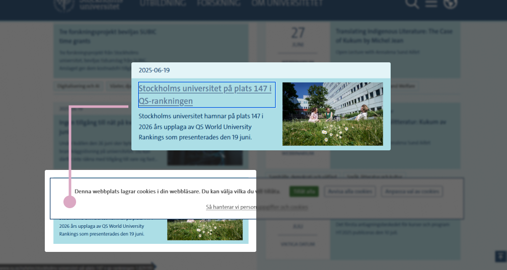
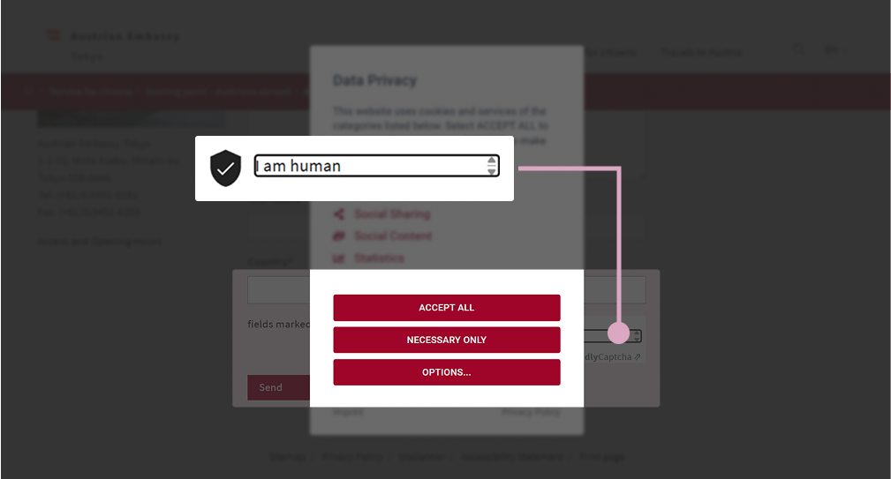

The Web Content Accessibility Guidelines 2.2, or WCAG 2.2 for short, introduced eight new criteria. Two of them are related to the headache of keyboard users (and also the accessibility specialists community) — the obscuring of a focused element by other content. These are the level AA criterion [2.4.11: Focus Not Obscured (Minimum)](https://www.w3.org/TR/WCAG22/#focus-not-obscured-minimum) and the level AAA one [2.4.12: Focus Not Obscured (Enhanced)](https://www.w3.org/TR/WCAG22/#focus-not-obscured-enhanced).

## Short explanation

Controls in a focus state should be visible at least *partially* when they are obscured by other elements.

*Partially obscured element* means the one which accessibility name (label) and other significant information at least somewhat visible. The criterion doesn’t consider a focus indicator, such as an outline around a button, as part of the element. If buttons don’t visually change when focused, this is not a problem from the perspective of criterion 2.4.11.

Exceptions to the level AA criterion include elements opened by users and components that can be moved around the page by dragging, etc.

The enhanced criterion 2.4.12 doesn’t allow even partially obscured elements in a focus state.

## Detailed explanation

Many of us have at least once found ourselves on a website with dropdowns where items are visually hidden but still accessible to the keyboard. Both criteria prevent this and similar keyboard navigation problems.

Elements with a keyboard focus can also be obscured by:

- Other dropdown elements: combo boxes, hamburger menus, date pickers
- Sticky, fixed elements: header, footer, sidebar navigation, cookie banners
- Pop-ups: chatbot messages, notifications, tooltips, and other hints
- Non-modal and (pseudo)modal dialog boxes without focus trap: cookie information or newsletter subscription
- Movable elements: stickers on a virtual Kanban board, color palette in a design tool.



Not all **dropdowns** are bad. The criteria consider two main cases with dropdowns. The first case is an initially open element, for example, a sidebar menu with site navigation. The second situation is an incorrectly coded dropdown. For instance, extensive navigation with submenus opens with the keyboard and doesn’t close with <kbd>Esc</kbd>.

It’s possible that **fixed navigation** with a lot of items doesn’t meet the minimum criterion. The focus problem becomes especially noticeable. When navigating with the keyboard to the beginning of the page.

**Fixed cookie banner** is another problematic design pattern. Banners with controls and descriptive texts are at risk of violating the level AA criterion. In a lot of cases, cookie banners are placed on pages as the last element. Keyboard users need to go to the end of the page to close the cookie message.

**Pop-ups** can also violate the minimum criterion 2.4.11. You may have encountered intrusive tooltips that automatically open when focusing on the related element and persistently obscure part of the remaining content. Only a page refresh can help.

**Dialog boxes** are another enemies of keyboard navigation. Let’s leave aside dialog usability issues. Most non-modal windows that are open by default and positioned in the center of the screen will violate the level AA criterion 2.4.11.

In the case of dialogs, criterion 2.4.11 allows modal windows. A modal dialog will not violate the criterion, even if it’s not coded quite correctly. For example, a user can scroll the page with an open modal dialog using a mouse or other pointer. The main thing is that the modal *truly* prevents setting the keyboard focus on the elements behind it.

A non-modal window doesn’t block the main page content. In contrast, a modal dialog prevents accessing the page while it’s open.

**Elements with glass effect or opaque styles**, such as semi-transparent tooltips and fixed site navigation, are the second special case.

Control elements must comply with the level AA criterion [1.4.11: Non-text Contrast](https://www.w3.org/TR/WCAG22/#non-text-contrast) to pass 2.4.11: Focus Not Obscured (Minimum). You need to check the contrast ratio between the color of the interactive element and the background of the overlaying element.

Imagine a semi-transparent tooltip that completely obscures a link. You need to compare the link color resulting from blending with the tooltip background and the background of the pop-up hint itself.

For example, the link color is #232323 (young night) after blending with the background, and the background of the tooltip is #373737 (muted gray.) The contrast ratio between colors is 1.32:1. This is below the minimum value for non-text elements. Thus, the criterion 2.4.11 is failed.

<figure class="article__image">
  
  <figcaption class="article__image-caption">
    An example of the opaque tooltip.
  </figcaption>
</figure>

In this imaginary example, we *didn’t compare* the color of the focus indicator. The only two cases we care about the appearance of the indicator are:

- if the focus indicator is placed inside the focused element
- if the element in a focus state changes significantly.

For example, a focused button has an inner border, so we compare the border color with the background of the overlaying element. Another case is when a button in a focus state changes its background color. Here we compare the new background color of the button with the background of the other element.

<figure class="article__image">
  
  <figcaption class="article__image-caption">
    An example of two types of focused buttons.
  </figcaption>
</figure>

**Elements that move around the page** fail the minimum criterion when they obscure links, buttons, and interactive components by default before they are moved by users.

## Not answered questions

In the description of both criteria, I didn’t find answers to several questions.

How should I treat images, headings, and brief descriptions wrapped by one link? For example, a link with text and graphics (or only graphics,) where only part of the image is visible.

What to do with a focused link when its text blends with the page background, and only the outline around it is visible? Even if the link is partially covered by something else, we don’t see *the element itself*.

## About users

First and foremost, partially or completely obscured elements in focus state are a barrier for **keyboard users**. These can be standard, custom, or on-screen varieties types.

Elements in focus state are also important for **screen magnifier users** who combine them with keyboard navigation.

Seeing focused elements is also important for **users of alternative input devices**, such as voice control or eye tracking when a person controls the cursor with their eyes.

The next category of users are those who **use pointer devices for navigation** (excluded computer mice.) For instance, styluses, head pointers, and joysticks.

Don’t forget about **neurodivergent users** with disabilities affecting memory and attention. For example, Attention Deficit Hyperactivity Disorder (ADHD,) Long COVID, or Traumatic Brain Injuries (TBIs.) These users often get distracted and forget about their current position and recent actions on the page.

## How to avoid barriers

The simplest solution is not to fix crumbesome navigation in the header and footer, especially on small screens. You can save screen space by reducing the sticky header height during scrolling.

The next helper is the CSS property `scroll-padding`. The property increases the distance between the fixed element and the rest of the page content.

Don’t abuse automatically opening non-modal windows and interface hints that can’t simply be closed with <kbd>Esc</kbd>. If you have a lot of free space along the edges of the page, such elements can be safely placed there.

Code modal windows correctly. Don’t allow keyboard users to go to the page without pressing dialog buttons or keyboard keys to close the modal window.

To solve the problem with cookie messages that cover everything, you can

- place it at the very beginning of the page and not fix it at all
- show it as the *true* modal window.

## Good examples

On a Wikipedia article page tooltips with images and text appear when focusing on links. Some links are partially obscured by tooltips. The tooltip disappears when moving to a new link but doesn’t close with <kbd>Esc</kbd>.

Since control elements in a focus state are only partially obscured by the tooltip the page complies with the criterion 2.4.11: Focus Not Obscured (Minimum).

<figure class="article__image">
  
  <figcaption class="article__image-caption">
    The article about “Popular Science” magazine.
  </figcaption>
</figure>

In the [Transcend blog](https://transcend.io/blog), the fixed header is moving when scrolling the page up and down. When navigating the page with the keyboard, no interactive element is obscured by the header.

<figure class="article__image">
  
  <figcaption class="article__image-caption">
    The Transcend’s blog post.
  </figcaption>
</figure>

The page complies with the level AAA criterion 2.4.12: Focus Not Obscured (Enhanced).

In the main tab of YouTube Studio, the notification with an interface hint automatically appears. This element doesn’t cover active links. The page pass the level AA criterion 2.4.11.

<figure class="article__image">
  
  <figcaption class="article__image-caption">
    YouTube Studio.
  </figcaption>
</figure>

## Not so good examples

On the main page of the [NHK World Japan](https://www3.nhk.or.jp/nhkworld/) broadcasting company website, the cookie banner with a semi-transparent background is fixed at the bottom of the display. When navigating the page with the keyboard some interactive elements are partially obscured by the banner.

The banner completely obscures one of the links in the footer. The link text color is #808080 (grey), and the cookie banner background color is #4c4c4c (quartz). The contrast ratio between the colors is 2.17:1. The final ratio is below the minimum ratio value for non-text elements (3:1). So the site doesn’t meet the level AA criterion 2.4.11.

<figure class="article__image">
  
  <figcaption class="article__image-caption">
    The main page of NHK World Japan.
  </figcaption>
</figure>

On the [Stockholm University](https://www.su.se/) site, the non-modal window with cookie information is centered on the screen.

Some links in focus states are completely obscured by the non-modal window. Based on that result, the site doesn’t meet the minimum criterion 2.4.11.

<figure class="article__image">
  
  <figcaption class="article__image-caption">
    The Stockholm University site.
  </figcaption>
</figure>

When first opening the main page of the [Austrian Embassy in Tokyo](https://www.bmeia.gv.at/en/austrian-embassy-tokyo) site, the window with cookie information appears. Visually, due to the darkened background, the window looks a modal. However, we can still navigate through the page with the keyboard when the window is open. Labels of some fields, links, and buttons are completely obscured by another element. So the page doesn’t meet criterion 2.4.11 level AA.

<figure class="article__image">
  
  <figcaption class="article__image-caption">
    The main page of the Austrian Embassy in Tokyo site.
  </figcaption>
</figure>

## How to test

Both criteria can be tested automatically and manually.

*Theoretically* bookmarklets could help with automatic testing. So far, I haven’t found the script that simultaneously shows focus styles for all interactive elements and opens the necessary top-layer interface components.

A temporary semi-automatic solution is the single bookmarklet [Show focus styles](https://code.jasonmorris.com/bookmarklets/show-focus-styles/) and manually opening windows, dropdowns, and similar elements.

Manual testing requires a keyboard. Approximate testing steps:

- Make sure there are interactive elements on the page (buttons, links, etc.)
- Find overlay elements
- Navigate through all interactive elements using <kbd>Tab</kbd> and <kbd>Shift Tab</kbd>
- Repeat the previous steps for other breakpoints.

Additional steps for elements obscured by semi-transparent top layer elements:

- Find out the background color of the top element
- Determine the color of the focused element. Pick the mix of its original color with the background of the overlaying component (without the focus indicator's color)
- Check the contrast ratio between two colors.

You can test color ratio with color contrast checking tools. A few names of them are [TPGi’s Colour Contrast Analyser (CCA)](https://www.tpgi.com/color-contrast-checker/) and [Accessible Web’s WCAG Color Contrast Checker](https://accessibleweb.com/color-contrast-checker/).

If every interactive element in a focus state is visible completely or partially, the page passes *2.4.11: Focus Not Obscured (Minimum) (Level AA)*.

If semi-transparent elements completely obscure elements in a focus state, and the contrast ratio between two colors is 3:1 and higher, the page also complies with the level AA criterion.

When no element in the keyboard focus state is obscured by others, the page passes *2.4.12: Focus Not Obscured (Enhanced) (Level AAA)*.

## Further reading

- [2.4.11 Focus Not Obscured (Minimum) — WCAG 2.2](https://www.w3.org/WAI/WCAG22/Understanding/focus-not-obscured-minimum.html)
- [2.4.12 Focus Not Obscured (Enhanced) — WCAG 2.2](https://www.w3.org/WAI/WCAG22/Understanding/focus-not-obscured-enhanced.html)
- [Cookie banner — GOV.UK Design System](https://design-system.service.gov.uk/components/cookie-banner/)
- [2.4.11: Adversarial Conformance](https://adrianroselli.com/2023/10/2-4-11-adversarial-conformance.html) by Adrian Roselli
- [How to test 2.4.11: Focus Not Obscured (Minimum)](https://www.tpgi.com/how-to-test-2-4-11-focus-not-obscured-minimum/) by TPGi
