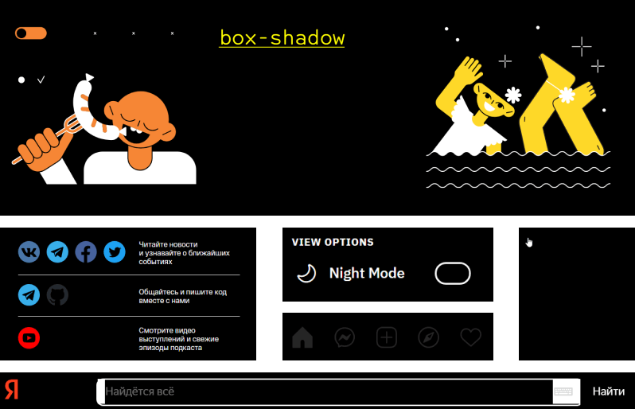

Когда говорят про доступность и&nbsp;CSS, часто имеют в&nbsp;виду свойства, которые влияют на&nbsp;дерево доступности и&nbsp;скринридеры. Но&nbsp;есть ещё один союзник в&nbsp;битве за&nbsp;доступность интерфейсов&nbsp;— медиафичи.

Медиафича (media feature)&nbsp;— это условие для CSS-директивы `@media`. Указывает на&nbsp;определённую характеристику устройства или&nbsp;браузера. К&nbsp;примеру, ориентацию экрана (`orientation`) или&nbsp;режим отображения (`display-mode`).

В&nbsp;этом посте расскажу про несколько медиафич: `prefers-reduced-motion`, `prefers-color-scheme`, `inverted-colors`, `forced-colors`, `ms-high-contrast`, `prefers-contrast` и `prefers-reduced-transparency`. Они&nbsp;отслеживают настройки операционной системы. Настройки изменяют пользователи, которых не&nbsp;устраивает дефолтное поведение системы. К&nbsp;примеру, люди с&nbsp;особыми потребностями и&nbsp;те, кто испытывает дискомфорт из-за дефолтного дизайна.

Так, пользователи с эпилептическими приступами отключают анимацию из-за того, что она может вызвать приступ. А некоторые люди с астигматизмом выбирают тёмную тему и уменьшают контрастность, чтобы не болели глаза.

Учёт пользовательских настроек сделает интерфейс сайта более гибким и&nbsp;персонализированным. Это поможет не&nbsp;только повысить его уровень доступности, но&nbsp;и&nbsp;может повысить конверсию. Всегда приятно пользоваться продуктами, которые учитывают твои предпочтения.

Большинство настроек применяется только к&nbsp;операционной системе. Многие из&nbsp;них, те&nbsp;же анимация и&nbsp;уровень контрастности, не&nbsp;изменяют интерфейсы сайтов. Всё зависит от&nbsp;того, учли ли их разработчики. Как раз здесь помогают медиафичи.

Отслеживать пользовательские настройки можно и&nbsp;с&nbsp;помощью JavaScript, но&nbsp;не&nbsp;хочу раздувать пост ещё больше. Остановлюсь только на&nbsp;возможностях CSS.

## Пользовательские настройки

Давайте сначала разберёмся, какие системные настройки можно учитывать в&nbsp;веб-интерфейсах уже сейчас или в&nbsp;будущем.

### Анимация

Настройки анимации позволяют изменять её&nbsp;скорость или полностью отключить в&nbsp;системе. Не&nbsp;влияют на&nbsp;сайты, если нет специальных стилей.

Кто пользуется настройкой:

- Пользователи с&nbsp;вестибулярными нарушениями и&nbsp;эпилептическими приступами.
- Люди с&nbsp;когнитивными особенностями. Особенно пользователи с&nbsp;синдром дефицита внимания.

Эта настройка есть в&nbsp;большинстве операционных систем.

### Цветовая схема

Пользователи могут также изменить настройки цветовой схемы и&nbsp;выбрать цвета, которые будут преобладать в&nbsp;системе. Это либо светлые, либо тёмные оттенки. Настройка не&nbsp;влияет на&nbsp;сайты, если на&nbsp;них&nbsp;не&nbsp;поддерживаются цветовые схемы.



Кто пользуется настройкой:

- Люди с&nbsp;особенностями зрения. Например, со&nbsp;сниженным зрением, глазными болями и&nbsp;повышенной светочувствительностью.
- Пользователи с&nbsp;когнитивными особенностями. К примеру, с&nbsp;синдромом дефицита внимания.
- Все остальные пользователи из-за эстетических предпочтений, привычки или уровня освещения.

Схемы можно выбрать во&nbsp;всех популярных операционных системах. В&nbsp;macOS и&nbsp;iOS есть дополнительная автоматическая тема. Если она&nbsp;выбрана, то&nbsp;днём применяется светлая тема, а&nbsp;ночью&nbsp;— тёмная.

### Инвертирование цветов

Режим инвертированных цветов (inverted colors mode) заменяет системные цвета на&nbsp;противоположные, как на&nbsp;негативе. Относится к&nbsp;режиму экранных фильтров.

Цвета изменяются не&nbsp;только в&nbsp;системе, но&nbsp;и&nbsp;во&nbsp;вкладках браузера. Так что пользователи могут выбрать этот режим вместо тёмной темы.

<figure>
	
	<figcaption>Дока с инверсией в Vivaldi на Windows 10.</figcaption>
</figure>

Кто пользуется настройкой:

- Люди с&nbsp;особенностями зрения. Например, с&nbsp;глаукомой или глазными болями.
- Люди с&nbsp;мигренями и&nbsp;головными болями.
- Другие пользователи из-за привычек или освещения.

Эта настройка есть в&nbsp;большинстве операционных систем. На&nbsp;iOS даже два вида инверсии&nbsp;— «Смарт-инверсия» (Smart Invert) и&nbsp;«Классическая инверсия» (Classic Invert). В&nbsp;режиме умной инверсии картинки и&nbsp;видео не&nbsp;инвертируются. В&nbsp;классическом инвертируется весь контент.

### Цветовой режим

Режим принудительных цветов (forced colors mode) ограничивает количество цветов, чтобы повысить читаемость текста за&nbsp;счёт изменения контраста текста и&nbsp;фона. В&nbsp;основном используются цвета с&nbsp;высоким контрастом. Этот режим изменяет цвета и&nbsp;в&nbsp;системе, и&nbsp;на&nbsp;сайтах.

Кто пользуется настройкой:

- Пользователи с&nbsp;особенностями зрения.
- Люди с&nbsp;мигренями и&nbsp;головными болями.
- Люди со&nbsp;светочувствительной эпилепсией.
- Пользователи, которым нужно уменьшить визуальный шум для концентрации внимания.

Пока цветовой режим можно выбрать только в&nbsp;Windows. В Windows&nbsp;10 и&nbsp;более ранних версиях это режим высокой контрастности (Windows High Contrast Mode, коротко WHCM). В&nbsp;Windows&nbsp;11&nbsp;— контрастные темы (Contrast Themes).

В&nbsp;режиме высокой контрастности есть несколько готовых наборов цветов:

- чёрный режим высокой контрастности (High Contrast Black);
- белый режим высокой контрастности (High Contrast White);
- высокая контрастность&nbsp;1&nbsp;и&nbsp;2.

Технология замены цветовой палитры зависит от&nbsp;браузера. Она&nbsp;отличается в&nbsp;браузерах на&nbsp;Chromium, Firefox (Quantum), Internet Explorer (Trident) и&nbsp;в&nbsp;старых версиях Edge (EdgeHTML).

<figure>
	
	<figcaption>«Веб-стандарты» с чёрным режимом высокой контрастности в Vivaldi на Windows 10.</figcaption>
</figure>

<figure>
	
	<figcaption>Так своеобразно интерпретирует по умолчанию чёрный режим высокой контрастности Firefox на Windows 10. Поведение по умолчанию можно изменить. Нужно выбрать в настройках языка и внешнего вида (Language and Appearence) опцию «Использовать системные цвета» (Use system colors).</figcaption>
</figure>

В&nbsp;Windows&nbsp;11 набор контрастных тем изменился:

- Водная (Aquatic).
- Пустыня (Desert).
- Сумерки (Dusk).
- Ночное небо (Night sky).

<figure>
	
	<figcaption>«Веб-стандарты» в режиме ночного неба в Vivaldi на Windows 11.</figcaption>
</figure>

Если не&nbsp;подходят готовые темы, то&nbsp;можно настроить их&nbsp;самостоятельно. В&nbsp;том&nbsp;числе уменьшить контрастность.

### Контрастность

Пользователи могут отдельно повысить или понизить уровень контрастности в&nbsp;системе без изменения яркости экрана.

Кто пользуется настройкой:

- Люди с&nbsp;особенностями зрения. Например, с&nbsp;глаукомой.
- Люди с&nbsp;мигренями и&nbsp;головными болями.
- Пользователи со&nbsp;старыми или некачественными дисплеями.
- Другие пользователи, которым не&nbsp;хватает уровня контрастности из-за освещения.

В&nbsp;macOS и&nbsp;iOS есть режим повышенной контрастности (Increased Contrast Mode). Он&nbsp;увеличивает разницу между оттенками серого и&nbsp;делает границы элементов чётче.

Настройки влияют на&nbsp;внешний вид системы и&nbsp;веб-интерфейсов. В&nbsp;отличие от&nbsp;системных окон, на&nbsp;сайтах изменяется только уровень контрастности. Границы элементов, конечно, чётче сами по&nbsp;себе не&nbsp;становятся.

<figure>
	
	<figcaption>В режиме повышенной контрастности, как ни странно, всё стало более контрастным. Вокруг окна и элементов управления появились чёрные рамки.</figcaption>
</figure>

### Прозрачность

Пользователи могут включить или выключить прозрачность фона (transparency). Непрозрачный фон часто выбирают те, кто повышает контрастность.

Прозрачный фон может увеличить когнитивную нагрузку и&nbsp;уменьшить читаемость текста. Поэтому этой настройкой пользуются:

- Люди с&nbsp;особенностями зрения. Например, с&nbsp;астигматизмом или сниженным зрением.
- Пользователи с&nbsp;когнитивными особенностями. К&nbsp;примеру, люди с&nbsp;дислексией или синдром дефицита внимания.
- Люди с&nbsp;мигренями и&nbsp;головными болями.

Прозрачность настраивается в&nbsp;Windows и&nbsp;macOS.

Эти настройки влияют только на прозрачность в&nbsp;интерфейсе системе.

<figure>
	
	<figcaption>Так работает настройка прозрачности в Windows 10. Фон навигации первого окна полупрозрачный, второй непрозрачный и однотонный.</figcaption>
</figure>

## Пара слов про медиатипы

У&nbsp;директивы `@media` есть несколько медиатипов. Они&nbsp;описывают устройство, на&nbsp;котором отображается документ.

- `all`. Все устройства. Задаётся автоматически, если не&nbsp;указать другой тип.
- `screen`. Устройства с&nbsp;экранами. Например, телефоны и&nbsp;ноутбуки.
- `print`. Устройства с&nbsp;предварительным предпросмотром и&nbsp;функциями печати. Те же принтеры.
- `speech`. Устройства с&nbsp;синтезом речи. К&nbsp;примеру, скринридеры и&nbsp;голосовые помощники.

Медиатип `speech` может быть интересен с&nbsp;точки зрения доступности. Пока что он&nbsp;не&nbsp;поддерживается браузерами. Раньше поддерживался браузером Opera на&nbsp;движке Presto, но&nbsp;перестал после перехода на&nbsp;Blink.

В&nbsp;будущем может пригодиться для специальных стилей для скринридеров. Например, чтобы применить к&nbsp;нужным элементам [CSS-свойства для устройств с синтезом речи](https://drafts.csswg.org/css-speech-1/).

## Медиафичи

А&nbsp;вот теперь переходим к&nbsp;медиафичам, которые помогут сделать веб-интерфейсы доступнее.

У&nbsp;части из&nbsp;них&nbsp;пока не&nbsp;очень впечатляющая поддержка. Что-то может измениться в&nbsp;будущем с&nbsp;развитием CSS. В&nbsp;любом случае про них полезно знать. Может даже захочется поэкспериментировать с&nbsp;этими медиафичами в&nbsp;небольшом пет-проекте уже сейчас.

### prefers-reduced-motion

Отслеживает, выбраны ли настройки анимации для уменьшения её&nbsp;интенсивности.

Есть два значения:

- `no-preference`, настройки анимации по&nbsp;умолчанию.
- `reduce`, изменённые настройки анимации.

У&nbsp;[prefers-reduced-motion хорошая поддержка браузерам](https://caniuse.com/prefers-reduced-motion)&nbsp;— 91.75&nbsp;%.

Она&nbsp;может пригодиться для любой анимации на&nbsp;сайте. Можно её&nbsp;замедлить или полностью отключить.

Если задать элементам с&nbsp;анимацией `animation: none`, то это полностью её&nbsp;остановит.

```css
@media (prefers-reduced-motion: reduce) {
  .danger-animation {
    animation: none;
  }
}
```

Другой пример. На&nbsp;сайте используется `scroll-behavior` для плавной прокрутки к&nbsp;блокам. Если на&nbsp;странице много контента, то от такой анимации может укачать. В&nbsp;этом случае можно анимировать прокрутку, когда в&nbsp;системе анимация не&nbsp;настроена.

```css
@media (prefers-reduced-motion: no-preference) {
  html {
    scroll-behavior: smooth;
  }
}
```

Параллакс часто вызывает у&nbsp;пользователей чувство тошноты и&nbsp;головокружение. Чтобы никому не&nbsp;было плохо от&nbsp;картинки с&nbsp;`position: sticky`, можно заменить значение на&nbsp;`relative`.

```css
.parallax-scrolling-image {
  position: sticky;
}

@media (prefers-reduced-motion: reduce) {
  .parallax-scrolling-image {
    position: relative;
  }
}
```

Анимация может быть и&nbsp;важной частью сайта. Поэтому лучше отталкиваться от контента. Всегда можно замедлить анимацию так, чтобы она&nbsp;не&nbsp;была опасна для пользователей или&nbsp;не&nbsp;отвлекала их.

Про&nbsp;эту мадиафичу и&nbsp;требования к&nbsp;анимации подробнее писала в&nbsp;[посте про&nbsp;доступность для людей с&nbsp;вестибулярными нарушениями и&nbsp;эпилептическими приступами](https://tatiana-fokina-blog.ru/posts/how-to-protect-users-with-epilepsy-and-vd/).

#### Тестирование prefers-reduced-motion

Быстро протестировать можно в&nbsp;инспекторе браузеров на&nbsp;Chromium. Зайдите в&nbsp;«Другие инструменты» (More tools), выберите вкладку «Отрисовка» (Rendering) и&nbsp;включите «Эмулировать медиафункцию CSS prefers-reduce-motion» (Emulate CSS media feature prefers-reduce-motion).

Изменить настройки анимации можно также вручную.

- Windows&nbsp;10: <samp>Настройки (Settings)</samp> → <samp>Специальные возможности (Ease of Access)</samp> → <samp>Экран (Display)</samp> → <samp>Показывать анимацию в&nbsp;Windows (Show animations in Windows)</samp>.
- Windows&nbsp;11: <samp>Настройки (Settings)</samp> → <samp>Специальные возможности (Accessibility)</samp> → <samp>Визуальные эффекты (Visual effects)</samp> → <samp>Эффекты анимации (Animation effects)</samp>.
- macOS: <samp>Системные настройки (System Preferences)</samp> → <samp>Универсальный доступ (Accessibility)</samp> → <samp>Монитор (Display)</samp> → <samp>Уменьшить движение (Reduce Motion)</samp>.
- iOS: <samp>Настройки (Settings)</samp> → <samp>Универсальный доступ (Accessibility)</samp> → <samp>Движение (Motion)</samp> → <samp>Уменьшение движения (Reduce Motion)</samp>.
- Android: <samp>Настройки (Settings)</samp> → <samp>Специальные возможности (Accessibility)</samp> → <samp>Экран (Display)</samp> → <samp>Удалить анимации (Remove animations)</samp>.

### prefers-color-scheme

Определяет выбранную цветовую схему.



Доступные значения:

- `light`, для светлой схемы.
- `dark`, для тёмной схемы.

У&nbsp;[prefers-color-scheme высокая глобальная поддержка](https://caniuse.com/prefers-color-scheme)&nbsp;— 91.68&nbsp;%.

Разработчики могут управлять всеми стилями при работе с&nbsp;тёмными темами сайта. Особенно важно обратить внимание на&nbsp;цвета:

- фонов,
- текстов,
- интерактивных элементов в&nbsp;разных состояниях,
- иконок и&nbsp;изображений,
- других декоративных элементов.

Например, картинки в&nbsp;тёмной теме можно сделать не&nbsp;такими контрастными с&nbsp;помощью `filter`, а&nbsp;ещё поменять значения `background-color` и&nbsp;`color`.

```css
.body {
  color: black;
  background-color: white;
}

@media (prefers-color-scheme: dark) {
  .body {
    color: white;
    background-color: black;
  }

  .image {
    filter: brightness(.8) contrast(1.2);
  }
}
```

В&nbsp;примере использую чистый чёрный и&nbsp;белый для читаемости кода. В&nbsp;реальном мире настолько контрастных цветов лучше избегать. Белый текст на&nbsp;чёрном фоне обычно труднее читать большинству пользователей.

#### Тестирование prefers-color-scheme

Быстро протестировать можно в&nbsp;инспекторе браузеров на&nbsp;Chromium. Найдите в&nbsp;«Другие инструменты» (More tools) вкладку «Отрисовка» (Rendering) и&nbsp;выберите тёмную тему в&nbsp;опции «Эмулировать медиафункцию CSS prefers-color-scheme» (Emulate CSS media feature prefers-color-scheme).

В&nbsp;Firefox темы находятся в&nbsp;первой вкладке с&nbsp;инспектором. Переключатели расположены над&nbsp;стилями. Переключатель с&nbsp;иконкой луны включает имитацию тёмной схемы, с&nbsp;солнцем&nbsp;— имитацию светлой.


В&nbsp;Safari эмуляция тёмной схемы включается в&nbsp;веб-инспекторе во&nbsp;вкладке «Элементы» (Elements). Переключатель называется «Force Dark Appearance» и&nbsp;находится в&nbsp;панели под&nbsp;вкладками.


Можно переключить схему и&nbsp;вручную.

- Windows: <samp>Настройки (Settings)</samp> → <samp>Персонализация (Personalization)</samp> → <samp>Цвета (Colors)</samp> → <samp>«Тёмный»</samp> в&nbsp;пункте про&nbsp;режим приложения.
- macOS: <samp>Системные настройки (System Preferences)</samp> → <samp>Основные (General)</samp> → <samp>«Тёмное»</samp> или <samp>«Автоматически»</samp> в&nbsp;разделе про оформление (Appearance).
- iOS: <samp>Настройки (Settings)</samp> → <samp>Экран и&nbsp;яркость (Display and Brightness)</samp> → <samp>«Тёмное» (Dark)</samp> в&nbsp;пункте про&nbsp;оформление (Appearance).
- Android: <samp>Настройки (Settings)</samp> → <samp>Экран (Display)</samp> → <samp>Тёмная тема (Dark Theme)</samp>.

### inverted-colors

Отслеживает режим инвертированных цветов.

Есть два значения:

- `none`, режим не&nbsp;выбран, в&nbsp;системе отображаются цвета по&nbsp;умолчанию.
- `inverted`, режим инвертированных цветов выбран.

[Глобальная поддержка inverted-colors](https://caniuse.com/mdn-css_at-rules_media_inverted-colors)&nbsp;— 17.56&nbsp;%. Пока поддерживается только в&nbsp;десктопном и&nbsp;мобильном Safari.

Обычно для этого режима не&nbsp;требуются дополнительные стили, кроме отмены инвертирования видео и&nbsp;картинок. Это можно сделать при&nbsp;помощи `filter`.

```css
@media (inverted-colors: inverted) {
  img,
  video {
    filter: invert(100%);
  }
}
```

#### Тестирование inverted-colors

Протестировать стили для режима инвертирования можно только вручную.

- macOS: <samp>Системные настройки (System Preferences)</samp> → <samp>Универсальный доступ (Accessibility)</samp> → <samp>Монитор (Display)</samp> → <samp>Инвертировать цвета (Invert colors)</samp>.
- iOS: <samp>Настройки (Settings)</samp> → <samp>Универсальный доступ (Accessibility)</samp> → <samp>Дисплей и&nbsp;размер текста (Display & Text Size)</samp> → <samp>«Смарт-инверсия» (Smart Invert)</samp> или <samp>«Классическая инверсия» (Classic Invert)</samp>.

### forced-colors

Отслеживает режим принудительных цветов. Например, режим высокой контрастности в&nbsp;Windows&nbsp;10.

[Поддержка forced-colors](https://caniuse.com/mdn-css_at-rules_media_forced-colors) невысокая&nbsp;— 31.6&nbsp;%. Медиафича доступна в&nbsp;Firefox с&nbsp;89 версии, Chrome с&nbsp;89 и&nbsp;Edge с&nbsp;79. Рекомендуется использовать в&nbsp;новых версиях Edge вместо устаревшей `ms-high-contrast`.

Сейчас активно дорабатывается и&nbsp;может измениться.

У&nbsp;медиафичи два значения:

- `none`, режим принудительных цветов не&nbsp;выбран. Цветовая палитра не&nbsp;ограничена.
- `active`, режим принудительных цветов включён.

Хорошо сочетается с&nbsp;`prefers-color-scheme`.

Когда браузер узнаёт о&nbsp;выборе режима принудительных цветов, то ограничивает цветовую палитру до небольшого набора цветов. Какие-то значения вообще отменяет.

У&nbsp;следующих свойств статические цвета (заданные разработчиками) заменяются на&nbsp;динамические (системные):

- `color`.
- `background-color`.
- `border-color`.
- `outline-color`.
- `column-rule-color`.
- `text-decoration-color`.
- `text-emphasis-color`.
- `webkit-tap-highlight-color`.
- `fill`.
- `stroke`.
- `flood-color`.
- `stop-color`.
- `lighting-color`.

А&nbsp;для этих свойств принудительно задаются другие значения:

- `color-scheme`&nbsp;— `light dark`.
- `background-image` без&nbsp;`url` получает значение `none`, если это интерактивный элемент. Исключение&nbsp;— кнопки. Так работает в&nbsp;Internet&nbsp;Explorer и&nbsp;легаси Edge.
- `box-shadow`&nbsp;— `none`.
- `text-shadow`&nbsp;— `none`.
- `scrollbar-color`&nbsp;— `auto`.

В&nbsp;случае высококонтрастного режима лучше отключить внутреннего дизайнера. Он&nbsp;нужен людям не&nbsp;ради эстетики, а&nbsp;для повышения читаемости контента. Так что медиафичу стоит использовать с&nbsp;умом и&nbsp;только тогда, когда это действительно нужно. В&nbsp;основном браузер сам справляется с&nbsp;этой задачей.

Главное правило для работы со&nbsp;стилями в&nbsp;этом режиме&nbsp;— вместо статических цветов используйте динамические. Их можно задать при помощи специальных [ключевых слов для системных цветов](https://www.w3.org/TR/css-color-3/#css-system) (CSS system color keywords). Например, `Window` для фона окна, `ButtonText` для цвета текста кнопок и&nbsp;`WindowText` для цвета текста. Так мы&nbsp;дадим системе знать, на&nbsp;какой цвет нужно заменить наш статический.

Другая важная особенность режима в&nbsp;том, что браузеры принимают решение о&nbsp;применении системных стилей на&nbsp;основе семантики элементов. Когда на&nbsp;сайте дивная вёрстка, то браузер будет применять ко&nbsp;всем элементам стили обычного текста. Это касается и&nbsp;элементов с&nbsp;ARIA-ролями. Например, `<div role="link">` не&nbsp;настоящая ссылка, поэтому к&nbsp;элементу не&nbsp;применятся системные цвета текста ссылок.

Если поверх картинки размещён текст, то&nbsp;под&nbsp;ним появится чёрная подложка (backplate). Её стилями управлять нельзя.

<figure>
    
    <figcaption>На первом скриншоте оригинальный интерфейс сайта Xbox в Vivaldi на Windows 10. На втором он в режиме чёрной высокой контрастности. Под текстом появилась чёрная подложка. Кусочек Мастера Чифа передаёт привет.</figcaption>
</figure>

Если с&nbsp;семантикой всё в&nbsp;порядке и&nbsp;хочется оптимизировать сайт под режим высокой контрастности, то внимание надо обратить всего на несколько моментов. Это SVG, картинки с&nbsp;прозрачным фоном, чекбоксы и&nbsp;радиокнопки, а&nbsp;также элементы с&nbsp;`box-shadow`. Их чаще всего надо дотюнивать.

На&nbsp;картинке собрала с&nbsp;разных сайтов элементы, с&nbsp;которыми могут возникнуть трудности у&nbsp;пользователей режима высокой контрастности.

Кнопки и&nbsp;ссылки с&nbsp;SVG-иконками сливаются с&nbsp;фоном или становятся менее контрастными. Чёрный логотип или тёмная картинка с&nbsp;прозрачным фоном тоже могут слиться с&nbsp;фоном. В&nbsp;случае чекбокса или радиокнопки непонятно, выбраны они&nbsp;или нет.

<figure>
    
    <figcaption>Главная Доки, футер «Веб-стандартов», переключатель темы на Reddit, меню Instagram, кнопка с иконкой для раскрытия меню на сайте Zara, поиск Яндекса.</figcaption>
</figure>

В&nbsp;этом примере улучшаем кнопки с&nbsp;иконками в&nbsp;режиме высокой контрастности с&nbsp;помощью ключевого слова `buttonText`. Так они получат системный цвет текста кнопки.

```css
@media (forced-colors: active) {
  .button__svg {
    fill: buttonText;
  }
}
```

Проверить то, как&nbsp;это работает в Windows, можно в&nbsp;[демо с&nbsp;кнопкой c&nbsp;инлайновым SVG](https://codepen.io/tatiana-fokina/pen/VwzmRVP).

Пока поддержка `forced-colors` не&nbsp;такая высокая, а&nbsp;`-ms-high-contrast` уже устарела. Так что сейчас лучше настраивать стили для режима высокой контрастности без&nbsp;медиавыражений.

Например, так задаём для индикатора фокуса стили и&nbsp;в&nbsp;`box-shadow`, и в&nbsp;`outline`.

```css
.button {
  border: 1px solid transparent;
}

.button:focus {
  box-shadow: 0 0 4px 1px darkslateblue;
  outline: 2px solid transparent;
}
```

В&nbsp;режиме высокой контрастности свойства `outline` применятся вместо отменённых системой `box-shadow`. В&nbsp;обычном режиме будет виден только `box-shadow`.

Для однотонных SVG-иконок лучше использовать ключевое слово `currentColor` для `fill` и&nbsp;`stroke`. Так они будут наследовать системный цвет родителя.

Представим, что у нас есть ссылка с&nbsp;инлайновой SVG-иконкой.

```css
/* В обычном режиме цвет ссылки — indigo */
/* В режиме высокой контрастности переопределится системой */
.link {
  color: indigo;
}

/* SVG наследует цвет indigo в обычном режиме */
/* В режиме высокой контрастности наследует системный цвет */
.link__svg {
  fill: currentColor;
}
```

Возьмём для примера это [демо со&nbsp;ссылкой на&nbsp;Twitter](https://codepen.io/tatiana-fokina/pen/GRvNzbZ). Если включим чёрный режим высокой контрастности, то&nbsp;текст ссылки и&nbsp;иконка станут системного жёлтого.

К&nbsp;сожалению, в&nbsp;прошлом году это [поведение сломалось](https://bugs.chromium.org/p/chromium/issues/detail?id=1164162) в&nbsp;браузерах на&nbsp;Chromuim. Это произошло из-за изменений в&nbsp;CSS-спецификации. Поэтому сейчас SVG с&nbsp;`currentColor` остаются статического цвета в&nbsp;режиме принудительных цветов.

Временное решение проблемы&nbsp;— свойство `forced-color-adjust`.

Если применим `forced-color-adjust` со&nbsp;значением `auto` к&nbsp;SVG, то&nbsp;он&nbsp;унаследует цвет родительского элемента при&nbsp;переключении в&nbsp;режим высокой контрастности.

```css
.link {
  color: indigo;
}

.link__svg {
  fill: currentColor;
  /* Фикс для режима высокой контрастности */
  forced-color-adjust: auto;
}
```

Проверить, как работает хак, можно в&nbsp;[демке с&nbsp;фиксом со&nbsp;ссылкой на&nbsp;Twitter](https://codepen.io/tatiana-fokina/pen/dyzOrQO).

Другой вариант&nbsp;— значение `preserve-parent-color`. Оно помогает элементу наследовать значение родителя, если не&nbsp;используются другие способы. Например, `inherit` или `currentColor`. В&nbsp;обычном режиме ведёт себя как значение `none`. Пока [в&nbsp;Chromium](https://bugs.chromium.org/p/chromium/issues/detail?id=1242706) работают над&nbsp;его имплементацией.

Ещё одно значение `forced-color-adjust`&nbsp;— `none`. Отменяет замену статических цветов на&nbsp;динамические. В&nbsp;большинстве случаев его не&nbsp;рекомендуется использовать. Пригодится в&nbsp;ситуациях, когда важно сохранить цвета. Хороший пример можно посмотреть в&nbsp;[демке с&nbsp;цветовыми палитрами](https://codepen.io/somelaniesaid/pen/eYZEorP).

#### Тестирование forced-colors

Включить режим высокой контрастности можно несколькими способами.

- Windows&nbsp;10: <samp>Настройки (Settings)</samp> → <samp>Специальные возможности (Ease of Access)</samp> → <samp>Высокая контрастность (High Contrast)</samp>.
- Windows&nbsp;11: <samp>Настройки (Settings)</samp> → <samp>Специальные возможности (Accessibility)</samp> → <samp>Контрастные темы (Contrast themes)</samp>.
- Шорткат&nbsp;— <kbd><kbd>Alt</kbd> + <kbd>Левый Shift</kbd> + <kbd>PrintScreen</kbd></kbd>.

### ms-high-contrast

Отслеживает, выбрал ли пользователь режим высокой контрастности. Соответствуют высококонтрастным темам в&nbsp;Windows до 11 версии.

Медиафича нестандартная и&nbsp;уже устарела. Вместо неё лучше использовать более современный аналог `forced-colors`. Может понадобиться, когда нужно поддерживать Internet&nbsp;Explorer&nbsp;и Edge&nbsp;18 версии и&nbsp;ниже.

Доступные значения:

- `black-on-white`, для режима с&nbsp;чёрным текстом на&nbsp;белом фоне.
- `white-on-black`, для режима с&nbsp;белым текстом на&nbsp;чёрном фоне.
- `active`, для всех остальных комбинаций цветов.

При работе со&nbsp;стилями учитывать всё то же, что и&nbsp;для `forced-colors`.

Единственная особенность&nbsp;— медиафича убирает `background-image` у&nbsp;интерактивных элементов. В&nbsp;примере изменяем это поведение:

```css
@media (-ms-high-contrast: black-on-white) {
  .interactive-element {
    background-image: url("bg-image.png");
  }
}
```

### prefers-contrast

Определяет выбор настроек, которые уменьшают или увеличивают разницу в&nbsp;контрастности между цветами.

Пока `prefers-contrast` не&nbsp;обязательно отслеживает высокий уровень контрастности, как в&nbsp;режиме высокой контрастности. Но стоит иметь в&nbsp;виду, что в&nbsp;будущем медиафича может быть теснее с&nbsp;ним связана.

Доступные значения:

- `no-preference`, настройки не&nbsp;выбраны.
- `high`, контрастность увеличена. Предлагается заменить на&nbsp;[more](https://drafts.csswg.org/mediaqueries-5/#valdef-media-prefers-contrast-more).
- `low`, контрастности понижена. Предлагается заменить на&nbsp;[less](https://drafts.csswg.org/mediaqueries-5/#valdef-media-prefers-contrast-less).
- `forced`, в&nbsp;системе выбран режим принудительных цветов. Например, режим высокой контрастности Windows. Предлагается заменить на&nbsp;[custom](https://drafts.csswg.org/mediaqueries-5/#valdef-media-prefers-contrast-custom).

[Глобальная поддержка prefers-contrast](https://caniuse.com/mdn-css_at-rules_media_prefers-contrast) не&nbsp;такая высокая&nbsp;— 13.37&nbsp;%. Поддерживается в&nbsp;мобильном и&nbsp;десктопном Safari и&nbsp;в&nbsp;Chrome с&nbsp;96 версии.

При учёте этого режима можно добавлять любые стили, которые улучшат пользовательский опыт.

В&nbsp;этом примере изменяем `border` у&nbsp;элемента, чтобы стили были видны при высокой контрастности.

```css
.image {
  border: 3px dashed lightpink;
}

/* Стили для повышенной контрастности */
@media (prefers-contrast: more) {
  .image {
    border: 3px solid black;
  }
}
```

А&nbsp;здесь все медиавыражения определяют режим высокой контрастности.

```css
@media (forced-colors: active) {
  /* Нужные стили */
}

@media (prefers-contrast: forced) {
  /* Нужные стили */
}

@media (prefers-contrast: custom) {
  /* Нужные стили */
}
```

Посмотреть на&nbsp;`forced-colors` в&nbsp;действии можно уже сейчас в&nbsp;Safari в&nbsp;[демке c&nbsp;милой выдрой](https://codepen.io/tatiana-fokina/pen/rNzjBXZ).

#### Тестирование prefers-contrast

Для тестирования медиафичи нужно включить настройку увеличения контрастности.

- macOS: <samp>Системные настройки (System Preferences)</samp> → <samp>Универсальный доступ (Accessibility)</samp> → <samp>Монитор (Display)</samp> → <samp>Увеличить контрастность (Increase Contrast)</samp>.
- iOS: <samp>Настройки (Settings)</samp> → <samp>Универсальный доступ (Accessibility)</samp> → <samp>Дисплей и&nbsp;размер текста (Display & Text Size)</samp> → <samp>Увеличение контраста (Increase Contrast)</samp>.

### prefers-reduced-transparency

Отслеживает отключение или уменьшение прозрачности в&nbsp;системе.

Значения медиафичи:

- `no-preference`, пользователь не&nbsp;менял настройки прозрачности.
- `reduce`, прозрачность уменьшена или отключена.

Пока `prefers-reduced-transparency` экспериментальная. Её не&nbsp;поддерживает ни&nbsp;один браузер.

В&nbsp;будущем так можно отменять `opacity` у&nbsp;элементов.

```css
.transparency-bg {
  opacity: 0.5;
}

@media (prefers-reduced-transparency: reduce) {
  .transparency-bg {
    opacity: 1;
  }
}
```

## О чём не&nbsp;рассказала

В этом посте не&nbsp;разбирала только одну медиафичу для пользовательских настроек&nbsp;— `prefers-reduced-data`. Она&nbsp;нужна для отслеживания настроек объёма получения данных.

Связана с&nbsp;перфомансом и&nbsp;тоже пригодится для доступности. Больше подробностей в&nbsp;[«Creating websites with prefers-reduced-data»](https://polypane.app/blog/creating-websites-with-prefers-reduced-data/).

## Выводы

CSS-медиафичи дают нам возможность учитывать на&nbsp;сайтах пользовательские настройки. С&nbsp;их помощью можно в&nbsp;несколько строк кода улучшить пользовательский опыт и&nbsp;сделать интерфейс доступнее и&nbsp;безопаснее.

Уже сейчас можно смело использовать `prefers-reduced-motion` и&nbsp;`prefers-color-scheme`. Довольно плохо пока поддерживаются `inverted-colors` и&nbsp;`prefers-contrast`, но&nbsp;их поддержка постепенно расширяется. Про `prefers-reduced-transparency` сейчас рано что-то говорить. А&nbsp;`ms-high-contrast` устарела, так лучше не&nbsp;задавать стили для режима высокой контрастности в&nbsp;современных браузерах.

## Что почитать и посмотреть

- [CSS Color Adjustment Module Level 1](https://www.w3.org/TR/css-color-adjust-1/), W3C.
- [Media Queries Level 5](https://www.w3.org/TR/mediaqueries-5/), W3C.
- [Operating System and Browser Accessibility Display Modes](https://www.a11yproject.com/posts/2020-01-23-operating-system-and-browser-accessibility-display-modes/), Эрик Бейли.
- [A Complete Guide to CSS Media Queries](https://css-tricks.com/a-complete-guide-to-css-media-queries/?utm_source=pocket_mylist), Андрес Галанте.
- [Revisiting prefers-reduced-motion, the reduced motion media query](https://css-tricks.com/revisiting-prefers-reduced-motion-the-reduced-motion-media-query/), Эрик Бэйли.
- [Respecting Users’ Motion Preferences](https://www.smashingmagazine.com/2021/10/respecting-users-motion-preferences/), Мишель Баркер.
- [Reduced motion auto-playing videos and background animations](https://www.scottohara.me/note/2019/07/12/reduced-motion-video.html), Скотт О’Хара.
- [thoughtbot.com, dark mode, and other user preferences](https://ericwbailey.design/writing/thoughtbot-com-dark-mode-and-other-user-preferences/), Эрик Бэйли.
- [A Complete Guide to Dark Mode on the Web](https://css-tricks.com/a-complete-guide-to-dark-mode-on-the-web/), Adhuham.
- [Светлая и тёмная темы на CSS: кастомные свойства, подключение, фолбэк для старых браузеров](https://www.youtube.com/watch?v=Qwuyeo7iuNY), видео Вадима Макеева.
- [Using JavaScript to detect high contrast and dark modes](https://www.scottohara.me/note/2021/10/01/detect-high-contrast-and-dark-modes.html), Скотт О’Хара.
- [The CSS prefers-color-scheme user query and order of preference](https://www.sarasoueidan.com/blog/prefers-color-scheme-browser-vs-os/), Сара Суайдан.
- [Using the Increased Contrast Mode CSS media query](https://www.tempertemper.net/blog/using-the-increased-contrast-mode-css-media-query), Мартин Андерхилл.
- [OS: High Contrast versus Inverted Colors](https://adrianroselli.com/2017/11/os-high-contrast-versus-inverted-colors.html), Адриан Розелли.
- [Working with High Contrast Mode](https://noti.st/ericwbailey/3HM9en), Эрик Бейли. Презентация доклада.
- [WHCM and System Colors](https://adrianroselli.com/2021/02/whcm-and-system-colors.html), Адриан Розелли.
- [Finessing forced-colors: tailoring the High Contrast experience](https://www.w3.org/2019/09/Meetup/speaker-melanie.html), доклад Мелани Ричардс с&nbsp;W3C Developer Meetup.
- [Styling for Windows high contrast with new standards for forced colors](https://blogs.windows.com/msedgedev/2020/09/17/styling-for-windows-high-contrast-with-new-standards-for-forced-colors/), Мелани Ричардс и Элисон Махер.
- [Quick Tips for High Contrast Mode](https://sarahmhigley.com/writing/whcm-quick-tips/), Сара Хигли.
- [CurrentColor SVG in forced colors modes](https://melanie-richards.com/blog/currentcolor-svg-hcm/), Мелани Ричардс.
- [ms-high-contrast](https://developer.mozilla.org/en-US/docs/Web/CSS/@media/-ms-high-contrast), MDN.

***

И снова спасибо [Василию Дудину](https://twitter.com/vasiliy_dudin) за помощь с редактированием.
