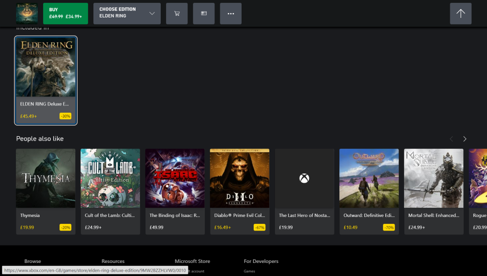

В этом посте из серии про разбор Руководств по доступности веб-контента (Web Content Accessibility Guidelines, коротко WCAG) расскажу про [критерий 2.4.7: видимый фокус](https://www.w3.org/WAI/WCAG22/Understanding/focus-visible.html).

Критерий относится к принципу управляемости и к руководству про доступность с клавиатуры. Во WCAG 2.1 это критерий уровня AA. Во WCAG 2.2 уровень изменится на A.

## Коротко о критерии

У интерфейса, с которым можно взаимодействовать с помощью клавиатуры, должен быть как минимум один способ работы с видимым **индикатором фокуса (focus indicator)**.

## Подробнее

Звучит сложно, но на самом деле всё не так страшно. У интерактивных элементов должны быть видимые стили фокуса, когда пользователь взаимодействует с ними. Например, у кнопок, ссылок или полей форм. Так что, в критерии нет указания на то, что, при взаимодействии с элементами с помощью мыши, фокус тоже должен быть обязательно виден.

Рекомендации по внешнему виду фокуса собраны в [2.4.11: внешний вид фокуса](https://tatiana-fokina-blog.ru/posts/wcag-focus-appearence/). Это новый критерий, который появится во WCAG 2.2. Однако, если фокус совсем незаметный, это считается нарушением критерия про видимый фокус. Например, когда рамка фокуса сливается с фоном кнопки или она тонкая и неконтрастная.

Другие требования к фокусу:

- он не должен исчезать через какое-то время сам по себе;
- стили элементов без фокуса не должны быть похожи на стили фокуса.

Хотя критерий этого не требует, следите за тем, чтобы у неактивных интерактивных элементов не было стилей фокуса. Например, в формах часто нельзя нажать на кнопку пока не заполнишь все нужные поля.

## Кому это важно

- Все пользователи клавиатуры — люди с особенностями моторики, продвинутые пользователи.
- Люди с когнитивными особенностями, у которых небольшой объём кратковременной памяти. Они легко отвлекаются и быстрее забывают на каком элементе остановились.



## Как избежать барьер

За стили фокуса отвечают дизайнеры и разработчики.

Дизайнеры могут проработать в дизайн-системе все состояния интерактивных элементов заранее.

Разработчиком достаточно не отменять стили фокуса по умолчанию:

```css
a:focus {
    outline: 0;
}

button:focus {
    outline: none;
}
```

Если в стилях есть такие строчки про фокус и больше ничего, вы нарушаете критерий про видимость фокуса. Лучше так не делать. Можно вообще не трогать фокус или задать ему другие стили через `outline` или с помощью `border`.

Кроме старого-доброго `:focus` можно использовать `:focus-visible`. Этот псевдокласс задаёт стили только для клавиатурного фокуса. Имейте в виду, что это может запутать пользователей, которые совмещают клавиатуру и мышь. Их может смутить то, что где-то стили фокуса есть, а где-то нет.

## Примеры соответствия критерию

- При фокусе на поле с почтой вокруг него появляется зелёная рамка, которую хорошо видно на белом фоне.
- При фокусе на ссылке её текст становится белым, а фон — тёмно-синим. Ссылку хорошо видно на белом фоне.

На [сайте Xbox](https://www.xbox.com/en-us/) у всех интерактивных элементов есть стили фокуса, хотя они не очень констистентные. В каки-то случаях это жирная пунктирная линия, в каких-то двойная сплошная рамка. Внутри она синяя, снаружи белая.

<figure>
	
	<figcaption>Страница игры Elden Ring на сайте Xbox.</figcaption>
</figure>

## Примеры барьеров

- При фокусе на чёрной кнопке с белым текстом вокруг неё появляется тонкая чёрная рамка. Её трудно увидеть.
- При фокусе на ссылке она никак визуально не изменяется.

На [сайте Pixar](https://www.pixar.com) у всех интерактивных элементов отменены стили фокуса и используется `outline: 0`. Это можно проверить с помощью клавиши <kbd>Tab</kbd> и <kbd><kbd>Tab</kbd> + <kbd>Shift</kbd></kbd>.

На [сайте PlayStation](https://www.playstation.com/en-us/) у элементов есть стили фокуса, но некоторые элементы в неинтерактивном состоянии выглядят как будто они в фокусе. Например, на скриншоте фокус сделан на кнопке «Learn More» («Узнать больше»). Это видно благодаря синей рамке вокруг неё. У ссылки «PS5 Console» точно такая же синяя рамка в неактивном состоянии. Из-за этого трудно понять, где на самом деле сейчас фокус.

<figure>
	
	<figcaption>Главная страница сайта PlayStation.</figcaption>
</figure>

## Как тестировать

Критерий тестируют смешанным способом.

- Найдите все интерактивные элементы с помощью <kbd>Tab или скриптом</kbd>.
- Убедитесь, что у всех элементов есть видимый фокус.

Найти интерактивные элементы на странице можно разными способами. Например, использовать букмарклеты [ANDI](https://www.ssa.gov/accessibility/andi/help/install.html) или [Force Show Keyboard Focus](https://pauljadam.com/bookmarklets/focus.html). Ещё можно написать [свой небольшой скрипт](https://codepen.io/svinkle/pen/WgYRxq) и собирать интерактивные элементы в консоли в браузере.

```js
document.addEventListener('focus', () => {
    console.log(document.activeElement);
}, true);
```

[Букмарклет Скотта О’Хары](https://codepen.io/scottohara/pen/QBwJyw?editors=0010) автоматически проходит через элементы и показывает их стили фокуса.

## Что почитать

- [Success Criterion 2.4.7 Focus Visible](https://www.w3.org/TR/WCAG22/#focus-visible), WCAG 2.2.
- [Understanding Success Criterion 2.4.7: Focus Visible](https://www.w3.org/WAI/WCAG22/Understanding/focus-visible.html), WCAG 2.2.
- [Ensure that focus indicator is visible](https://www.accessguide.io/guide/focus-indicator), Access Guide.
- [Accessibility testing guide. 2.4.7 Focus Visible](https://github.com/alphagov/wcag-primer/wiki/2.4.7), gov.uk.
- [Force Focus Tools](https://www.webaxe.org/force-focus-tools/), Web Axe.
