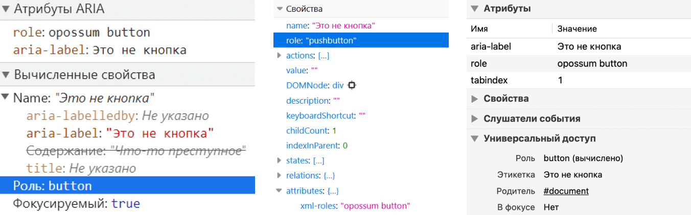
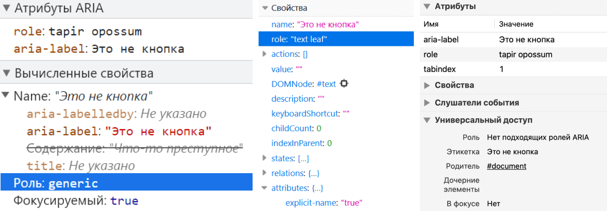

Недавно случайно узнала, что&nbsp;ARIA-атрибут `role` может содержать больше одного значения. И&nbsp;это очень неожиданно, по&nbsp;крайней мере для меня.

Этот пост написала из исследовательского интереса, так&nbsp;что&nbsp;в&nbsp;нём нет большого количества полезных практических советов. А&nbsp;что-то даже лучше не&nbsp;применять на&nbsp;практике.

## Небольшая справка о роли элемента

[Роль](https://www.w3.org/TR/wai-aria-1.1/#dfn-role) содержит информацию о функциях элемента и&nbsp;как с&nbsp;ним можно взаимодействовать. К&nbsp;примеру, о `<button>` скринридер объявит, что&nbsp;это кнопка, а&nbsp;также сможет на&nbsp;неё нажать.

У&nbsp;элементов может быть либо встроенная роль, либо явно заданная в&nbsp;атрибуте `role`.

Есть много [категорий и&nbsp;видов ролей](https://www.w3.org/TR/wai-aria-1.1/#role_definitions), и&nbsp;существуют чёткие правила их явного использования. Например, нельзя менять роли при&nbsp;взаимодействии с&nbsp;элементом или задавать [абстрактные](https://www.w3.org/TR/wai-aria-1.1/#abstract_roles) (`landmark`, `section`, `widget` и&nbsp;другие). Также есть роли, которые предполагают вложенные элементы. Например, в&nbsp;элемент с&nbsp;`role="menu"` должен быть вложен как минимум один с&nbsp;`menuitem`. Однако главное правило&nbsp;— стараться как можно реже явно задавать роли, особенно таким образом переопределять семантику элементов.

## Что там в&nbsp;документации

В&nbsp;WAI-ARIA (Web Accessibility Initiative&nbsp;— Accessible Rich Internet Applications), как в&nbsp;самом очевидном источнике о `role=""`, нет примеров с&nbsp;двумя ролями. И&nbsp;про&nbsp;несколько значений у&nbsp;этого атрибута пришлось поискать.

### WAI-ARIA&nbsp;1.1

В&nbsp;пункте [7.1&nbsp;Role Attribute](https://www.w3.org/TR/wai-aria-1.1/#host_general_role) собраны характеристики атрибута роли, которые нужно учитывать в&nbsp;языках реализации (host languages):

> - Имя атрибута **должно быть** `role`.
> - Значение атрибута **должно** допускать список токенов в&nbsp;качестве значения.
> - Появление имени литерала любой конкретной [роли](https://www.w3.org/TR/wai-aria-1.1/#dfn-role) в&nbsp;качестве одного из токенов **не должно** само по&nbsp;себе делать недопустимым значение атрибута в&nbsp;синтаксисе языка реализации.
> - Первый литерал имени неабстрактной роли в&nbsp;списке токенов в&nbsp;атрибуте `role` определяет роль в&nbsp;соответствии с&nbsp;тем, как User Agent **должен** обрабатывать элемент. То, как User Agent обрабатывает роли, установлено в&nbsp;[Core Accessibility API Mappings](https://www.w3.org/TR/core-aam-1.1/).

Раз WAI-ARIA отсылает нас к&nbsp;другой документации, то давайте почитаем теперь её.

### Core Accessibility API Mappings&nbsp;1.1

Это спецификация для браузеров и&nbsp;любого другого User Agent. В&nbsp;ней описано, как они должны взаимодействовать с&nbsp;Accessibility API.

В&nbsp;пункте [5.4&nbsp;Role mapping](https://www.w3.org/TR/core-aam-1.1/#mapping_role) есть то, что&nbsp;нам нужно:

> Традиционно Accessibility API платформы имеют ограниченный набор заранее установленных [ролей](https://www.w3.org/TR/core-aam-1.1/#dfn-role), которые ожидаются [вспомогательными технологиями](https://www.w3.org/TR/core-aam-1.1/#dfn-assistive-technology) на&nbsp;этой платформе, и&nbsp;предоставлены могут быть только одна или две роли. Напротив, WAI-ARIA позволяет указывать несколько ролей в&nbsp;виде упорядоченного набора валидных токенов ролей, разделённых пробелами. Дополнительные роли&nbsp;— фоллбэк для других ролей, что&nbsp;похоже на&nbsp;концепцию указания нескольких шрифтов на&nbsp;случай, если первый тип шрифта не поддерживается.

В&nbsp;этом пункте собраны и&nbsp;сами правила работы с&nbsp;ролями из&nbsp;WAI-ARIA.

> 1. User Agent **должен** использовать первый токен в&nbsp;их последовательности в&nbsp;значении [атрибута](https://www.w3.org/TR/core-aam-1.1/#dfn-attribute) роли, который соответствует имени любой неабстрактной роли из&nbsp;[таблицы маппинга ролей](https://www.w3.org/TR/core-aam-1.1/#mapping_role_table)… Обратите внимание, что, когда роли из&nbsp;WAI-ARIA перезаписывают семантику языков реализации, то&nbsp;DOM (Document Object Model) не изменяется, только [дерево доступности](https://www.w3.org/TR/core-aam-1.1/#dfn-accessibility-tree).
> 2. User Agent **не должен** мапировать роли, которые определены в&nbsp;спецификации WAI-ARIA как «абстрактные», с&nbsp;помощью стандартного механизма ролей Accessibility API.

### HTML

Давным-давно в&nbsp;[спецификации по&nbsp;HTML](https://html.spec.whatwg.org/multipage/) был пункт 3.2.7.3.1&nbsp;ARIA Role Attribute, который тоже описывал возможность добавлять несколько ролей для&nbsp;элемента:

> Для&nbsp;каждого HTML-элемента можно указать ARIA-атрибут [`role`](https://html.spec.whatwg.org/multipage/infrastructure.html#attr-aria-role). Это атрибут роли из&nbsp;ARIA, который определён в спецификации в&nbsp;[Section 5.4&nbsp;Definition of Roles](https://www.w3.org/TR/wai-aria-1.1/#role_definitions).
> Атрибут, если он задан, должен иметь значение, которое выглядит как&nbsp;набор токенов, разделённых пробелами и представляющих различные роли WAI-ARIA, к&nbsp;которым относится элемент.
> Роль WAI-ARIA, которая назначена для&nbsp;HTML-элемента, первая неабстрактная роль, найденная в&nbsp;списке значений, сгенерированных, когда атрибут [`role`](https://www.w3.org/TR/html51/infrastructure.html#attr-aria-role) разделён пробелами.

Пункта больше нет, но&nbsp;[интернет помнит всё](https://www.tpgi.com/notes-on-use-of-multiple-aria-role-attribute-values/).

### Будущее

В&nbsp;следующих, пока&nbsp;что&nbsp;черновых версиях [WAI-ARIA&nbsp;1.2](https://www.w3.org/TR/wai-aria-1.2/#host_general_role) и&nbsp;[Core Accessibility API Mappings&nbsp;1.2](https://www.w3.org/TR/core-aam-1.2/#mapping_role), нет ничего нового про&nbsp;несколько атрибутов у&nbsp;`role=""`. Единственное, в&nbsp;спецификации для&nbsp;User Agent появилось больше деталей о поддержке ролей разными реализациями Accessibility API.

### Перевод с&nbsp;документационного

Какие выводы можно сделать после путешествия по&nbsp;спецификациям?

- В&nbsp;атрибуте `role` можно указывать несколько значений.
- Несколько значений перечисляется стандартно через пробел.
- Несколько ролей нужны для&nbsp;фоллбэка. Если первая роль не поддерживается или не существует, то применяется вторая и&nbsp;так далее.
- Если это абстрактная роль, то браузер и&nbsp;скринридер её проигнорируют.

## Тестируем

Давайте проверим, что&nbsp;будут делать браузеры и&nbsp;скринридеры с&nbsp;двумя значениями в&nbsp;атрибуте `role`. Поэкспериментируем в&nbsp;Chrome 97, Firefox 96 и&nbsp;Safari 14 с&nbsp;NVDA 2021.2 и&nbsp;десктопным VoiceOver.

Кстати, в&nbsp;[старых браузерах и&nbsp;скринридерах](https://act-rules.github.io/rules/674b10#accessibility-support) это не получится проверить. Они просто игнорируют `role=""` с&nbsp;несколькими значениями. Имейте это в&nbsp;виду.

Разметка, которую буду тестировать, может напугать. Это проверка работы одного атрибута, так&nbsp;что&nbsp;решила хотя бы раз в&nbsp;жизни использовать запрещённые приёмы 😀 В&nbsp; реальных проектах так лучше никогда не делать. Это ужасный антипаттерн.

### Оба значения существуют

```html
<div role="button link" aria-label="Это не кнопка" tabindex="1">Что-то преступное</div>
```

- NVDA и&nbsp;Chrome: «Это не кнопка, кнопка».
- NVDA и&nbsp;Firefox: «Кнопка».
- VoiceOver и&nbsp;Safari: «Это не кнопка».

В&nbsp;Chrome и&nbsp;Safari `<div>` c&nbsp;`role="button link"` получил роль `button`, в&nbsp;Firefox&nbsp;— `pushbutton`.


Вывод: когда два значения валидные, то в&nbsp;дерево попадает самое первое.

### Одно значение существует, другое нет

```html
<div role="opossum button" aria-label="Это не кнопка" tabindex="1">Что-то преступное</div>
```

- NVDA и&nbsp;Chrome: «Это не кнопка, кнопка».
- NVDA и&nbsp;Firefox: «Кнопка».
- VoiceOver и&nbsp;Safari: «Это не кнопка».

В&nbsp;Chrome и&nbsp;Safari `<div>` c&nbsp;`role="opossum button"` получил роль `button`, в&nbsp;Firefox&nbsp;— `pushbutton`.



Вывод: если одно значение невалидное, а&nbsp;второе валидное, то&nbsp;в&nbsp;дерево попадает существующее.

### Одно значение абстрактное, другое нет

```html
<div role="widget button" aria-label="Это не кнопка" tabindex="1">Что-то преступное</div>
```

- NVDA и&nbsp;Chrome: «Это не кнопка, кнопка».
- NVDA и&nbsp;Firefox: «Кнопка».
- VoiceOver и&nbsp;Safari: «Это не кнопка».

В&nbsp;Chrome и&nbsp;Safari `<div>` c&nbsp;`role="widget button"` получил неабстрактную роль `button`, в&nbsp;Firefox&nbsp;— `pushbutton`.


Вывод: когда есть абстрактная роль, то она игнорируется и&nbsp;применяется неабстрактная.

### Обоих значений не существует

```html
<div role="tapir opossum" aria-label="Это не кнопка" tabindex="1">Что-то преступное</div>
```

- NVDA и&nbsp;Chrome: ничего не объявляет.
- NVDA и&nbsp;Firefox: ничего не объявляет.
- VoiceOver и&nbsp;Safari: «Это не кнопка». Объявляет только содержимое атрибута `aria-label`.

В&nbsp;Chrome для&nbsp;`<div>` c&nbsp;`role="tapir opossum"` вычислена роль `generic`, в&nbsp;Firefox&nbsp;— `text leaf`, а&nbsp;в&nbsp;Safari просто не нашлось подходящей роли.

`generic`&nbsp;— это встроенная роль `<div>`. Это значит, что&nbsp;перед нами безымянный элемент-контейнер без&nbsp;семантического значения. А&nbsp;`text leaf` означает какой-то текстовый контент.



Вывод: если оба значения невалидные, то&nbsp;в&nbsp;дерево доступности или попадает встроенная роль элемента, или ничего не вычисляется. Зависит от&nbsp;браузера.

## Финальные мысли

Всё это время WAI-ARIA предусматривала возможность задавать для&nbsp;атрибута `role` больше одного значения, но не особо это афишировала.

Не думаю, что&nbsp;это ужасное упущение в&nbsp;спецификации. Сложно представить, для&nbsp;каких ролей нужны фоллбеки в&nbsp;современных браузерах. К&nbsp;тому же, с&nbsp;атрибутом `role` и&nbsp;так&nbsp;легко запутаться. Когда у&nbsp;тебя есть возможность задать бесконечное количество ролей, то&nbsp;это ещё больше усложняет разметку и&nbsp;может привести к&nbsp;неожиданным ошибкам.

## Что почитать

- [Accessible Rich Internet Applications (WAI-ARIA)&nbsp;1.1](https://www.w3.org/TR/wai-aria-1.1/).
- [Core Accessibility API Mappings&nbsp;1.1](https://www.w3.org/TR/core-aam-1.1/).
- [`role` attribute has valid value](https://act-rules.github.io/rules/674b10), ACT-Rules Community.
- [Notes on use of multiple ARIA role attribute values](https://www.tpgi.com/notes-on-use-of-multiple-aria-role-attribute-values/), Стив Фолкнер.

***

Спасибо [Василию Дудину](https://twitter.com/vasiliy_dudin) за&nbsp;помощь с&nbsp;редактированием.
