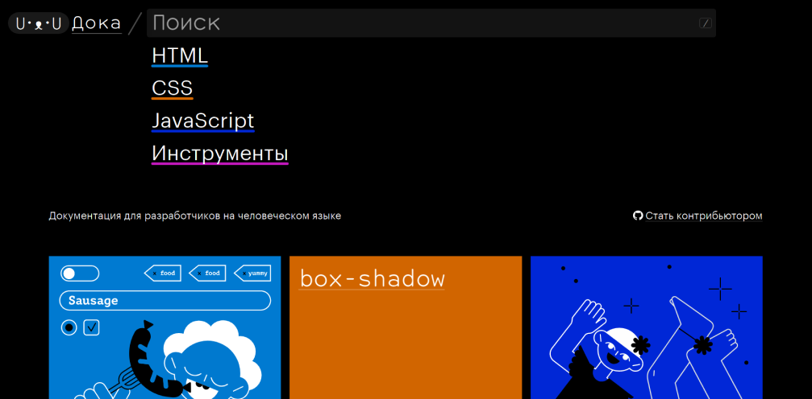
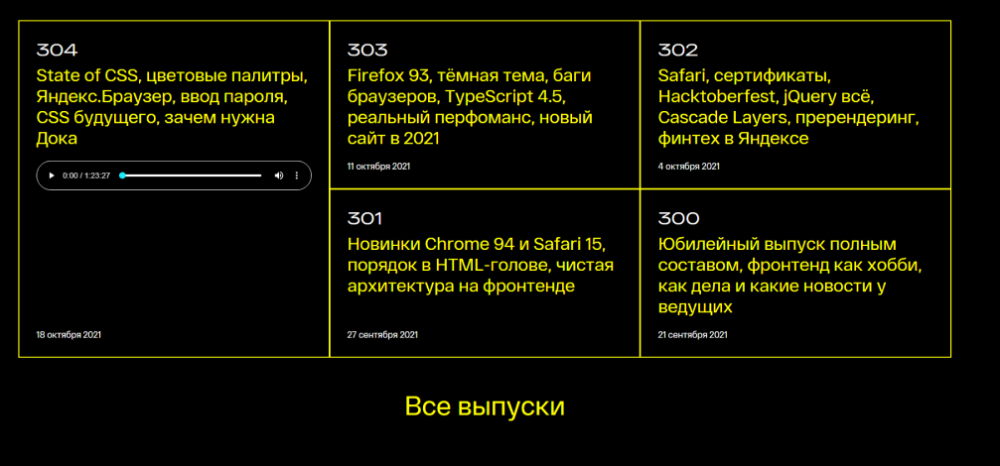
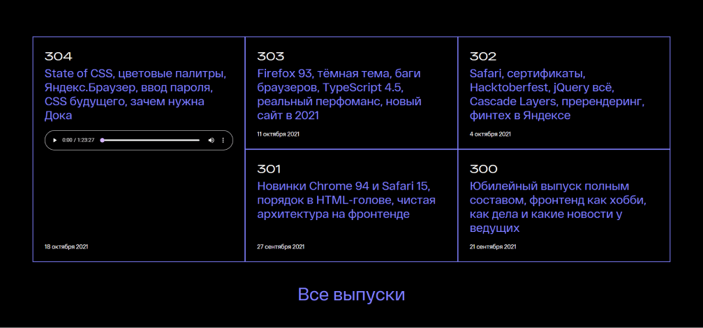
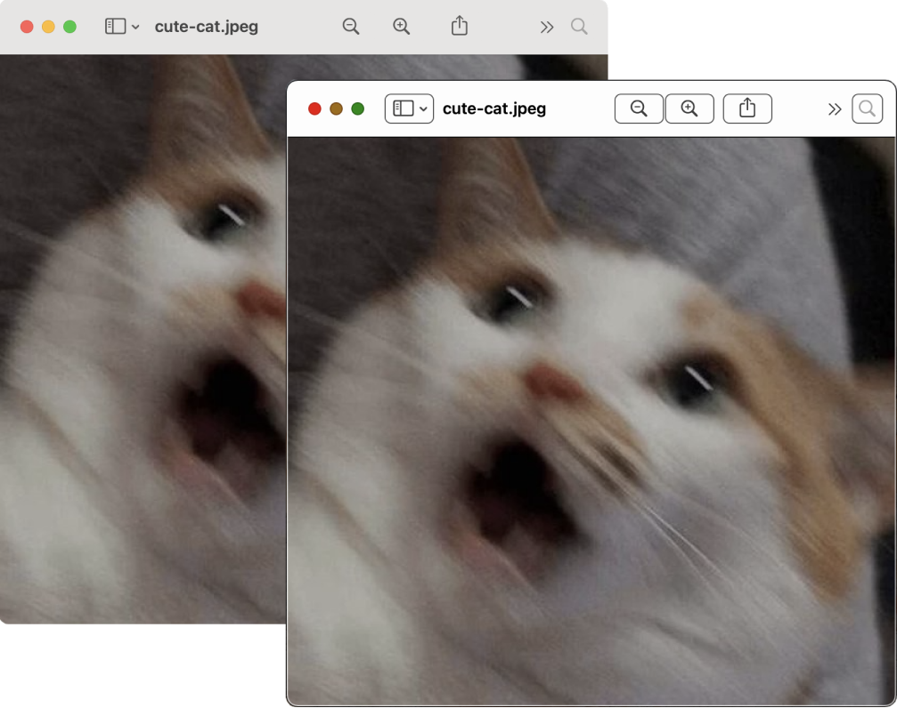
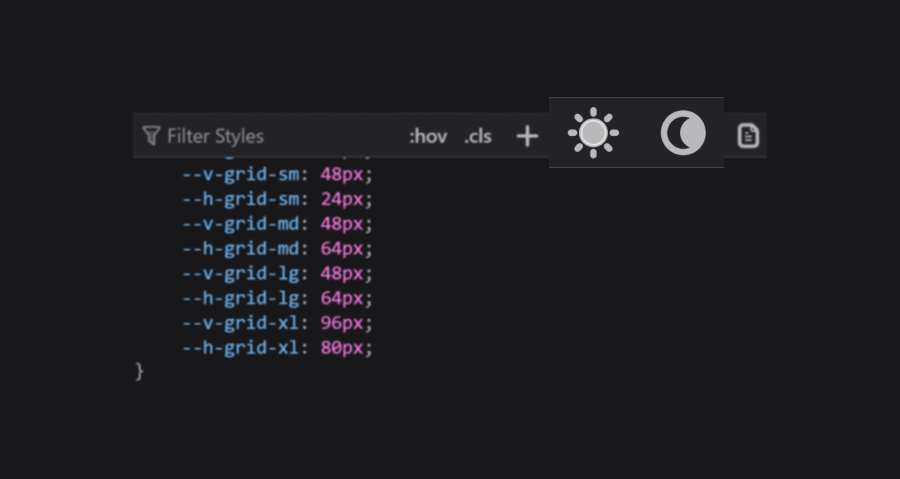
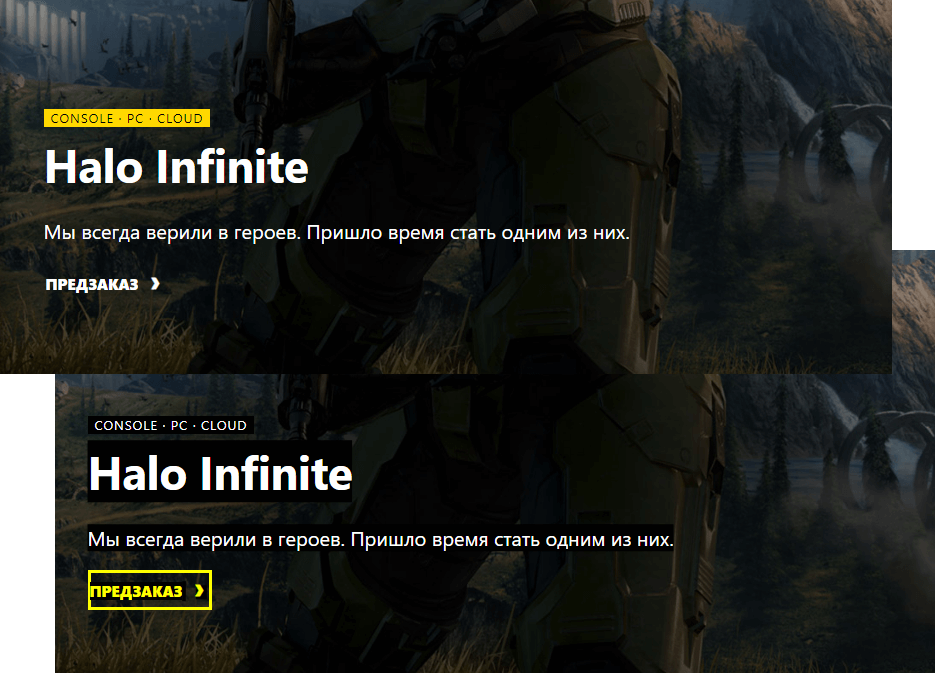

Когда говорят про доступность и CSS, часто имеют в виду свойства, которые влияют на дерево доступности и скринридеры. Но есть ещё один союзник в битве за доступность интерфейсов — медиафичи.

_Медиафича (media feature)_ — это условие для CSS-директивы `@media`. Указывает на определённую характеристику устройства или браузера. К примеру, ориентацию экрана (`orientation`) или режим отображения (`display-mode`).

В этом посте расскажу про несколько медиафич: `prefers-reduced-motion`, `prefers-color-scheme`, `inverted-colors`, `forced-colors`, `ms-high-contrast`, `prefers-contrast` и `prefers-reduced-transparency`. Они отслеживают настройки операционной системы. Настройки изменяют пользователи, которых не устраивает дефолтное поведение системы. К примеру, люди с особыми потребностями и те, кто испытывает дискомфорт из-за дефолтного дизайна.

Так, пользователи с эпилептическими приступами отключают анимацию из-за того, что она может вызвать приступ. А некоторые люди с астигматизмом выбирают тёмную тему и уменьшают контрастность, чтобы не болели глаза.

Учёт пользовательских настроек сделает интерфейс сайта более гибким и персонализированным. Это поможет не только повысить его уровень доступности, но и может повысить конверсию. Всегда приятно пользоваться продуктами, которые учитывают твои предпочтения.

Большинство настроек применяется только к операционной системе. Многие из них, те же анимация и уровень контрастности, не изменяют интерфейсы сайтов. Всё зависит от того, учли ли их разработчики. Как раз здесь помогают медиафичи.

Отслеживать пользовательские настройки можно и с помощью JavaScript, но не хочу раздувать пост ещё больше. Остановлюсь только на возможностях CSS.

## Пользовательские настройки

Давайте сначала разберёмся, какие системные настройки можно учитывать в веб-интерфейсах уже сейчас или в будущем.

### Анимация

Настройки анимации позволяют изменять её скорость или полностью отключить в системе. Не влияют на сайты, если нет специальных стилей.

Этой настройкой пользуются люди с вестибулярными нарушениями, эпилептическими приступами и с когнитивными особенностями. Особенно пользователи с синдромом дефицита внимания.

Настройка есть во всех операционных системах.

### Цветовая схема

Пользователи могут также изменить настройки цветовой схемы и выбрать цвета, которые будут преобладать в системе. Это либо светлые, либо тёмные оттенки. Настройка не влияет на сайты, если на них не поддерживаются цветовые схемы.



Этой настройкой пользуются следующие категории пользователей:

- с особенностями зрения. Например, со сниженным зрением, глазными болями и повышенной светочувствительностью;
- с когнитивными особенностями. К примеру, с синдромом дефицита внимания;
- все остальные из-за эстетических предпочтений, привычки или уровня освещения.

Схемы можно выбрать во всех популярных операционных системах. В macOS и iOS есть дополнительная автоматическая тема. Если она выбрана, то днём применяется светлая тема, а ночью — тёмная.

### Инвертирование цветов

_Режим инвертированных цветов (inverted colors mode)_ заменяет системные цвета на противоположные, как на негативе. Относится к режиму экранных фильтров.

Цвета изменяются не только в системе, но и во вкладках браузера. Так что пользователи могут выбрать этот режим вместо тёмной темы. На скриншоте видно, как работает режим инверсии. Жёлтые оттенки стали синими, зелёный — малиновым, белый — чёрным.

<figure class="article__image">
  
  <figcaption class="article__image-caption">
    Сайт Доки с инверсией в Vivaldi на Windows 10.
  </figcaption>
</figure>

Кто пользуется настройкой:

- люди с особенностями зрения, например, с глаукомой или глазными болями;
- пользователи с мигренями и головными болями;
- Другие пользователи из-за привычек или освещения.

Настройка есть в большинстве операционных систем. На iOS даже два вида инверсии — «Смарт-инверсия» (Smart Invert) и «Классическая инверсия» (Classic Invert). В режиме умной инверсии картинки и видео не инвертируются. В классическом инвертируется весь контент.

### Цветовой режим

_Режим принудительных цветов (forced colors mode)_ ограничивает количество цветов, чтобы повысить читаемость текста за счёт изменения контраста текста и фона. В основном используются цвета с высоким контрастом. Этот режим изменяет цвета и в системе, и на сайтах.

Кто пользуется настройкой:

- пользователи с особенностями зрения;
- люди с мигренями и головными болями;
- люди со светочувствительной эпилепсией;
- пользователи, которым нужно уменьшить визуальный шум для концентрации внимания.

Пока цветовой режим можно выбрать только в Windows. В Windows 10 и более ранних версиях это _режим высокой контрастности (Windows High Contrast Mode, коротко WHCM)_. В Windows 11 — _контрастные темы (Contrast Themes)_.

В режиме высокой контрастности есть несколько готовых наборов цветов:

- чёрный режим высокой контрастности (High Contrast Black);
- белый режим высокой контрастности (High Contrast White);
- высокая контрастность 1 и 2.

Технология замены цветовой палитры зависит от браузера. Она отличается в браузерах на Chromium, Firefox (движок Quantum), Internet Explorer (Trident) и в старых версиях Edge (EdgeHTML). К примеру, в Vivaldi (Chromium) белый фон сайта стал чёрным, серые ссылки и границы — ярко-жёлтыми, а обычный текст — белым вместо тёмно-серого.

<figure class="article__image">
  
  <figcaption class="article__image-caption">
    «Веб-стандарты» с чёрным режимом высокой контрастности в Vivaldi на Windows 10.
  </figcaption>
</figure>

В Firefox цвет изначально белого фон останется таким же, серые ссылки и границы — ярко-синими, а обычный текст — чёрный вместо тёмно-серого.

<figure class="article__image">
  
  <figcaption class="article__image-caption">
    Своеобразное отображение чёрного режима высокой контрастности в Firefox на Windows 10.
  </figcaption>
</figure>

Можно изменить поведение в Firefox по умолчанию. Настройка находится в разделе с настройками языка и внешнего вида (Language and Appearence) и конкретно в подразделе «Цвета» (Colors). Откройте модальное окно кнопкой «Управлять цветами…» (Manage Colors…) и выберите чекбокс «Использовать системные цвета» (Use system colors).

В Windows 11 набор контрастных тем изменился. Появились «Водная» (Aquatic), «Пустыня» (Desert), «Сумерки» (Dusk) и «Ночное небо» (Night sky).

<figure class="article__image">
  
  <figcaption class="article__image-caption">
    «Веб-стандарты» с режимом ночного неба в Vivaldi на Windows 11.
  </figcaption>
</figure>

Если не подходят готовые темы, то можно настроить их самостоятельно. В том числе уменьшить контрастность.

### Контрастность

Пользователи могут отдельно повысить или понизить уровень контрастности в системе без изменения яркости экрана.

Этой настройкой пользуются пользователи:

- с особенностями зрения, например, с глаукомой;
- с мигренями и головными болями;
- со старыми или некачественными дисплеями;
- другие, кому не хватает уровня контрастности из-за освещения.

В macOS и iOS есть _режим повышенной контрастности (increased contrast mode)_. Он увеличивает разницу между оттенками серого и делает границы элементов чётче.

Повышение контрастности влияет на внешний вид системы и веб-интерфейсов. В отличие от системных окон, на сайтах изменяется только уровень контрастности. Посмотрим на то, что станет с модальным окном в macOS в обычным режимом и в режиме повышенной контрастности. В обоих окнах открыта картинка с кричащим котом, которая называется «cute-cat.jpeg». У первого окна нет рамки, а фон панели управления с кнопками и дополнительными настройками — светло-серый. Второе окно внешне отличается от первого. У него появилась чёрная рамка, фон панели управления стал белым, а у всех кнопок и других элементов в панели появились отдельные чёрные рамки.

<figure class="article__image">
  
  <figcaption class="article__image-caption">
    Как ни странно, всё стало более контрастным.
  </figcaption>
</figure>

### Прозрачность

Пользователи могут включить или выключить прозрачность фона (transparency). Непрозрачный фон часто выбирают те, кто повышает контрастность.

Прозрачный фон может увеличить когнитивную нагрузку и уменьшить читаемость текста. Поэтому этой настройкой пользуются:

- люди с особенностями зрения. Например, с астигматизмом или сниженным зрением;
- пользователи с когнитивными особенностями. К примеру, люди с дислексией или синдром дефицита внимания;
- люди с мигренями и головными болями.

Прозрачность точно настраивается в Windows и на macOS. Эти настройки не только влияют на прозрачность в интерфейсе системы, но и на сайты с браузерами. К примеру, на этом скриншоте фон навигации первого окна полупрозрачный, а у второго — непрозрачный и однотонный.

<figure class="article__image">
  
  <figcaption class="article__image-caption">
    Так выглядит отключенная прозрачность в Windows 11.
  </figcaption>
</figure>

## Пара слов про медиатипы

У директивы `@media` есть несколько медиатипов. Они описывают устройство, на котором отображается документ.

- `all`. Все устройства. Задаётся автоматически, если не указать другой тип.
- `screen`. Устройства с экранами. Например, телефоны и ноутбуки.
- `print`. Устройства с предварительным предпросмотром и функциями печати. Те же принтеры.
- `speech`. Устройства с синтезом речи. К примеру, скринридеры и голосовые помощники.

Медиатип `speech` может быть интересен с точки зрения доступности. Пока что он не поддерживается браузерами. Раньше поддерживался браузером Opera на движке Presto, но перестал после перехода на Blink.

В будущем может пригодиться для специальных стилей для скринридеров. Например, чтобы применить к нужным элементам [CSS-свойства для устройств с синтезом речи](https://drafts.csswg.org/css-speech-1/).

## Медиафичи

А вот теперь переходим к медиафичам, которые помогут сделать веб-интерфейсы доступнее.

Часть из них пока не так хорошо поддерживается браузерами. Что-то может измениться в будущем с развитием CSS. В любом случае про них полезно знать.

### prefers-reduced-motion

Отслеживает, выбраны ли настройки анимации для уменьшения её интенсивности. Пригодится для любой анимации на сайте. Анимацию можно замедлить или полностью отключить.

Значения `prefers-reduced-motion`:

- `no-preference`, настройки анимации по умолчанию.
- `reduce`, изменённые настройки анимации.

У [`prefers-reduced-motion` хорошая поддержка браузерам](https://caniuse.com/prefers-reduced-motion) — 97 % (в 2024).

В этом примере полностью отключаю анимацию через `animation: none`.

```css
@media (prefers-reduced-motion: reduce) {
  .danger-animation {
    animation: none;
  }
}
```

Другой пример. На сайте используется `scroll-behavior` для плавной прокрутки к блокам. Если на странице много контента, то от такой анимации может укачать. В этом случае можно анимировать прокрутку, когда в системе анимация не настроена.

```css
@media (prefers-reduced-motion: no-preference) {
  html {
    scroll-behavior: smooth;
  }
}
```

Параллакс часто вызывает у пользователей чувство тошноты и головокружение. Чтобы никому не было плохо от картинки с `position: sticky`, можно заменить значение свойства на `relative`.

```css
.parallax-scrolling-image {
  position: sticky;
}

@media (prefers-reduced-motion: reduce) {
  .parallax-scrolling-image {
    position: relative;
  }
}
```

Анимация может быть и важной частью сайта. Поэтому лучше отталкиваться от контента. Всегда можно замедлить анимацию так, чтобы она не была опасна для пользователей или не отвлекала их.

Про эту мадиафичу и требования к анимации подробнее писала в [посте про доступность для людей с вестибулярными нарушениями и эпилептическими приступами](/ru/articles/how-to-protect-users-with-epilepsy-and-vd/).

#### Тестируем prefers-reduced-motion

В Chrome и других браузерах на Chromium можете быстро протестировать отключение анимации в инструменте разработчика. Нажмите на кнопку с тремя точками «Настройка и управление инструментом разработчика» (Customize and control DevTools), потом разверните «Другие инструменты» (More tools) и откройте раздел «Отрисовка» (Rendering). Наконец, выберите опцию «Эмулировать медиафункцию CSS `prefers-reduced-motion`» (Emulate CSS media feature `prefers-color-scheme`).

Firefox не даёт эмулировать `prefers-color-scheme` через свой инспектор, но есть обходной путь. Введите в поисковой строке браузера `about:config`, через поиск найдите `ui.prefersReducedMotion` и установите для настройки `1`. Она полностью отключит анимацию. Значение `0`, наоборот, вернёт вас к обычному показу воспроизведению.

А так вручную изменяются настройки анимации в операционных системах.

**Windows 11**: <samp>Настройки (Settings)</samp> → <samp>Персонализация (Personalization)</samp> → <samp>Визуальные эффекты (Visual effects)</samp> → <samp>Эффекты анимации (Animation effects)</samp>.

**MacOS**: <samp>Системные настройки (System Preferences)</samp> → <samp>Универсальный доступ (Accessibility)</samp> → <samp>Монитор (Display)</samp> → <samp>Уменьшить движение (Reduce Motion)</samp>.

**iOS**: <samp>Настройки (Settings)</samp> → <samp>Универсальный доступ (Accessibility)</samp> → <samp>Движение (Motion)</samp> → <samp>Уменьшение движения (Reduce Motion)</samp>.

**Android**: <samp>Настройки (Settings)</samp> → <samp>Специальные возможности (Accessibility)</samp> → <samp>Экран (Display)</samp> → <samp>Удалить анимации (Remove animations)</samp>.

### prefers-color-scheme

Определяет выбранную цветовую схему.



Значения `prefers-color-scheme`:

- `light`, для светлой схемы.
- `dark`, для тёмной схемы.

У [`prefers-color-scheme` высокая глобальная поддержка](https://caniuse.com/prefers-color-scheme) — 96 % (на момент второй половины 2024).

Разработчики могут управлять всеми стилями при работе с тёмными темами сайта. Особенно важно обратить внимание на цвета фонов, текстов,интерактивных элементов в разных состояниях, иконок и изображений, а также других декоративных элементов.

Например, картинки в тёмной теме можно сделать не такими контрастными с помощью `filter`, а ещё поменять значения `background-color` и `color`. В примере использую чистый чёрный и белый для читаемости кода. В реальном мире лучше избегать настолько контрастных цветов. Белый текст на чёрном фоне обычно трудно читать большому количеству пользователей.

```css
.body {
  color: black;
  background-color: white;
}

@media (prefers-color-scheme: dark) {
  .body {
    color: white;
    background-color: black;
  }

  .image {
    filter: brightness(.8) contrast(1.2);
  }
}
```

#### Тестирование prefers-color-scheme

В браузерах на Chromium включить эмуляцию `prefers-color-scheme` можно через инструмент разработчика. Нажмите на кнопку с тремя точками «Настройка и управление инструментом разработчика» (Customize and control DevTools), нажмите на пункт «Другие инструменты» (More tools) и перейдите в раздел «Отрисовка» (Rendering). Там включите опцию «Эмулировать медиафункцию CSS `prefers-color-scheme`» (Emulate CSS media feature `prefers-color-scheme`).

В Firefox темы находятся в первой вкладке с инспектором. Переключатели расположены над стилями. Переключатель с иконкой луны включает имитацию тёмной схемы, с солнцем — имитацию светлой.

<figure class="article__image">
  
  <figcaption class="article__image-caption">
    Вкладка «Инспектор» в Firefox.
  </figcaption>
</figure>

В Safari эмуляция тёмной схемы включается в веб-инспекторе во вкладке «Элементы» (Elements). Переключатель называется «Force Dark Appearance» и находится в панели под всеми вкладками.

<figure class="article__image">
  
  <figcaption class="article__image-caption">
    Вкладка с элементами в веб-инспекторе Safari.
  </figcaption>
</figure>

Можно переключить схему вручную.

**Windows 11**: <samp>Настройки (Settings)</samp> → <samp>Персонализация (Personalization)</samp> → <samp>Цвета (Colors)</samp> → <samp>«Тёмный»</samp> в пункте про режим приложения.

**macOS**: <samp>Системные настройки (System Preferences)</samp> → <samp>Основные (General)</samp> → <samp>«Тёмное»</samp> или <samp>«Автоматически»</samp> в разделе про оформление (Appearance).

**iOS**: <samp>Настройки (Settings)</samp> → <samp>Экран и яркость (Display and Brightness)</samp> → <samp>«Тёмное» (Dark)</samp> в пункте про оформление (Appearance).

**Android**: <samp>Настройки (Settings)</samp> → <samp>Экран (Display)</samp> → <samp>Тёмная тема (Dark Theme)</samp>.

### inverted-colors

Отслеживает режим инвертированных цветов.

Значения `inverted-colors`:

- `none`, режим не выбран, в системе отображаются цвета по умолчанию.
- `inverted`, режим инвертированных цветов выбран.

[Глобальная поддержка `inverted-colors`](https://caniuse.com/mdn-css_at-rules_media_inverted-colors) — 18 % (вторая половина 2024). Пока поддерживается только в Safari.

Для режима инвертированных цветов обычно не требуются дополнительные стили, кроме отмены инвертирования видео и картинок. Это можно сделать при помощи `filter`.

```css
@media (inverted-colors: inverted) {
  img,
  video {
    filter: invert(100%);
  }
}
```

#### Тестируем inverted-colors

Протестировать стили для режима инвертирования можно только вручную.

**macOS**: <samp>Системные настройки (System Preferences)</samp> → <samp>Универсальный доступ (Accessibility)</samp> → <samp>Монитор (Display)</samp> → <samp>Инвертировать цвета (Invert colors)</samp>.

**iOS**: <samp>Настройки (Settings)</samp> → <samp>Универсальный доступ (Accessibility)</samp> → <samp>Дисплей и размер текста (Display & Text Size)</samp> → <samp>«Смарт-инверсия» (Smart Invert)</samp> или <samp>«Классическая инверсия» (Classic Invert)</samp>.

### forced-colors

Отслеживает режим принудительных цветов. Например, режим высокой контрастности в Windows. Хорошо сочетается с другой медиафичей `prefers-color-scheme`.

Значения `forced-colors`:

- `none`, режим принудительных цветов не выбран. Цветовая палитра не ограничена.
- `active`, режим принудительных цветов включён.

[Поддержка `forced-colors`](https://caniuse.com/mdn-css_at-rules_media_forced-colors) довольно высокая — 93 % (вторая половина 2024). Так что используйте её вместо устаревшей `ms-high-contrast` в новых версиях Edge.

Когда браузер узнаёт о выборе режима принудительных цветов, то ограничивает цветовую палитру до небольшого набора цветов. Какие-то значения вообще отменяет.

У следующих свойств статические цвета (заданные разработчиками) заменяются на динамические (системные):

- `color`;
- `background-color`;
- `border-color`;
- `outline-color`;
- `column-rule-color`;
- `text-decoration-color`;
- `text-emphasis-color`;
- `webkit-tap-highlight-color`;
- `fill`;
- `stroke`;
- `flood-color`;
- `stop-color`;
- `lighting-color`.

А для этих свойств принудительно задаются другие значения:

- `color-scheme` — `light dark`;
- `background-image` без `url` получает значение `none`, если это интерактивный элемент. Исключение — кнопки в Internet Explorer и легаси-версии Edge;
- `box-shadow` — `none`;
- `text-shadow` — `none`;
- `scrollbar-color` — `auto`.

В случае высококонтрастного режима лучше отключить внутреннего дизайнера. Он нужен людям не ради эстетики, а для повышения читаемости контента. Так что медиафичу стоит использовать с умом и только тогда, когда это действительно нужно. В основном браузер сам справляется с этой задачей.

Главное правило для работы со стилями в этом режиме — вместо статических цветов используйте динамические. Их можно задать при помощи специальных [ключевых слов для системных цветов](https://www.w3.org/TR/css-color-3/#css-system) (CSS system color keywords). Например, `Window` для фона окна, `ButtonText` для цвета текста кнопок и `WindowText` для цвета текста. Так мы дадим системе знать, на какой цвет нужно заменить наш статический.

Другая важная особенность режима в том, что браузеры принимают решение о применении системных стилей на основе семантики элементов. Когда на сайте дивная вёрстка, то браузер будет применять ко всем элементам стили обычного текста. Это касается и элементов с ARIA-ролями. Например, `<div role="link">` не настоящая ссылка, поэтому к элементу не применятся системные цвета текста ссылок.

Если поверх картинки размещён текст, то под ним появится чёрная подложка (backplate). Её стилями управлять нельзя. На первом скриншоте оригинальный интерфейс сайта Xbox в Vivaldi на Windows 10. На втором он в режиме чёрной высокой контрастности. Под текстом появилась чёрная подложка.

<figure class="article__image">
  
  <figcaption class="article__image-caption">
   Сайт Xbox без и с режимом чёрной высокой контрастности. Кусочек Мастера Чифа передаёт привет.
  </figcaption>
</figure>

Если с семантикой всё в порядке и хочется оптимизировать сайт под режим высокой контрастности, то внимание надо обратить всего на несколько моментов. Это SVG, картинки с прозрачным фоном, чекбоксы и радиокнопки, а также элементы с `box-shadow`. Их чаще всего надо дотюнивать.

На картинке собрала с разных сайтов элементы, с которыми могут возникнуть трудности у пользователей режима высокой контрастности. Кнопки и ссылки с SVG-иконками сливаются с фоном или становятся менее контрастными. Чёрный логотип или тёмная картинка с прозрачным фоном тоже могут слиться с фоном. В случае чекбокса или радиокнопки непонятно, выбраны они или нет.

У нарисованного человека на картинке слились с чёрным фоном волосы. Иконки остались синих, серых и красных цветов и выглядят неконтрастно на фоне чёрного. Чёрный кружок из переключателя и чёрные буквы из логотипа Яндекс тоже слились с фоном. Чёрная иконка с крестиком для открытия меню пропала на фоне того же цвета.

<figure class="article__image">
  
  <figcaption class="article__image-caption">
    Главная Доки, футер «Веб-стандартов», переключатель темы на Reddit, меню Instagram, кнопка с иконкой для раскрытия меню на сайте Zara, поиск Яндекса.
  </figcaption>
</figure>

В этом примере улучшила кнопки с иконками в режиме высокой контрастности с помощью ключевого слова `buttonText`. Так они получат системный цвет текста кнопки.

```css
@media (forced-colors: active) {
  .button__svg {
    fill: buttonText;
  }
}
```

Проверить то, как это работает в Windows, можно в [демо с кнопкой c инлайновым SVG](https://codepen.io/tatiana-fokina/pen/VwzmRVP).

Например, так задаём для индикатора фокуса стили и в `box-shadow`, и в `outline`.

```css
.button {
  border: 1px solid transparent;
}

.button:focus {
  box-shadow: 0 0 4px 1px darkslateblue;
  outline: 2px solid transparent;
}
```

В режиме высокой контрастности свойства `outline` применятся вместо отменённых системой `box-shadow`. В обычном режиме будет виден только `box-shadow`.

Для однотонных SVG-иконок лучше использовать ключевое слово `currentColor` для `fill` и `stroke`. Так они будут наследовать системный цвет родителя.

Представим, что у нас есть ссылка с инлайновой SVG-иконкой. В обычном режиме цвет ссылки — `indigo`, в режиме высокой контрастности переопределится системой. SVG с классом `.link__svg` тоже наследует тот же цвет в обычном режиме, а в режиме повышенной контрастности — системный.

```css
.link {
  color: indigo;
}

.link__svg {
  fill: currentColor;
}
```

Возьмём для примера [демо со ссылкой на Twitter](https://codepen.io/tatiana-fokina/pen/GRvNzbZ). Если включим чёрный режим высокой контрастности, то текст ссылки и иконка станут системного жёлтого цвета.

#### Баг с SVG

В старых версиях браузеров на Chromuim [SVG-иконки могут не перекрашиваться](https://bugs.chromium.org/p/chromium/issues/detail?id=1164162). Это случилось из-за изменений в CSS-спецификации.

Если ну очень хочется это исправить, используйте временный хак со свойством `forced-color-adjust: auto` у SVG. В этом случае дочерний элемент унаследует цвет родительского при включении режима высокой контрастности.

```css
.link {
  color: indigo;
}

.link__svg {
  fill: currentColor;
  /* Фикс для режима высокой контрастности */
  forced-color-adjust: auto;
}
```

Проверить, как работает хак, можно в [демке с фиксом со ссылкой на Twitter](https://codepen.io/tatiana-fokina/pen/dyzOrQO).

Другой способ справиться с багом — `forced-color-adjust: preserve-parent-color`. В этом случае элемент наследует значение родителя, если не используются другие способы. Например, `inherit` или `currentColor`. В обычном режиме ведёт себя как значение `none`.

Также можно вообще отменить замену статических цветов на динамические благодаря `forced-color-adjust: none`. В большинстве случаев его лучше не использовать. Пригодится только если важно сохранить цвета. Хороший пример —  [палитры цветов](https://codepen.io/somelaniesaid/pen/eYZEorP).

#### Тестирование forced-colors

В браузерах на Chromium откройте инструмент разработчика. Найдите кнопку с тремя точками «Настройка и управление инструментом разработчика» (Customize and control DevTools), разверните дропдаун «Другие инструменты» (More tools) и перейдите в пункт «Отрисовка» (Rendering). После включите опцию «Эмулировать медиафункцию CSS `forced-colors`» (Emulate CSS media feature `forced-colors`).

Firefox не даёт эмулировать `forced-colors` через свой инспектор, но есть обходной путь. Введите в поисковой строке браузера `about:config`, через поиск найдите `ui.forcedColors` и установите для настройки значение `true` или `1`. Потом не забудьте вернуть всё обратно.

Включить режим принудительных цветов можно и руками.

**Windows 11**: <samp>Настройки (Settings)</samp> → <samp>Персонализация (Personalization)</samp> → <samp>Цвета (Colors)</samp> → <samp>Контрастные темы (Contrast themes)</samp>.

### ms-high-contrast (легаси)

Отслеживает, выбрал ли пользователь режим высокой контрастности. Соответствуют высококонтрастным темам в Windows до 11 версии.

Медиафича нестандартная и уже устарела. Вместо неё лучше использовать более современный аналог `forced-colors`. Может понадобиться, когда нужно поддерживать Internet Explorer и Edge 18 версии и ниже.

Доступные значения:

- `black-on-white`, для режима с чёрным текстом на белом фоне.
- `white-on-black`, для режима с белым текстом на чёрном фоне.
- `active`, для всех остальных комбинаций цветов.

При работе со стилями учитывать всё то же, что и для `forced-colors`.

Единственная особенность — медиафича убирает `background-image` у интерактивных элементов. Так можно изменить это поведение:

```css
@media (-ms-high-contrast: black-on-white) {
  .interactive-element {
    background-image: url("bg-image.png");
  }
}
```

### prefers-contrast

Определяет выбор настроек, которые уменьшают или увеличивают разницу в контрастности между цветами.

Пока `prefers-contrast` не обязательно отслеживает высокий уровень контрастности, как в режиме высокой контрастности. Но стоит иметь в виду, что в будущем медиафича может быть теснее с ним связана.

У `prefers-contrast` могут быть такие значения:

- `no-preference`, настройки не выбраны.
- `more`, контрастность увеличена.
- `less`, контрастности понижена.
- `custom`, в системе выбран режим принудительных цветов. Например, режим высокой контрастности Windows.

[Глобальная поддержка `prefers-contrast`](https://caniuse.com/mdn-css_at-rules_media_prefers-contrast) достаточно высокая — 93 % (вторая половина 2024).

При учёте этого режима можно добавлять любые стили, которые улучшат пользовательский опыт.

В этом примере изменяем `border` у элемента, чтобы стили были видны при высокой контрастности.

```css
.image {
  border: 3px dashed lightpink;
}

/* Стили для повышенной контрастности */
@media (prefers-contrast: more) {
  .image {
    border: 3px solid black;
  }
}
```

А здесь все медиавыражения определяют режим высокой контрастности.

```css
@media (forced-colors: active) {
  /* Ваши стили */
}

@media (prefers-contrast: forced) {
  /* Ваши стили */
}

@media (prefers-contrast: custom) {
  /* Ваши стили */
}
```

Посмотреть на `forced-colors` в действии можно уже сейчас в Safari в [демке c милой выдрой](https://codepen.io/tatiana-fokina/pen/rNzjBXZ).

#### Тестирование prefers-contrast

Теперь можете быстро эмулировать `prefers-contrast` в браузерах на Chromium. Откройте инструмент разработчика и найдите кнопку с тремя точками «Настройка и управление инструментом разработчика» (Customize and control DevTools). Потом разверните дропдаун «Другие инструменты» (More tools) и перейдите в пункт «Отрисовка» (Rendering). После включите опцию «Эмулировать медиафункцию CSS `prefers-contrast`» (Emulate CSS media feature `prefers-contrast`).

Firefox не даёт эмулировать `prefers-contrast` в инспекторе, но есть альтернатива. Введите в браузерной поисковой строке `about:config` и найдите через поиск настройку `ui.prefersСontrast`. Теперь установите для неё значение `true` или `1`, только не забудьте после вернуть всё обратно.

Протестировать медиафичу в системах можете через настройку увеличения контрастности.

**macOS**: <samp>Системные настройки (System Preferences)</samp> → <samp>Универсальный доступ (Accessibility)</samp> → <samp>Монитор (Display)</samp> → <samp>Увеличить контрастность (Increase Contrast)</samp>.

**iOS**: <samp>Настройки (Settings)</samp> → <samp>Универсальный доступ (Accessibility)</samp> → <samp>Дисплей и размер текста (Display & Text Size)</samp> → <samp>Увеличение контраста (Increase Contrast)</samp>.

### prefers-reduced-transparency

Отслеживает отключение или уменьшение прозрачности в системе.

Значения `prefers-reduced-transparency`:

- `no-preference`, пользователь не изменял настройки прозрачности.
- `reduce`, прозрачность уменьшена или отключена.

Сейчас [браузеры неплохо поддерживают `prefers-reduced-transparency`](https://caniuse.com/?search=prefers-reduced-transparency) — 71 % (вторая половина 2024).

Например, так можете отменить `opacity` у элементов с прозрачным фоном:

```css
.transparency-bg {
  opacity: 0.5;
}

@media (prefers-reduced-transparency: reduce) {
  .transparency-bg {
    opacity: 1;
  }
}
```

#### Тестируем prefers-reduced-transparency

Быстро эмулировать настройку можете в инструменте разработчика в браузерах на Chromium. Найдите в верхней панели кнопку с тремя точками «Настройка и управление инструментом разработчика» (Customize and control DevTools). Разверните дропдаун «Другие инструменты» (More tools) и перейдите в пункт «Отрисовка» (Rendering). После включите опцию «Эмулировать медиафункцию CSS `prefers-reduced-transparency`» (Emulate CSS media feature `prefers-reduced-transparency`).

Firefox не даёт эмулировать `prefers-reduced-transparency` напрямую через инспектор, но есть альтернатива. Введите в браузерной поисковой строке `about:config` и найдите через поиск настройку `ui.prefersReducedTransparency`. Установите для неё значение `true` или `1`, но потом не забудьте вернуть всё обратно.

**Windows 11**: <samp>Настройки (Settings)</samp> → <samp>Персонализация (Personalization)</samp> → <samp>Цвета (Colors)</samp> → <samp>Эффекты прозрачности (Transparency effects)</samp>.

**macOS**: <samp>Системные настройки (System Preferences)</samp> → <samp>Универсальный доступ (Accessibility)</samp> → <samp>Экран (Display)</samp> → <samp>Уменьшить прозрачность (Reduce transparency)</samp>.

**iOS**: <samp>Настройки (Settings)</samp> → <samp>Универсальный доступ (Accessibility)</samp> → <samp>Экран и размер текста (Display & Text Size)</samp> → <samp>Уменьшить прозрачность (Reduce transparency)</samp>.

## О чём не рассказала

В этом посте не разобрала только одну медиафичу для пользовательских настроек — `prefers-reduced-data`. Она отслеживает то, какой объём получения данных выбрал пользователь. Хотя она связана с перфомансом, но тоже пригодится для доступности. Подробнее в «[Creating websites with `prefers-reduced-data`](https://polypane.app/blog/creating-websites-with-prefers-reduced-data/)».

## Что почитать

- [Media Queries Level 5](https://www.w3.org/TR/mediaqueries-5/)
- [Operating System and Browser Accessibility Display Modes](https://www.a11yproject.com/posts/operating-system-and-browser-accessibility-display-modes/)
- [thoughtbot.com, dark mode, and other user preferences](https://ericwbailey.design/writing/thoughtbot-com-dark-mode-and-other-user-preferences/)
- [Respecting Users’ Motion Preferences](https://www.smashingmagazine.com/2021/10/respecting-users-motion-preferences/)
- [Creating Accessible UI Animations](https://www.smashingmagazine.com/2023/11/creating-accessible-ui-animations/)
- [`prefers-reduced-motion`](https://doka.guide/a11y/prefers-reduced-motion/) (Дока)
- [A Complete Guide to Dark Mode on the Web](https://css-tricks.com/a-complete-guide-to-dark-mode-on-the-web/)
- [`prefers-color-scheme`](https://doka.guide/css/prefers-color-scheme/) (Дока)
- [I no longer understand `prefers-contrast`](https://kilianvalkhof.com/2023/css-html/i-no-longer-understand-prefers-contrast/)
- [Styling for Windows high contrast with new standards for forced colors](https://blogs.windows.com/msedgedev/2020/09/17/styling-for-windows-high-contrast-with-new-standards-for-forced-colors/)
- [CurrentColor SVG in forced colors modes](https://melanie-richards.com/blog/currentcolor-svg-hcm/)
- [`prefers-reduced-transparency`](https://doka.guide/a11y/prefers-reduced-transparency/) (Дока)
- [`forced-colors`](https://doka.guide/a11y/forced-colors/) (Дока)

***

И снова спасибо [Василию Дудину](https://twitter.com/vasiliy_dudin) за помощь с редактированием.
