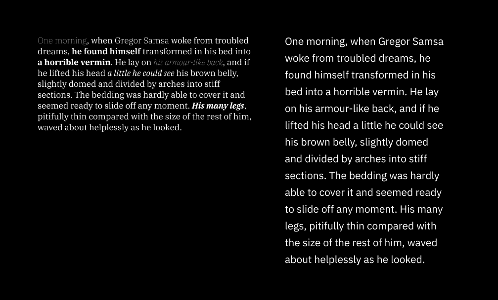

Мне нравится Pocket. Нет, не так: я ОБОЖАЮ Pocket. Так храню в одном месте кучу статей и постов, которые планирую читать. Иногда текстов накапливается слишком много, и из-за этого желание читать пропадает, но это уже не проблема сервиса.

Pocket — сервис для хранения веб-закладок. Туда складываете страницы, которые постоянно храните открытыми в браузере (да-да, говорю про тебя).

Другая причина, почему удобно пользоваться Pocket, — консистентный опыт. Я имею дело только с шрифтом одного типа и размера, а ещё с одинаковой шириной колонок и цветовой темой. Другой плюс — нет отвлекающей графики, анимации и других дизайнерских и не только решений. В премиум-аккаунте ещё больше настроек.

Мне нравится и мобильный Pocket. Приложение работает и в офлайн-режиме. Нужно только заранее синхронизировать накопленное.

В этом посте поделюсь **личным опытом** и барьером с доступностью, с которым неожиданно для себя столкнулась. Как всегда делите мнение на два. Опыт людей с астигматизмом отличается. Конечно же не обвиняю команду, которая разработала одно из любимых веб-сервисов и приложений.

## Персональный барьер

Несколько месяцев назад открыла мобильный Pocket и заметила, что по умолчанию стоит тёмная тема. Это странно: я же включаю режим с сепией везде, где можно. Я проверила настройки и ничего не нашла: там были только стандартные тёмная, светлая и системная темы.

<figure class="article__image">
  
  <figcaption class="article__image-caption">
    Мобильное приложение Pocket.
  </figcaption>
</figure>

В момент, когда зашла в приложение и открыла статью, я испытала физическую и когнитивную боль. Глаза не просто перенапряглись: нельзя было сосредоточиться на чтении. Слова и строки сливались в один мерцающий комок текста, а следующую строку было невозможно найти.

Дело в том, что у меня астигматизм, и иногда глаза не дружат с тёмными темами и высокой контрастностью. Проблему решит платная версия сервиса, но в голову пришёл вопрос. Достаточно ли пользователям только тёмной и светлой темы как основной?

## Астигматизм, приятно познакомиться

_Астигматизм_ — дефект зрения, характеризующийся неравномерной кривизной полусферы роговицы глаза и отсутствием единой фокусной точки… Если просто, то у части людей роговица слегка сплюснута вместо того, чтобы быть шаром.

Зрение — результат преломления света через переднюю часть глаза (роговицу) на заднюю часть глазного яблока (сетчатку). Дальше зрительный нерв и мозг завершают начатое и отдают конечную картинку.

На глазной сетчатке людей с астигматизмом не проецируется чёткое изображение, потому что свет не фокусируется в одной точке, как должен. В результате объекты, на которые смотрите, кажутся размытыми, искажёнными и частично оказываются вне фокуса. Объекты вокруг людей с астигматизмом слегка двоятся (диплопия) и нечётко видны на близком и дальнем расстоянии без специальных очков и линз. Это как если бы две (2) идентичных картинки на полупрозрачной бумаге наложили друг на друга и они не совпали.

<figure class="article__image">
  
  <figcaption class="article__image-caption">
    Логотип блога притворяется астигматизмом.
  </figcaption>
</figure>

Из-за астигматизма глаза также перенапрягаются из-за раздражителей. К раздражителям относятся яркий свет, вспышки, глянцевые поверхности и высокий цветовой контраст. Другие симптомы астигматизма — повышенная светочувствительность, проблемы с ночным зрением, головные боли, усталость и ореолы вокруг источников света.

Ореолы — раздражающий симптом. Ситуацию, когда объекты светятся, называют **гало-эффектом**. Этот эффект работает как с физическими источниками света, так и с цифровыми. Из-за этого сложно читать неоновые вывески в темноте, чётко видеть на улицах с фонарями, лампочками и гирляндами, особенно в дождь, или читать с экранов в с тёмным режимом.

Давным-давно стало интересно, почему так больно работать и читать с тёмными темами, и я нашла причину. Дело в работе зрачков. Представьте, что купили профессиональный фотоаппарат. Когда фотографируете при плохом освещении, камере нужно больше света. Вы профессионал, поэтому вручную устанавливаете выдержку. Чтобы фотография получилась в темноте, нужно больше света. Это значит, что лепестки, из которых состоит диафрагма, раскрывают пошире. Слишком много света тоже портит фотографию, так что диафрагму в этом случае закрывают.

Подумайте так, если не увлекаетесь фотографией, подумайте об этом так: в тёмной комнате зрачки становятся больше. При ярком свете зрачок становится меньше. Когда читаете чёрный текст на белом фоне, в глаза попадает больше света, поэтому зрачки уменьшаются. Наоборот, при чтении белого текста на чёрном фоне, глаза получают меньше света, так что они увеличиваются.

Люди с астигматизмом чувствительны к уровням освещения. В темноте сложнее видеть чётко, а при хорошем освещении легче фокусироваться на объектах. Зрачки уменьшаются, так что свет не так рассеивается. Это сглаживает симптомы астигматизма.

## Жизнь в бежевых тонах

Гало-эффект усложняет чтение для людей с астигматизмом, что особенно заметно в тёмном режиме. Когда вы испытываете галацию (симптом астигматизма или других глазных заболеваний), использование темного режима может привести к эффекту галации. Эффект галации - это визуальное искажение, при котором белые буквы кажутся имеющими ореол позади них, заставляя их казаться сияющими, размытыми или сливающимися друг с другом. Это может сделать текст туманным и трудным для чтения.

Давайте смоделируем эффект галации. Первый экран показывает, как текст выглядит по умолчанию в приложении Pocket. Для вас... возможно, это выглядит не так уж плохо, и даже не имеет высокого контраста. Вторая картинка показывает, как я вижу текст в приложении. Он размыт и удвоен одновременно, поэтому я не могу хорошо прочитать каждую строку и слово на экране. Плюс у меня напрягаются глаза после чтения.

<figure class="article__image">
  
  <figcaption class="article__image-caption">
    Жизнь не бывает простой.
  </figcaption>
</figure>

Простой способ побороть удвоение и сияние текста — включить режим сепии.

Сепия - это красновато-коричневый цвет, который не слишком темный и не слишком яркий, что делает маловероятным создание высокого контраста с черным текстом. Кстати, это спокойный цвет, который напоминает мне оттенок старых книжных страниц. Я почти чувствую запах состаренной бумаги, глядя на этот цвет!

<figure class="article__image">
  
  <figcaption class="article__image-caption">
    I feel relieved.
  </figcaption>
</figure>

На самом деле, веб-версия Pocket включает режим сепии. В настройках отображения есть опция сепии, наряду с настройками размера шрифта и светлым и темным режимами. Я чувствую облегчение. Режим сепии помогает мне читать длинные тексты. Для многих людей, включая меня, легче читать черный текст на фоне сепии или оттенков бежевого. На самом деле, это не просто вопрос комфорта. С фоном сепии я не борюсь с сильным напряжением глаз в течение нескольких дней после чтения.

## Другие факторы

Тёмный режим не единственный фактор, который влияюет на комфортность чтения для людей с астигматизмом. Комфорт также зависит от читаемости и разборчивости.

_Читаемость_ означает, легко ли читать тексты. Она включает в себя семейство шрифтов, размер шрифта, межстрочный интервал и длину строки, цвет и контраст.

_Разборчивость_ отвечает за чёткость и различиммость отдельных символов и букв. Это тип шрифта, начертания символов, вес и ширину, межбуквенный интервал и ширину штриха.

Когда складываете плохую читаемость, разборчивость и тёмный режим вместе, в мире становится чуть больше страдабщих пользователей с астигматизмом 😩

Проиллюстрирую примером. Два текста чисто белые и размещены на ярко-черном фоне. Для первой, более широкой колонки я использую шрифт IBM Plex Serif размером 17 пикселей. Я также использую разные веса: полужирный, жирный, тонкий, светлый, курсив, тонкий курсив и так далее. Высота строки установлена на авто, что дает 22 пикселя. Для второй, более узкой колонки... я использую IBM Plex Sans размером 21 пиксель и обычным весом. Я также увеличил высоту строки до 34 пикселей.

Давайте поиграем со шрифтами. Лично мне гораздо легче читать текст во второй колонке, несмотря на то, что это высококонтрастная тема белого на черном.

<figure class="article__image">
  
  <figcaption class="article__image-caption">
    Let's play with fonts.
  </figcaption>
</figure>

## Быть или не быть

Примерно 40 % взрослого населения планеты имеют астигматизм, так что он есть примерно у одного (1) из трёх (3) человек. Это делает его одним из самых распространённых заболеваний глаз. Как разработчики и дизайнеры, мы часто учитываем опыт людей с различными визуальными состояниями, такими как светочувствительность, глаукома или размытое зрение с низким контрастом.

Темные темы стали популярными в сообществе разработчиков. Они могут экономить заряд батареи на определенных экранах, уменьшать напряжение глаз во время ночных сессий кодирования и эстетически привлекательны. Вы легко можете найти исследования, показывающие, что мобильные пользователи предпочитают темный режим. Мы любим цифры. Но что на самом деле говорят нам эта статистика и основанные на ней решения? Для меня они не отвечают на несколько критических вопросов:

## Что почитать

- [Why ‘dark mode’ causes more accessibility issues than it solves](https://medium.com/@h_locke/why-dark-mode-causes-more-accessibility-issues-than-it-solves-d2f8359bb46a), Эйч Локк.
- [Are dark themes really better for your eyes and battery?](https://www.maketecheasier.com/are-dark-themes-better-for-eyes-battery/), Эндрю Браун.
- [Dark mode vs. light mode: Which is better?](https://www.nngroup.com/articles/dark-mode/), NN/g.
- [Alternatives to using pure black (#000000) for text and backgrounds](https://uxplanet.org/alternatives-to-using-pure-black-000000-for-text-and-backgrounds-54ef0e733cdb), Дмитрий Сергушкин.
- [Sensory perception and interaction research group at the University of British Columbia](http://www.cs.ubc.ca/labs/spin/) (исследование).
- [Astigmatism and dark mode](https://www.lkhrs.com/blog/2023/astigmatism-and-dark-mode/), Люк Вайлд.
