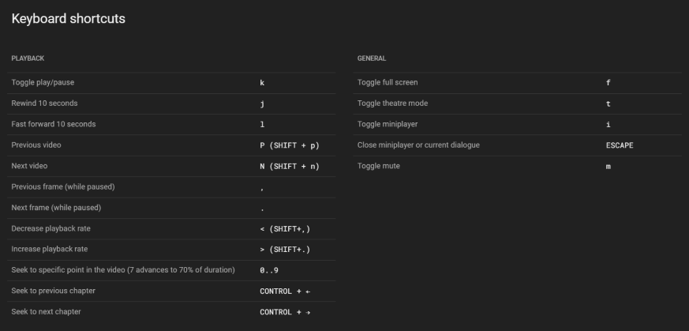

В этом посте из серии про разбор Руководств по доступности веб-контента (Web Content Accessibility Guidelines, коротко WCAG) расскажу про [критерий 2.1.4: клавиша символа в клавиатурном сокращении](https://www.w3.org/TR/WCAG22/#character-key-shortcuts).

Это базовый критерий уровня A, и он связан с принципом управляемости и с доступностью управления с клавиатуры.

## Коротко о критерии

Если используете в клавиатурном сокращении только букву, символ или цифру, у пользователя должна быть возможность его отключить, переназначить или применить только при фокусе на элементе.



## Подробнее

Критерий про клавишу символа касается сайтов, программ и приложений, где есть авторские клавиатурные сокращения. Они часто встречаются в редакторах кода, текстовых редакторах и почтовых клиентах.

Критерий подразумевает, что лучше всего использовать клавиатурные сокращения с [клавишами-модификаторами](https://www.w3.org/TR/uievents-key/#keys-modifier). То есть, сокращения не должны состоять только из букв, символов и любых других клавиш с тем, что можно напечатать (non-printable key).



На реальных сайтах и в приложениях часто удобнее и привычнее использовать клавиши с буквами. Например, в видеоплеерах. В этом случае можно сделать следующее:

- добавить на странице или в настройки элемент, который отключает клавиатурные сокращения;
- дать возможность перенастроить сокращения.

Если клавиатурное сокращение с буквой, символом или цифрой срабатывает только при фокусе на элементе, это тоже соответствует критерию. Например выпадающее меню, которое открывается при клике на кнопке «Открыть меню» или при нажатии на клавишу <kbd>m</kbd>, когда кнопка в фокусе.

## Кому это важно

- Пользователи, которые взаимодействуют с интерфейсом голосом. Например, используют речевой ввод.
- Все пользователи клавиатуры — пользователи скринридеров, экранных луп, пользователи с особенностями моторики, например, с церебральным параличом, ампутированными пальцами, протезами.
- Пользователи небольших портативных клавиатур.
- Люди с когнитивными особенностями, которым удобно назначать одни и те же клавиши для одной команды на разных сайтах и в приложениях.

В первую очередь критерий связан с пользователями голосового управления. В этих программах есть несколько режимов. Один только для команд, другой для голосового ввода текста, и ещё есть смешанный режим, в котором можно надиктовывать текст и выполнять команды. Чаще всего используют смешанный режим. Он удобнее, не нужно переключаться между разными режимами.

При наборе слова по буквам вместо буквы может выполнится одна или даже несколько команд, если в клавиатурных сокращениях используются только клавиши с буквами. Команды могут активировать даже посторонние звуки, если включён микрофон.

## Как избежать барьер

Чаще всего проблемы с клавиатурными сокращениями возникают на этапе проработки дизайна взаимодействия (interaction design) и написания кода.

Важно найти баланс между лёгкостью нажатия на клавиши и тем, как при этом сложно сделать ошибку. Можно всегда использовать клавиши-модификаторы в любых клавиатурных сокращениях или дать пользователям гибкие настройки для команд, когда их много.

## Примеры соответствия критерию

- На сайте есть модальное окно с настройками, его можно открыть при помощи <kbd>Alt</kbd> + <kbd>O</kbd>.
- В веб-приложении клавиша <kbd>/</kbd> (косая черта) делает фокус на поле поиска, но пользователь может её отключить с помощью переключателя в настройках своего профиля.
- На сайте видео разворачивается на весь экран с помощью <kbd>F</kbd>, но пользователь может зайти в настройки и изменить клавиши для этой команды.

В [Gmail много клавиатурных сокращений из одного символа или знака](https://support.google.com/mail/answer/6594). Например, <kbd>/</kbd> (косая черта) для поиска по письмам или <kbd>g</kbd> для перехода к следующей странице. Эти сокращения можно отключить и настроить. В списке всех настроек откройте вкладку с продвинутыми настройками (advanced) и включите кастомные клавиатурные сокращения (custom keyboard shortcuts). После появится отдельная вкладка «Клавиатурные сокращения» («Keyboard Shortcuts»), в которой можно переназначить клавиши для разных команд.

<figure class="article__image">
  
  <figcaption class="article__image-caption">
    Настройки клавиатурных сокращений в Gmail.
  </figcaption>
</figure>

В [GitHub тоже есть команды, которые выполняются одной клавишей с буквой или знаком](https://docs.github.com/en/get-started/using-github/keyboard-shortcuts). Например, <kbd>s</kbd> делает фокус на поле поиска, а <kbd>.</kbd> (точка) открывает редактор кода. В настройках профиля можно отключить клавиатурные сокращения или изменить их. Для этого зайдите в настройки профиля, выберите вкладку «Accessibility» («Доступность») и отожмите чекбокс «Character Keys» («Клавиши символов»). Теперь можно настроить клавиши-модификаторы для клавиатурных сокращений в подразделе «Command Palette» («Палитра команд»). Для этого надо выбрать из выпадающих списков «Search mode» («Режим поиска») и «Command mode» («Режим команд») подходящую опцию.

<figure class="article__image">
  
  <figcaption class="article__image-caption">
    Настройки клавиатурных сокращений в GitHub.
  </figcaption>
</figure>

## Примеры барьеров

- На сайте есть поиск, к которому можно перейти с помощью клавиши <kbd>S</kbd>. У пользователя нет возможности отключить это клавиатурное сокращение или переназначить клавишу.
- В приложении есть кнопка для открытия модального окна. Ещё окно открывается клавишей <kbd>+</kbd> (плюс), даже когда кнопка не в фокусе.

В [десктопной версии YouTube есть много клавиатурных сокращений](https://support.google.com/youtube/answer/7631406). Например, <kbd>F</kbd> раскрывает видео на весь экран, <kbd>k</kbd> ставит видео на паузу или продолжает воспроизведение, <kbd>c</kbd> включает или выключает субтитры, а <kbd>,</kbd> (запятая) перематывает к следующему кадру, когда видео на паузе. Однако на сайте нельзя отключить клавиатурные сокращения или переназначить клавиши.

<figure class="article__image">
  
  <figcaption class="article__image-caption">
    Модальное окно со всеми клавиатурными сокращениями на YouTube.
  </figcaption>
</figure>

## Как тестировать

Протестировать критерий поможет ручное или автоматическое тестирование.

- Найдите страницы или экраны, где есть клавиатурные сокращения.
- Найдите все сокращения, где используются только клавиши с буквами, символами или цифрами.
- Проверьте, как выполняются команды. Это происходит только при фокусе на элементе или на всей странице.
- Если команда срабатывает без фокуса на элементе, убедитесь, что её можно отключить или переназначить.

Проще всего поискать во всех .js-файлах по ключевым словам, связанным с клавишами. Например, `keydown`, `keyup` или `keypress`. Ещё можно написать скрипт, который будет нажимать все возможные клавиши на страницах и выводить, например, в консоль сообщение о том, какие клавиши он обнаружил. Так это сделано в довольно старом [букмарклете Trigger character key shortcuts](http://3needs.org/en/testing/code/kb-shortcuts.html).

## Что почитать

- [Success Criterion 2.1.4 Character Key Shortcuts](https://www.w3.org/TR/WCAG22/#character-key-shortcuts), WCAG 2.2.
- [Understanding Success Criterion 2.1.4: Character Key Shortcuts](https://www.w3.org/WAI/WCAG22/Understanding/character-key-shortcuts.html), WCAG 2.2.
- [Provide a way to turn off character key shortcuts](https://www.accessguide.io/guide/character-key-shortcuts), Access Guide.
- [Exploring WCAG 2.1 — 2.1.4 Character Key Shortcuts](https://knowbility.org/blog/2018/WCAG21-214CharacterKeyShortcuts), Knowbility.
- [Keyboard shortcuts need modifier keys](https://hidde.blog/keyboard-shortcuts/), Хиде де Врис.
