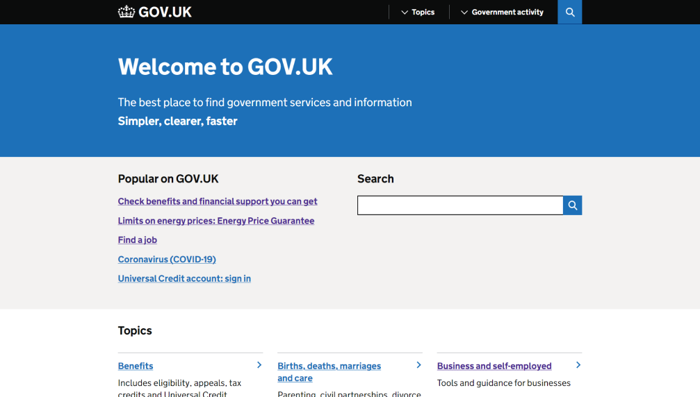
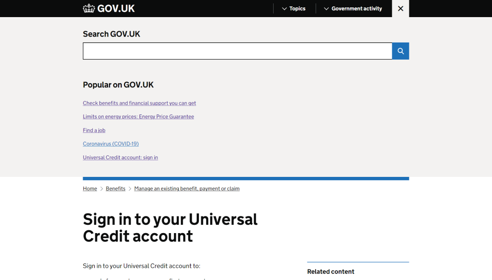
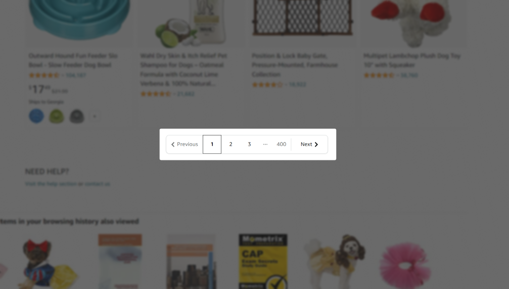
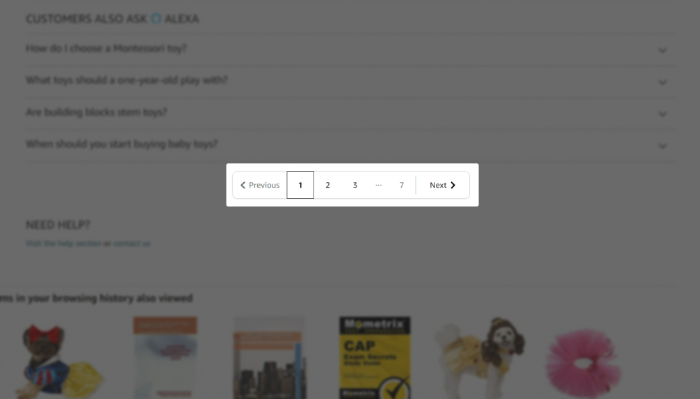

В Руководстве по доступности веб-контента (Web Content Accessibility Guidelines или коротко WCAG) описаны барьеры, которые лучше избегать в цифровых продуктах.

Проблема WCAG в том, что не всегда понятно, что руководства хотят от дизайнеров, разработчиков и других специалистов. Так что решила написать серию постов с коротким разбором критериев простым языком.

Первый пост серии про [критерий 3.2.4: Консистентная идентификация](https://www.w3.org/TR/WCAG22/#consistent-identification). Критерий входит в руководство про понятность и он уровня AA, поэтому точно столкнётесь с ним при аудите и тестировании.

## Коротко о критерии

Элементы с одинаковой функциональностью выглядят и работают одинаково на разных страницах сайта.

Одинаковая функциональность означает, что элементы делают одно и то же. К примеру, открывают одно диалоговое окно или ведут на одну страницу.

Хотя критерий об элементах на разных страницах, хорошо следить и за консистентностью на одной странице.

## Подробнее

Критерий касается интерактивных элементов, к примеру, кнопок, ссылок, вкладок и подобного. У консистентных элементов примерно одинаковые:

- названия — которые видно визуально или только вспомогательным технологиям;
- функции — как один и тот же элемент работает на разных страницах;
- внешний вид — иконки, стили и прочее.

Названия элементов не обязательно должны быть одинаковыми и могут немного отличаться. Ничего страшного, если одна кнопка называется «Перейти к следующему слайду», а у другая — «Перейти к слайду 2». Другой пример — две ссылки с немного разным текстом, которые ведут на одну и ту же страницу. Это тоже не нарушает критерий.

## Кому это важно

- Все пользователи, которые ищут элементы с одинаковой функциональностью на разных страницах сайтов. Например, ссылку на личный кабинет.
- Пользователи с когнитивными особенностями — с дислексией, синдромом дефицита внимания и другими нейроотличиями.
- Люди, которым нужны текстовые альтернативы, — названия кнопок и ссылок, описания изображений. Это любые пользователи вспомогательных технологий, особенно пользователи скринридеров и голосового управления.

Кнопки и ссылки, которые делают одно и то же, но называются по-разному, могут привести к когнитивной перегрузке. Это барьер для людей с небольшими когнитивными ресурсами.

Когнитивная перегрузка — теория о том, как внешние и внутренние факторы влияют на рабочую или оперативную память человека. В оперативной памяти временно хранится важная информаций для решения разных задач.

Кнопка для входа в личный кабинет, которая выглядит по-разному, но ведёт себя одинаково на главной и других страницах, увеличивает внешнюю нагрузку на рабочую память. Это может вызвать стресс, раздражение, фрустрацию и заставить кого-то уйти с сайта из-за когнитивной перегрузки.

## Как избежать барьер

Часто проблемы с консистентностью появляются ещё на этапе дизайна. С этим помогает справиться атомарный дизайн и продуманная дизайн-система. На уровне кода следить за консистентностью тоже легче, когда есть дизайн-система и используется компонентный подход.

## Примеры соответствия критерию

- Кнопки с одинаковой иконкой лупы и называнием «Поиск по сайту».
- Элементы с разными функциями, но с одинаковыми иконками в виде галочки и c разными видимыми названиями «Согласен» и «Получать рассылку».
- Пагинация со ссылками, в названиях которых есть номера страниц. Например, «Страница 1», «Страница 2», «Страница 3».

На [сайте gov.uk](http://gov.uk/) есть поиск с кнопкой с иконкой лупы на отдельных страницах и в меню. Иконки и сами кнопки выглядят одинаково, у них везде одно и то же название «Search GOV.UK».

<figure class="article__image">
  
  <figcaption class="article__image-caption">
    На главной странице gov.uk есть поле поиска с кнопкой со скрытой подписью «Search GOV.UK».
  </figcaption>
</figure>

<figure class="article__image">
  
  <figcaption class="article__image-caption">
    На другой странице gov.uk есть поле поиска из меню с кнопкой с такой же скрытой подписью «Search GOV.UK».
  </figcaption>
</figure>

На [сайте Amazon](https://www.amazon.com/) на страницах с категориями товаров есть пагинация. В ней одинаковые по функциональности элементы с одинаковыми названиями в `aria-label` — «Current page, page 1», «Current page, page 2» и так далее. Для переключения между страницами есть стрелки «Вперёд» и «Назад», а также конкретные номера страниц.

<figure class="article__image">
  
  <figcaption class="article__image-caption">
    Пример с пагинацией на Amazon.
  </figcaption>
</figure>

Если перейти на другую страницу, блок с пагинацией будет выглядеть точно так же и располагаться в том же месте страницы.

<figure class="article__image">
  
  <figcaption class="article__image-caption">
    Убеждаемся, что пагинация на Amazon везде выглядит одинаково.
  </figcaption>
</figure>

## Примеры барьеров

- Кнопки с одинаковой иконкой лупы для поиска по сайту, но с разными названиями «Поиск» («Search») и «Найти» («Find»).
- Ссылки с иконкой в виде дома, которые ведут на главную страницу, но у них разные скрытые названия в `aria-label` — «Главная» и «Перейти к основной странице сайта».

## Как тестировать

Проверить консистентность интерактивных элементов поможет ручное и пользовательское тестирование. Примерные шаги:

- Сравните элементы с одинаковой функциональностью на разных страницах и убедитесь, что у них одинаковые названия и они не сильно отличаются друг от друга визуально.
- Проведите тестирование с пользователями, чтобы найти элементы с одинаковой функциональностью, которые вызывают трудности.

## Что почитать

- [WCAG 2.2](https://www.w3.org/TR/WCAG22/)
- [Understanding Success Criterion 3.2.4: Consistent Identification](https://www.w3.org/WAI/WCAG22/Understanding/consistent-identification.html), WCAG 2.2
- [Provide consistent UI components](https://www.accessguide.io/guide/consistent-ui/), Access Guide
