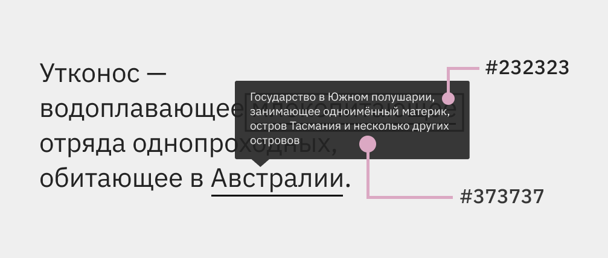
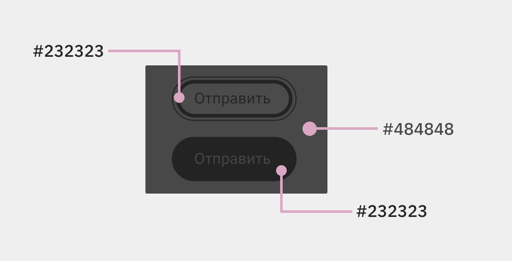
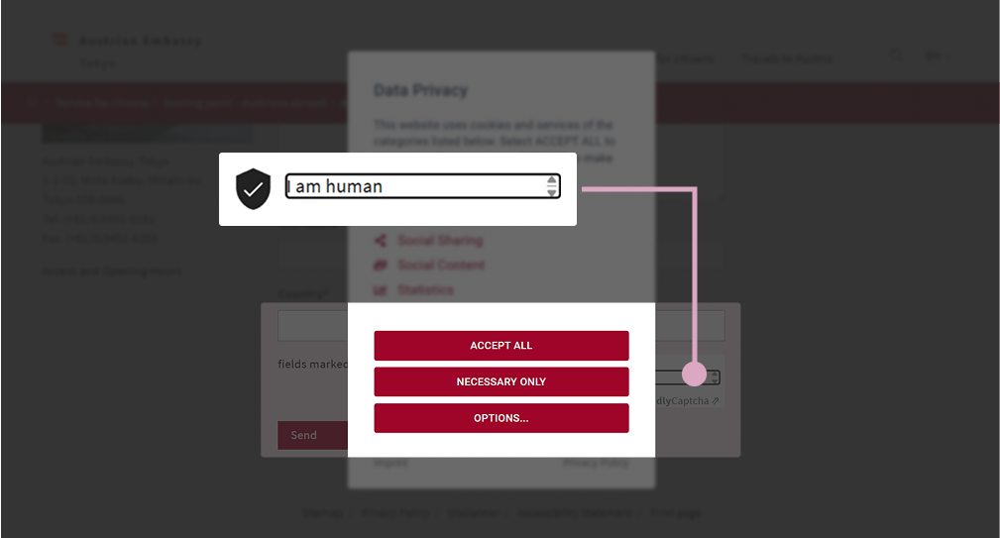

В Руководстве по доступности веб-контента 2.2 (Web Content Accessibility Guidelines 2.2) появилось восемь новых критериев. Два из них связаны с головной болью пользователей клавиатуры (заодно и сообщества специалистов по доступности) — перекрытием элемента в фокусе другим содержимым. Это критерии [2.4.11: фокус не перекрыт (минимальный)](https://www.w3.org/TR/WCAG22/#focus-not-obscured-minimum) уровня AA и [2.4.12: фокус не перекрыт (продвинутый)](https://www.w3.org/TR/WCAG22/#focus-not-obscured-enhanced) уровня AAA.

## Коротко о критериях

Минимально интерактивные элементы в состоянии фокуса, когда они перекрыты другими, должны быть хотя бы *частично* видны.

*Частично скрытый элемент* тот, название и другое смысловое содержимое которого видны хотя бы слегка. Критерий не считает индикатор фокуса вроде обводки вокруг кнопки за часть элемента. Так что, когда кнопка не изменяется в состоянии фокуса, это не проблема с точки зрения критерия 2.4.11.

Исключения из минимального критерия — открытые пользователем элементы и компоненты, которые можно перемещать по странице (например, путём перетаскивания).


  *Дропдаун (англ. dropdown)* дословно переводится как «выпадающий вниз».


Продвинутый критерий 2.4.12 не допускает элементов в фокусе, даже когда их содержание лишь слегка скрыто другим содержимым.

## Подробнее

Многие хоть раз оказывались на сайте с выпадающей навигацией в которой пункты скрыты визуально и, при этом, доступны для навигации с клавиатуры. Эту проблему с навигацией и пытаются предотвратить критерии 2.4.11 и 2.4.12.

Элементы с клавиатурным фокусом также могут перекрывать:

- другие дропдаун-элементы: комбинированные списки, гамбургерное меню, поля для выбора даты.
- Фиксированные (прилипающие) элементы: хедер, футер, боковая навигация, куки-баннеры.
- Попапы: сообщения от чат-ботов, уведомления, тултипы и другие всплывающие подсказки.
- Немодальные и (недо)модальные диалоговые окна без ловушки фокуса: информация о куки или о подписке на рассылку.
- Элементы с произвольным положением в интерфейсе: стикеры на виртуальной канбан-доске, цветовая палитра в инструменте для дизайнеров.

Не все **дропдауны** «плохие». Критерии о перекрытии элемента в фокусе рассматривают два основных случая с дропдаунами. Первый случай — изначально открытый элемент, например, боковое меню с навигацией по сайту. Вторая ситуация — неправильно свёрстанный дропдаун. К примеру, внушительная навигация с подменю, которая открывается с клавиатуры и не закрывается по нажатию на <kbd>Esc</kbd> или другие клавиши.

Обычно **фиксированная навигация** не соответствует минимальному критерию, если занимает много места на экране. Проблема с фокусом становится особенно заметной при навигации с клавиатуры обратно, к началу страницы.

**Фиксированный баннер с куки** — другой проблемный паттерн дизайна. Особенно рискуют нарушить минимальный критерий баннеры с длинными текстами. Куки-баннеры часто расположены после остального содержимого. Из-за этого пользователям клавиатуры приходится идти в конец страницы, содержимое которой скрыто за баннером, чтобы закрыть сообщение о куки.

**Попапы** тоже могут нарушить минимальный критерий 2.4.11. Вам могли попадаться назойливые тултипы, которые автоматически открываются при фокусе на связанном элементе и до последнего перекрывают часть остального содержимого. Помочь может только обновление страницы.

**Диалоговые окна** — отдельная боль. Большинство открытых по умолчанию немодальных окон, особенно расположенных по центру экрана, нарушат минимальный критерий 2.4.11. Распространённый пример подобных диалогов — настройки куки.


  *Куки (англ. cookies)* — текстовые файлы, содержащие информацию о пользователе, например, о его браузере или устройстве. Владельцы сайтов собирают эти данные в основном для маркетинговых целей.


Критерий 2.4.11 не имеет ничего против модальных окон. Модальный диалог не нарушит критерий, даже если свёрстан не совсем правильно. К примеру, пользователь может проскроллить страницу с модальным диалогом мышкой или другим указателем. Главное, чтобы модалка *по-настоящему* не давала устанавливать фокус с клавиатуры на элементах за ней.


  Немодальное окно не блокирует основное содержимое страницы. Модальный диалог наоборот не даёт перейти к странице, пока он открыт.


Особый случай, который описывает 2.4.11, — **элементы с эффектом стекла или с полупрозрачностью**. К примеру, полупрозрачные всплывающие подсказки и фиксированная навигация по сайту.

Чтобы пройти минимальный 2.4.11, «просвечивающий» компонент должен соответствовать другому критерию [1.4.11: нетекстовый контраст](https://www.w3.org/TR/WCAG22/#non-text-contrast). Для него проверяют соотношение контраста между цветом интерактивного элемента и фоном наложившегося.

Представьте полупрозрачный тултип в тексте, который полностью закрывает ссылку из предыдущей строки. В этом случае нужно сравнить цвет ссылки, получившийся после смешения с фоном тултипа, и сам фон всплывающей подсказки.

Например, цвет ссылки после смешения с фоном — #232323 (ранняя ночь), а фон наложившегося тултипа — #373737 (приглушённый серый). Соотношение контраста между цветами 1.32:1. Это ниже минимального значения для нетекстовых элементов. Таким образом, критерий 2.4.11 провален.

<figure class="article__image">
  
  <figcaption class="article__image-caption">
    Пример с полупрозрачным тултипом.
  </figcaption>
</figure>

В воображаемом примере мы *не сравнивали* цвет индикатора фокуса. Нам не важен внешний вид индикатора, кроме двух ситуаций:

- если индикатор находится внутри компонента в фокусе;
- когда элемент в состоянии фокуса сильно изменяется.

К примеру, в случае кнопки с внутренней обводкой сравниваем цвет обводки с фоном наложившегося элемента. Для кнопки, которая при фокусе изменила фон, надо сравнить её новый фоновый цвет с фоном другого элемента.

<figure class="article__image">
  
  <figcaption class="article__image-caption">
    Примеры кнопок с разными стилями для состояния фокуса.
  </figcaption>
</figure>

**Перемещающиеся по странице элементы** нарушат минимальный критерий, если с самого начала перекрывают ссылки, кнопки и другие интерактивные элементы интерфейса.

## Ощущение недосказанности

В описании критериев я не нашла ответов на несколько своих вопросов.

Как проверять ссылки в виде карточек с картинками, заголовками и краткими описаниями? Например, ссылка с текстом и графикой (или только с графикой), у которой видна только часть картинки.

Что делать со ссылкой в фокусе, когда её текст сливается с фоном страницы, и видна только обводка вокруг? Даже если ссылка перекрыта чем-то ещё частично, мы не видим *сам элемент*.

## Кому это важно

В первую очередь частично или полностью перекрытые элементы в состоянии фокуса — барьер для **пользователей клавиатур**. Это могут быть как обычные, так и кастомные или экранные типы.

Элементы в состоянии фокуса также важно видеть **пользователям экранных луп**, которые совмещают их с клавиатурной навигацией. Эта вспомогательная технология позволяет увеличивать отдельные части интерфейса.

Видеть элементы в фокусе важно и **пользователям альтернативных устройств ввода**. Например, голосового управления или айтрекинга, когда человек управляет курсором глазами.

Следующая группа — те, кто **пользуется указателями для навигации** (мышки не в счёт). К примеру, стилусами, головными указателями и джойстиками.

Не забывайте про **пользователей с когнитивными особенностями**, затрагивающими память и внимательность. Например, людей с синдромом дефицита внимания и гиперактивности (СДВГ), постковидным синдромом или травмами головного мозга. Такие пользователи могут чаще других отвлекаться и забывать о текущем положении и последних действиях на странице.

## Как избежать барьер

Самое простое решение — не фиксировать объёмную навигацию в хедере и футере, особенно на маленьких экранах. Вообще, чем больше места занимают подобные элементы, тем больше содержимого они скрывают. Можно сэкономить место, уменьшив прилипающий хедер при прокрутке.

Следующий помощник — `scroll-padding`. Это CSS-свойство увеличивает расстояние между фиксированным элементом и остальным содержимым страницы.

Не злоупотребляйте автоматически открывающимися немодальными окнами и интерфейсными подсказками, которые нельзя просто взять и закрыть с помощью <kbd>Esc</kbd>. Если у вас есть много свободного места по краям страницы, подсказки можно переместить туда.

Верстайте модальные окна правильно. Не давайте пользователям попасть на страницу, пока они не закроют модалку.

Чтобы решить проблему с перекрывающим всё на свете сообщением о куки, можно попробовать следующее:

- разместить его в самом начале страницы и вообще не фиксировать;
- показать его в *настоящем* модальном окне.

## Примеры соответствия критериям

При фокусе на ссылках со страницы статьи из Википедии появляются тултипы с картинками и текстом. Некоторые ссылки частично перекрываются раскрытой подсказкой. Тултип исчезает при переходе к новой ссылке, но не закрывается с помощью <kbd>Esc</kbd>.

<figure class="article__image">
  
  <figcaption class="article__image-caption">
    Статья про журнал «Popular Science».
  </figcaption>
</figure>

Так как интерактивные элементы в фокусе скрываются подсказкой частично, страница соответствует критерию 2.4.11: фокус не перекрыт (минимальный).

В [блоге Transcend](https://transcend.io/blog) хедер фиксируется при прокрутке страницы вниз и вверх. При перемещении с клавиатуры по странице ни один интерактивный элемент не скрывается за хедером.

<figure class="article__image">
  
  <figcaption class="article__image-caption">
    Страница одного поста из блога Transcend.
  </figcaption>
</figure>

Страница соответствует и минимальному критерию 2.4.11, и максимальному 2.4.12: фокус не перекрыт (продвинутый).

В главной вкладке YouTube Studio автоматически появляется уведомление с интерфейсной подсказкой. Этот элемент не закрывает собой активные ссылки. Это соответствует минимальному критерию 2.4.11.

<figure class="article__image">
  
  <figcaption class="article__image-caption">
    YouTube Studio.
  </figcaption>
</figure>

## Примеры барьеров

На главной сайта телекомпании [NHK World Japan](https://www3.nhk.or.jp/nhkworld/) в нижней части экрана зафиксирован куки-баннер с полупрозрачным фоном. Некоторые интерактивные элементы частично скрываются за баннером, когда навигируешься по странице с клавиатуры.

Одну из ссылок в футере баннер вообще полностью перекрывает. Цвет текста ссылки — #808080 (серый), цвет фона куки-баннера — #4c4c4c (кварцевый серый). Соотношение уровня контраста между двумя цветами — 2.17:1. Это ниже минимального значения для нетекстовых элементов (3:1). Из-за этого сайт не соответствует критерию 2.4.11 уровня AA.

<figure class="article__image">
  
  <figcaption class="article__image-caption">
    Сайт NHK World Japan.
  </figcaption>
</figure>

На сайте [университета Стокгольма](https://www.su.se/) немодальное окно с информацией про куки выровнено по центру экрана.

Немодальное окно полностью закрывает часть ссылок в фокусе. Из-за этого сайт не соответствует минимальному критерию 2.4.11.

<figure class="article__image">
  
  <figcaption class="article__image-caption">
    Главная университета Стокгольма.
  </figcaption>
</figure>

При первом открытии главной [посольства Австрии в Токио](https://www.bmeia.gv.at/en/austrian-embassy-tokyo) появляется окно с сообщением о куки. Визуально, из-за затемнённого фона, окно выглядит модальным. При этом мы всё ещё можем навигироваться по странице с клавиатуры, когда окно открыто. Из-за этого названия части полей, ссылок и кнопок полностью перекрываются. Значит, страница не соответствует критерию 2.4.11 уровня AA.

<figure class="article__image">
  
  <figcaption class="article__image-caption">
    Сайт посольства Австрии в Токио.
  </figcaption>
</figure>

## Как тестировать

Оба критерия можно протестировать как автоматически, так и вручную.

С автоматическим тестированием *теоретически* помогут букмарклеты.

Пока я не нашла готовых решений, которые бы одновременно показывали стили фокуса у всех интерактивных элементов и открывали нужные компоненты в верхнем слое интерфейса.

Временное полуавтоматическое решение — отдельные букмарклеты для показа стилей фокуса ([Show focus styles](https://code.jasonmorris.com/bookmarklets/show-focus-styles/)) и ручное открытие окон, дропдаунов и похожих элементов.

Для ручного тестирования понадобится клавиатура. Примерные этапы тестирования:

- Убедитесь, что на странице есть интерактивные элементы (кнопки, ссылки и другие).
- Найдите элементы, которые накладываются поверх остального содержимого.
- Пройдитесь по всем интерактивным элементам с помощью <kbd>Tab</kbd> и <kbd>Shift Tab</kbd>.
- Повторите предыдущие шаги для других брейкпоинтов.

Дополнительные шаги для элементов с полупрозрачным фоном, которые расположены выше других:

- Узнайте цвет фона верхнего элемента.
- Определите цвет элемента в фокусе: его исходный цвет без индикатора фокуса, смешанный с фоном наложившегося элемента.
- Проверьте соотношение контраста между цветами.

Тестировать полупрозрачные компоненты можно с помощью инструментов для проверки контраста цветов. Например, [Colour Contrast Analyser (CCA)](https://www.tpgi.com/color-contrast-checker/) от TPGi и [WCAG Color Contrast Checker](https://accessibleweb.com/color-contrast-checker/) от Accessible Web.

Если каждый интерактивный элемент в фокусе виден полностью или частично, страница соответствует *2.4.11: фокус не перекрыт (минимальный)* уровня AA.

Если полупрозрачные элементы полностью перекрывают элементы в состоянии фокуса, а соотношение контраста между цветами составляет 3:1 и выше, страница также соответствует минимальному критерию.

Когда ни один элемент в состоянии клавиатурного фокуса не скрывается другими, страница соответствует *2.4.12: фокус не перекрыт (продвинутый)* уровня AAA.

## Что почитать

- [2.4.11: фокус не перекрыт (минимальный) — WCAG 2.2](https://www.w3.org/WAI/WCAG22/Understanding/focus-not-obscured-minimum.html)
- [2.4.12: фокус не перекрыт (продвинутый) — WCAG 2.2](https://www.w3.org/WAI/WCAG22/Understanding/focus-not-obscured-enhanced.html)
- [Куки-баннер — Дизайн-система GOV.UK](https://design-system.service.gov.uk/components/cookie-banner/)
- [2.4.11: Конфликтное соответствие](https://adrianroselli.com/2023/10/2-4-11-adversarial-conformance.html), Адриан Розелли
- [Как тестировать 2.4.11: фокус не перекрыт (минимальный)](https://www.tpgi.com/how-to-test-2-4-11-focus-not-obscured-minimum/), TPGi
