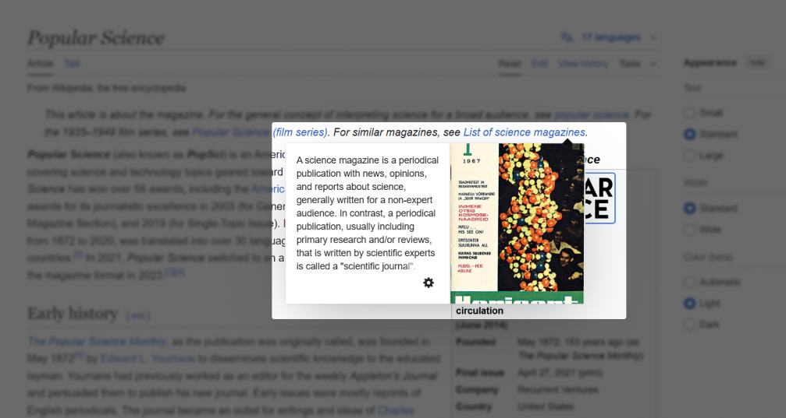

В Руководстве по доступности веб-контента 2.2 (Web Content Accessibility Guidelines 2.2) появилось восемь новых критериев. Два из них связаны с головной болью пользователей клавиатуры (заодно и сообщества специалистов по доступности) — перекрытием элемента в фокусе другим содержимым. Это критерии [2.4.11: фокус не перекрыт (минимальный)](https://www.w3.org/TR/WCAG22/#focus-not-obscured-minimum) уровня AA и [2.4.12: фокус не перекрыт (продвинутый)](https://www.w3.org/TR/WCAG22/#focus-not-obscured-enhanced) уровня AAA.

## Коротко о критериях

Согласно 2.4.11 (минимальный критерий -- АА), любые интерактивные элементы в состоянии фокуса, когда они перекрыты другими, должны быть хотя бы *частично* видны.

Исключения из критерия — задействованные пользователем элементы и компоненты, которые можно перемещать по странице (например, путём перетаскивания).

Также исключением является сам индикатор фокуса (например, обводка вокруг кнопки). Для этого специально существует следующий критерий -- 2.4.12 (ААА).

## Какие проблемы они направлены решать

В первую очередь эти критерии призваны предотвращать проблемы с навигацией для пользователей клавиатуры. Например, исключить ситуации, где в выпадающем (*дропдаун*) меню навигации пункты доступны с клавиатуры, но визуально не видны. 

 Дропдаун (англ. dropdown) дословно переводится как «выпадающий вниз». 

Перекрывать элементы, доступные для клавиатурного фокуса, также могут:

- другие дропдаун-элементы: комбинированные списки, гамбургерные меню, поля для выбора даты;
- фиксированные (прилипающие) элементы: хедер, футер, боковая навигация, куки-баннеры;
- попапы: сообщения от чат-ботов, уведомления, тултипы и другие всплывающие подсказки;
- немодальные и (недо)модальные диалоговые окна без ловушки фокуса: информация о куки или о подписке на рассылку;
- элементы с произвольным положением в интерфейсе: стикеры на виртуальной канбан-доске, цветовая палитра в инструменте для дизайнеров.

Поговорим о каждом примере отдельно.

Не все дропдауны «плохие». Критерии о перекрытии элемента в фокусе рассматривают два основных *проблематичных* случая с дропдаунами. Первый случай — изначально открытый элемент, например, боковое меню с навигацией по сайту. Второй — неправильно свёрстанный дропдаун. К примеру, внушительная навигация с подменю, которая открывается с клавиатуры и не закрывается по нажатию на <kbd>Esc</kbd> или другими клавишами.

Точно так же **фиксированная навигация** не будет соотвествовать минимальному критерию, если занимает много места на экране. В таком случае, проблема с фокусом становится очевидной при навигации с клавиатуры обратно -- к началу страницы.

**Фиксированный баннер с куки** — еще один проблемный для этих критериев паттерн. Так как баннеры с длинными текстами попадают под подозрение 2.4.11, то куки-баннеры, перекрывающие собой все позади себя, привлекают наше внимание в первую очередь.

**Попапы** тоже могут нарушать минимальный критерий 2.4.11. Назойливые тултипы, которые автоматически открываются при фокусе на связанном элементе, до последнего перекрывают часть остального содержимого. До последнего -- потому, что помочь может только обновление страницы.

**Диалоговые окна** — отдельная боль. Большинство открытых по умолчанию *немодальных* окон, особенно расположенных по центру экрана, нарушат минимальный критерий 2.4.11. Распространённый пример подобных диалогов — опять же, настройки куки.


  *Куки (англ. cookies)* — текстовые файлы, содержащие информацию о пользователе, например, о его браузере или устройстве. Владельцы сайтов собирают эти данные в основном для маркетинговых целей.


Как и против дропдаунов, критерий 2.4.11 не имеет ничего против модальных окон. Модальный диалог не нарушит критерий сам по себе. Даже если свёрстан... не совсем правильно. Пользователь всегда может проскроллить страницу с модальным диалогом мышкой или другим указателем. Но если модалка не давает устанавливать фокус с клавиатуры на элементах за ней **совсем** -- это нарушение.


  Немодальное окно не блокирует основное содержимое страницы. Модальный диалог наоборот не даёт перейти к странице, пока он открыт.


Особый случай, который описывает 2.4.11, — **элементы с эффектом стекла или с полупрозрачностью**. Например, полупрозрачные всплывающие подсказки и фиксированная навигация по сайту.

Здесь, чтобы пройти минимальный 2.4.11, «просвечивающий» компонент должен соответствовать *еще* одному критерию -- [1.4.11: нетекстовый контраст](https://www.w3.org/TR/WCAG22/#non-text-contrast). Для него проверяют соотношение контраста между цветом интерактивного элемента и фоном наложившегося.

Для понимания, почему этой ситуации уделяется особое внимание, представьте полупрозрачный тултип в тексте, который полностью закрывает ссылку из, например, предыдущей строки. Но, ничего страшного -- в такой ситуации нужно просто сравнить цвет ссылки, получившийся после смешения с фоном тултипа, и сам фон всплывающей подсказки.

Например, цвет ссылки после смешения с фоном — #232323 (ранняя ночь), а фон наложившегося тултипа — #373737 (приглушённый серый). Соотношение контраста между цветами 1.32:1. Это *ниже минимального значения* для нетекстовых элементов. Таким образом, критерий 2.4.11 провален. Несмотря на то, что частично скрытый элемент и видно "слегка". В случаях, как этот, "слегка" четко определяется другими критериями. 

<figure class="article__image">
  
  <figcaption class="article__image-caption">
    Пример с полупрозрачным тултипом.
  </figcaption>
</figure>

Обратите внимание, что в воображаемом примере мы не сравнивали цвет **индикатора фокуса**. Это потому, что нам никогда не важен внешний вид индикатора, кроме двух ситуаций:

- если индикатор находится внутри компонента в фокусе;
- когда элемент в состоянии фокуса сильно изменяется.

В случае кнопки с внутренней обводкой сравниваем цвет обводки с фоном наложившегося элемента. Но, для кнопки, которая при фокусе изменила фон, надо сравнить её новый цвет фона с фоном другого элемента.

<figure class="article__image">
  
  <figcaption class="article__image-caption">
    Примеры кнопок с разными стилями для состояния фокуса.
  </figcaption>
</figure>

**Перемещающиеся по странице элементы** нарушат минимальный критерий, если с самого начала движения перекрывают ссылки, кнопки и другие интерактивные элементы интерфейса.

## Еще пара моментов

Казалось бы -- все предельно понятно, но, тем не менее, при изучении новых критериев у меня возникли пара вопросов, ответы на которые я не могу вывести из материалов, приложенных к описанию критериев:

1. Как проверять ссылки в виде карточек с картинками, заголовками и краткими описаниями? Например, ссылку с текстом и графикой (или только с графикой), у которой видна только часть картинки.

2. Что делать со ссылкой в фокусе, когда её текст сливается с фоном страницы, и видна только обводка вокруг? Ведь даже если ссылка перекрыта чем-то ещё частично, мы не видим *сам элемент*.

Возможно, при прочтении вас тоже заинтересовали эти или подобные моменты. Но, **на момент написания статьи**, я не могу вынести однозначные ответы на них *только из документации WCAG 2.2*. 

## Значение для пользователей

Как я уже упомянула в начале статьи (и, мы подробно рассмотрели в дальнейшем), частично или полностью перекрытые элементы в состоянии фокуса — барьер для **пользователей клавиатур** в первую очередь.

**Пользователям экранных луп**, которые совмещают их с клавиатурной навигацией, так же важно четко видеть элементы в состоянии фокуса.


  *Экранна лупа* -- вспомогательный инструмент, позволяющий увеличивать отдельные области экрана.


То же самое важно и **пользователям альтернативных устройств ввода**, когда пользователь все еще навигируется по интерфейсу *визуально*. Например, во время голосового управления или айтрекинга (управление курсором с помощью взгляда). Или **пользуется указателями для навигации** (какими-то, кроме "привычной" мышки). К примеру, стилусами, головными указателями и джойстиками.

Не забывайте про **пользователей с когнитивными особенностями**, затрагивающими память и внимательность. Например, людей с синдромом дефицита внимания и гиперактивности (СДВГ), постковидным синдромом или травмами головного мозга. Такие пользователи могут чаще других отвлекаться и забывать о текущем положении и последних действиях на странице, а, значит, им важно *всегда* иметь **визуальный доступ к элементу в фокусе**.

## Соответствие критериям на практике: советы

Самое простое превентивное решение — не фиксировать объёмную навигацию в хедере и футере, особенно на маленьких экранах. Вообще, чем больше места занимают подобные элементы, тем больше содержимого они скрывают. Можно сэкономить место, уменьшив прилипающий хедер при прокрутке.

Следующий помощник — `scroll-padding`. Это CSS-свойство увеличивает расстояние между фиксированным элементом и остальным содержимым страницы.

Не злоупотребляйте автоматически открывающимися немодальными окнами и интерфейсными подсказками, которые нельзя закрыть с помощью <kbd>Esc</kbd>. Если у вас есть много свободного места по краям страницы, подсказки можно попробовать переместить туда.

Верстайте модальные окна правильно. Не давайте пользователям возможности попасть на страницу, пока они не закроют модалку.

Чтобы решить проблему с сообщением о куки, перекрывающим всё на свете, можно реализовать следующие приемы:

- разместить его в самом начале страницы и вообще не фиксировать;
- показать его в *настоящем* модальном окне.

## Соответствие критериям на практике: примеры из реальной жизни

### Превью ссылок на Википедии

При фокусе на ссылках статей в Википедии появляются тултипы с картинками и текстом. Некоторые ссылки частично перекрываются раскрытой подсказкой. Тултип исчезает при переходе к новой ссылке. Не закрывается с помощью <kbd>Esc</kbd>.

<figure class="article__image">
  
  <figcaption class="article__image-caption">
    Статья про журнал «Popular Science».
  </figcaption>
</figure>

Так как интерактивные элементы в фокусе скрываются подсказкой *только* частично, страница соответствует критерию 2.4.11: фокус не перекрыт (минимальный, АА).

### Фиксированный хедер в Transcend
В [блоге Transcend](https://transcend.io/blog) хедер фиксируется при прокрутке страницы вниз и вверх. При перемещении с клавиатуры по странице ни один интерактивный элемент не скрывается за хедером.

<figure class="article__image">
  
  <figcaption class="article__image-caption">
    Страница одного поста из блога Transcend.
  </figcaption>
</figure>

Страница соответствует и минимальному критерию 2.4.11, и максимальному 2.4.12: фокус не перекрыт (продвинутый).

### Подсказки в YouTube Studio
В главной вкладке YouTube Studio автоматически появляется уведомление с интерфейсной подсказкой. Этот элемент не закрывает собой активные ссылки. Это соответствует минимальному критерию 2.4.11.

<figure class="article__image">
  
  <figcaption class="article__image-caption">
    YouTube Studio.
  </figcaption>
</figure>

## НЕсоотвествие критериям на практике: примеры из реальной жизни

### NHK World Japan -- полупрозрачный куки-баннер

На главной сайта телекомпании [NHK World Japan](https://www3.nhk.or.jp/nhkworld/) в нижней части экрана зафиксирован куки-баннер с полупрозрачным фоном. Некоторые интерактивные элементы частично скрываются за баннером, когда навигируешься по странице с клавиатуры.

Одну из ссылок в футере баннер перекрывает полностью. Так как фон баннера полупрозрачный, проверяем контраст. Цвет текста ссылки — #808080 (серый), цвет фона куки-баннера — #4c4c4c (кварцевый серый). Соотношение уровня контраста между двумя цветами — 2.17:1. Это **ниже минимального значения** для нетекстовых элементов (3:1). Из-за этого сайт не соответствует критерию 2.4.11 уровня AA.

<figure class="article__image">
  
  <figcaption class="article__image-caption">
    Сайт NHK World Japan.
  </figcaption>
</figure>

### Немодальный куки-баннер Stockholm University 
На сайте [университета Стокгольма](https://www.su.se/) немодальное окно с информацией про куки выровнено по центру экрана.

Немодальное окно *полностью* закрывает часть ссылок в фокусе. Из-за этого сайт не соответствует минимальному критерию 2.4.11.

<figure class="article__image">
  
  <figcaption class="article__image-caption">
    Главная университета Стокгольма.
  </figcaption>
</figure>

### (Недо)модальный куки-баннер Посольства Австрии в Токио

При первом открытии главной [посольства Австрии в Токио](https://www.bmeia.gv.at/en/austrian-embassy-tokyo) появляется окно с сообщением о куки. Визуально, из-за затемнённого фона, окно выглядит модальным. При этом мы всё ещё можем навигироваться по странице с клавиатуры, когда окно открыто. Из-за этого названия части полей, ссылок и кнопок полностью перекрываются. Значит, страница не соответствует критерию 2.4.11 уровня AA.

<figure class="article__image">
  
  <figcaption class="article__image-caption">
    Сайт посольства Австрии в Токио.
  </figcaption>
</figure>

## Тестирование критериев

Оба критерия могут быть протестированы как вручную, так и автоматически.

С автоматическим тестированием *теоретически* помогут **букмарклеты**. В смысле, способны по своей природе, но пока мне не встречались готовые решения, которые бы одновременно показывали стили фокуса у всех интерактивных элементов и открывали нужные компоненты в верхнем слое интерфейса.

Временное *полу*автоматическое решение — отдельные букмарклеты для показа стилей фокуса ([Show focus styles](https://code.jasonmorris.com/bookmarklets/show-focus-styles/)) и ручное открытие окон, дропдаунов и похожих элементов.

Для ручного тестирования понадобится клавиатура. Примерные этапы тестирования:

1. Убедитесь, что на странице есть интерактивные элементы (кнопки, ссылки и другие).
2. Найдите элементы, которые накладываются поверх остального содержимого.
3. Пройдитесь по всем интерактивным элементам с помощью <kbd>Tab</kbd> и <kbd>Shift Tab</kbd>.
4. Повторите предыдущие шаги для других брейкпоинтов.

Дополнительные шаги для элементов с полупрозрачным фоном, которые накладываются поверх других:
1. Узнайте цвет фона верхнего элемента.
2. Определите цвет элемента в фокусе: его исходный цвет без индикатора фокуса, смешанный с фоном наложившегося элемента.
3. Проверьте соотношение контраста между цветами.

Тестировать полупрозрачные компоненты можно с помощью инструментов для проверки контраста цветов. Например, [Colour Contrast Analyser (CCA)](https://www.tpgi.com/color-contrast-checker/) от TPGi и [WCAG Color Contrast Checker](https://accessibleweb.com/color-contrast-checker/) от Accessible Web.

Если каждый интерактивный элемент в фокусе виден полностью или частично, страница соответствует 2.4.11: фокус не перекрыт (минимальный) уровня AA.

Если полупрозрачные элементы полностью перекрывают элементы в состоянии фокуса, а соотношение контраста между цветами составляет 3:1 и выше, страница также соответствует минимальному критерию.

Когда ни один элемент в состоянии клавиатурного фокуса не скрывается другими, страница соответствует 2.4.12: фокус не перекрыт (продвинутый) уровня AAA.

## Что почитать

- [2.4.11: фокус не перекрыт (минимальный) — WCAG 2.2](https://www.w3.org/WAI/WCAG22/Understanding/focus-not-obscured-minimum.html)
- [2.4.12: фокус не перекрыт (продвинутый) — WCAG 2.2](https://www.w3.org/WAI/WCAG22/Understanding/focus-not-obscured-enhanced.html)
- [Куки-баннер — Дизайн-система GOV.UK](https://design-system.service.gov.uk/components/cookie-banner/)
- [2.4.11: Конфликтное соответствие](https://adrianroselli.com/2023/10/2-4-11-adversarial-conformance.html), Адриан Розелли
- [Как тестировать 2.4.11: фокус не перекрыт (минимальный)](https://www.tpgi.com/how-to-test-2-4-11-focus-not-obscured-minimum/), TPGi
