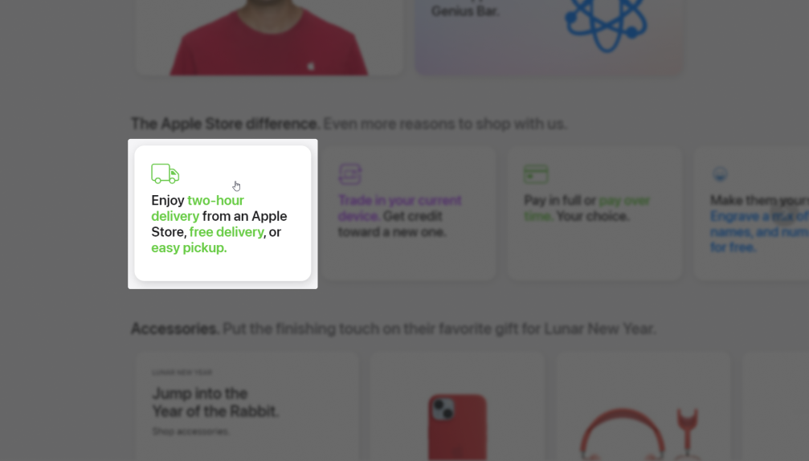

Продолжаю разбирать Руководства по доступности веб-контента (Web Content Accessibility Guidelines, коротко WCAG). Сегодня расскажу про [критерий 1.3.1: информация и взаимосвязи](https://www.w3.org/TR/WCAG22/#info-and-relationships).

Это базовый критерий уровня A, который относится к принципу воспринимаемости и к руководству про адаптируемость.

## Коротко о критерии

Информация, структура и отношения между элементами, которые видны визуально, также должны быть определены программно или доступны в виде текста.

## Подробнее

Страницы и контент на страницах должны быть доступны в разных форматах представления — визуальном, аудиальном и любом другом. В этом критерий про информацию и взаимосвязь пересекается с одним из принципов универсального дизайна про равенство в использовании.

«Программно определённый» (programmatically determined) означает, что HTML и дополнительная ARIA-разметка используются правильно и отражают роль элемента, его свойства и связи с другими элементами. Критерий просит обозначать функции и роли элементов не только визуально, но и на уровне кода.

К примеру, визуально заголовки крупнее остального текста и часто выделены жирным начертанием. В коде то же самое обозначают теги `<h1>`, `<h2>`, `<h3>` и так далее. Параграфы содержат несколько предложений и между ними есть отступы. На уровне кода это отражает тег `
`. Обязательное для заполнения поле принято обозначать астериском (*). Рядом с ним можно подписать, что оно обязательное. Новое сообщение приходит со звуковым оповещением. Хорошо дополнить его ещё и текстовым уведомлением и сделать эту область изменяющейся (live region).

Из-за того, что критерий связан с разметкой и затрагивает много элементов на страницах, он довольно часто нарушается. [По статистике Intopia](https://intopia.digital/articles/top-5-critical-accessibility-issues-in-2022/) эта ошибка в 2022 году обнаружена в 95 % аудитов и составляет 14 % от всех проблем с доступностью.

## Кому это важно

- Пользователи скринридеров, которые слушают интерфейсы. В первую очередь это люди со слепотой.
- Пользователи дисплеев Брайля.
- Пользователи с когнитивными особенностями, которые используют расширения для изменения стилей или режимы чтения в браузерах.

## Как избежать барьер

Так как критерий про информацию и взаимосвязи связан с разметкой, в основном за его соблюдением должны следить разработчики.

Большую часть проблем решают семантические теги для структуры страницы и для отдельных элементов. Например, `<header>`, `<main>`, `<footer>`, `<h1>`–`<h6>`, `<button>`, `<a>`, `<table>` и многие другие. Кстати, у [W3C есть хорошее руководство по таблицам](https://www.w3.org/WAI/tutorials/tables/).

Также следите за тем, чтобы разметка была валидной, `id` на странице не повторялись и были связаны с нужными элементами там, где требуется.

Обращайте внимание на групповые элементы. К примеру, если есть несколько связанных чекбоксов, хорошо обернуть их в `<fieldset>` и задать группе имя в `<legend>`.

Про ARIA думайте только в случае, когда возможностей HTML не хватает. Например, для заголовков в первую очередь используйте теги от `<h1>` до `<h6>`, а не `role="heading"` с нужным значением `aria-level`. Если решили использовать ARIA, всегда уточняйте какие атрибуты обязательно нужно использовать с ролями и какая их поддерживают вспомогательные технологии и браузеры.

Хороший повод использовать возможности ARIA — видимые заголовки для ориентиров. Это блоки страницы, по которым могут перемещаться пользователи скринридеров. К примеру, `<header>` и `<footer>`. Свяжите заголовок и ориентир с помощью `aria-labelledby`. Тогда у ориентиров появятся названия, а пользователям будет проще по ним перемещаться.

## Примеры соответствия критерию

- У обязательных полей в форме есть астериксы: «Перед формой пояснение «Обязательно заполните поля со звёздочкой (*)».
- На странице текст «История происхождения вида». Он больше остального текста, выделен жирным начертанием. В разметке это `<h2>`.
- Элемент с текстом «Отправить» выглядит как кнопка и отправляет сообщение в чат. В разметке для него используют тег `<button>`.
- На странице боковое меню с заголовком «Похожие исполнители». В коде это `<aside>`, внутри которого есть `<h2>`. `<aside>` связан с `<h2>` с помощью `aria-labelledby`.
- На странице, которая была свёрстана в 2001, таблица используется для раскладки, а не для данных. У неё сброшена табличная семантика с помощью `role="presentation"`.
- Текст из нескольких пунктов с буллитами, который похож на список. В разметке это `<ul>` с несколькими вложенными в него `<li>`.

## Примеры барьеров

- Текст «О нашей замечательной компании» выглядит как заголовок. Он расположен на отдельной строке, больше остального текста и выделен жирным начертанием. В коде для него используют тег `
` вместо `<h1>`.
- Заголовок `<h1>` находится в кнопке `<button>`.
- Элемент с текстом «Список товаров для дома» внешне выглядит и ведёт себя как ссылка, но в разметке это просто `` с `onclick="location.href='newpage.html'"` без роли ссылки.
- Текст расположен в двух колонках благодаря нескольким пробелам между словами, а не с помощью CSS.
- В разделе отзывов есть карточки с текстом отзывов и именами людей, которые их оставили. Имя добавлено в карточку через псевдоэлемент `::before`, хотя это не декоративный контент.
- `<table>` используется на странице для раскладки, а не для данных. При этом табличная семантика не сброшена с помощью `role="presentation"`, в таблице есть `<th>`.
- Для таблицы с данными используют тег `<table>`, но внутри нарушена правильная иерархия элементов. Теги `<tr>` обёрнуты в `<td>`.
- На странице есть двe кнопки, которые открывают выпадающие меню. Обе кнопки связаны с меню с помощью `aria-controls` и `id`, однако в случае обоих меню у них одинаковое значение `id` — `dropdown-1`.
- Перед текстовым полем расположен лейбл «Дополнительные комментарии к заказу». У тега `<label>` нет атрибута `for`, хотя у `<textfield>` есть `id`.
- На странице есть текст с круглыми буллитами. На самом деле это несколько параграфов `
` с символом буллита в начале — `∙`.
- Группа чекбоксов касается размера пиццы. Они не объединены в коде и у них нет связанного с ними общего названия группы.

На [главной Apple Store](https://www.apple.com/store/) есть большие разделы с заголовками. Например, «Help is here. Whenever and however you need it» («Помощь рядом. Когда и каким бы образом она ни была нужна»). Оба предложения находятся на отдельной строке, они одинакового размера и расположены друг за другом. Единственное различие — первое предложение тёмно-серого цвета, а второе светло-серого. В коде только «Help is here» — это `<h2>`. Второе предложение обёрнуто в ``, который расположен рядом с `<h2>`.

<figure class="article__image">
  
  <figcaption class="article__image-caption">
    Один из заголовков второго уровня на главной Apple Store.
  </figcaption>
</figure>

Ещё на сайте есть элемент, который выглядит как карточка-ссылка. Возьмём карточку с текстом «Enjoy two-hour delivery from an Apple Store, free delivery, or easy pickup» («Насладись двухчасовой доставкой из Apple Store, бесплатная доставка и простой самовывоз»).

Визуально это выглядит как параграф текста, перед которым салатовая иконка с грузовиком. Некоторые ключевые слова выделены таким же салатовым цветом — «two-hour delivery», «free delivery» и «easy pickup». В коде весь текст обёрнут в `
`, который вложен внутрь `<a>`.

<figure class="article__image">
  
  <figcaption class="article__image-caption">
    Карточка на главной Apple Store.
  </figcaption>
</figure>

Этот элемент нарушает и другие критерии. По названию ссылок не понятно, куда они ведут, а ещё на самом деле этот элемент открывает модальное окно на той же самой странице.

## Как тестировать

Протестировать критерий про информацию и взаимосвязи поможет смешанное тестирование.

- Откройте нужную страницу и проверьте её структуру. Какие на ней есть ориентиры, совпадает ли визуальное представление заголовков, списков, параграфов и других похожих элементов с представлением в коде.
- Проверьте другие элементы, которые не связаны со структурой. Например, ссылки, кнопки, формы и т. д.
- Если есть ARIA-разметка, насколько она корректна. Совпадают ли явно заданные роли с функциями и внешним видом элементов, правильно ли используются ARIA-атрибуты.

Проверить автоматически основную структуру страниц и разметку в целом помогут:

- [HTML-валидатор](https://validator.w3.org);
- автоматические инструменты вроде [axe](https://www.deque.com/axe/), [WAVE](https://wave.webaim.org/) или [Lighthouse](https://developer.chrome.com/docs/lighthouse/accessibility/);
- [букмарклеты](https://accessibility-bookmarklets.org/install.html) и расширения, например, [Web Developer](https://chrispederick.com/work/web-developer/).

Ещё можно посмотреть вручную код в инструменте разработчика в браузере или отключить временно стили на странице. Крайне полезно также послушать страницу со скринридером.

## Что почитать

- [Understanding SC 1.3.1: Info and Relationships (Level A)](https://www.w3.org/WAI/WCAG22/Understanding/info-and-relationships.html), WCAG 2.2
- [Define information, structure, and relationships in markup](https://www.accessguide.io/guide/info-structure-relationships/), Access Guide
- [1.3.1 Info and Relationships](https://github.com/alphagov/wcag-primer/wiki/1.3.1/), gov.uk
- [The 411 on 4.1.1](https://adrianroselli.com/2022/12/the-411-on-4-1-1.html), Адриан Розелли
