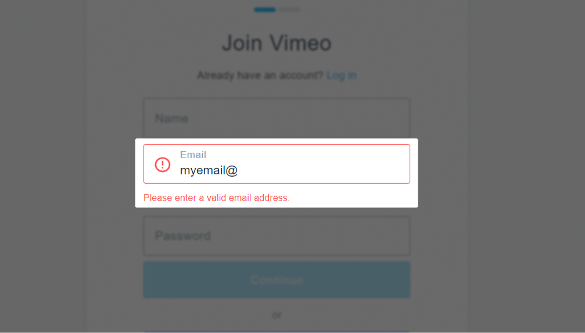
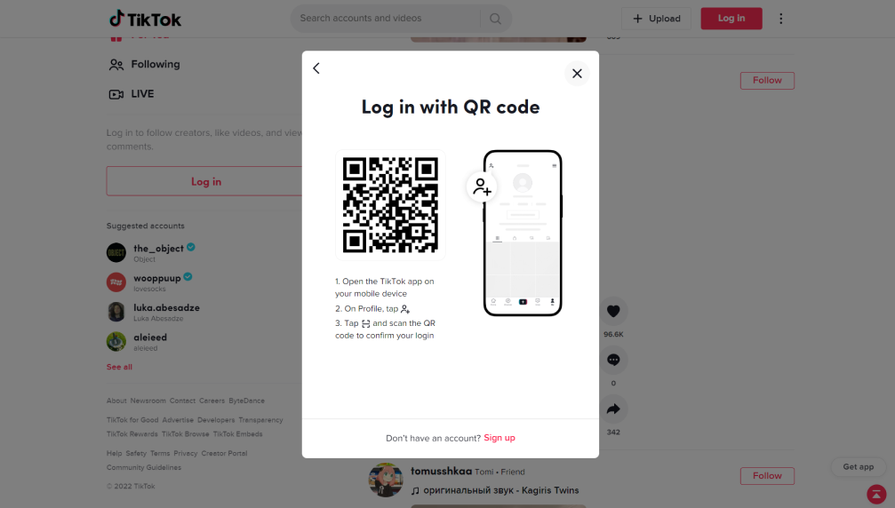

В этом посте из серии про разбор Руководств по доступности веб-контента (Web Content Accessibility Guidelines, коротко WCAG) расскажу про [критерий 1.3.3: сенсорные характеристики](https://www.w3.org/TR/WCAG22/#sensory-characteristics).

Это базовый критерий уровня A, он связан с принципом воспринимаемости и с различимостью содержимого.

## Коротко о критерии

Инструкции о том, как взаимодействовать с чем-то на странице, не зависят от сенсорных характеристик элемента — формы, размера, цвета, места, звука и прочего.

## Подробнее

Критерий относится к любым инструкциям на сайтах. Это могут быть инструкции к целым формам, звуковые оповещения, подсказки к полям, а может быть просто текст на странице с анонсом новой фичи и рассказом о том, как её использовать.

Когда описываете работу с чем-то, расскажите не только о внешнем виде элемента, а ещё про его название и функции. Так что, принцип подразумевает, что у кнопки или ссылки есть название. Лучше делать его видимым, хотя WCAG разрешает добавлять для кнопок визуально скрытые имена. Они доступны только пользователям вспомогательных технологий.

К примеру, когда пользователь скринридера услышит «Найдите круглую синюю кнопку в левом углу экрана», это не поможет ему найти эту кнопку. Скринридеры не рассказывают о цветах и других стилях элементов, а ещё сложно понять на слух, где право и лево на сайте.

Ещё внешний вид и расположение элементов могут отличаться в зависимости от темы на сайте, размера экрана и при разном освещении и яркости.

Чтобы инструкция про кнопку стала понятной всем, можно рассказать чуть больше про неё: «Найдите круглую синюю кнопку с названием «Следующая страница» в левом углу экрана». Теперь пользователь скринридера знает её название и может найти в списке всех кнопок или перейти к ней без списка.

В инструкциях полезно описывать внешние характеристики элемента. Это помогает некоторым пользователям с когнитивными особенностями и нейроотличиями, так что критерий не призывает рассказывать только о названиях и функциях.

Критерий перекликается с одним из принципов универсального дизайна о легко воспринимаемой информации. Этот принцип требует использовать несколько каналов восприятия — визуальный, аудиальный, тактильный и вербальный.


_Универсальный дизайн (Universal Design, UD)_ — это подход к созданию продуктов, товаров и услуг, которыми может пользоваться максимальное число людей.


Несколько примеров инструкций, в которых что-то пошло не так:

- Больше информации найдёте справа.
- Если кликните на стрелку, перейдёте к следующему шагу.
- Важная информация выделена жёлтым цветом.
- Кликните по круглой синей кнопке в верхнем правом углу.

Что касается «выше» и «ниже», всё зависит от контекста и языка. Пользователям может быть понятно, что содержимое находится до определённой точки или после неё.

## Кому это важно

- Пользователям со слепотой и слабовидящим, которые много полагаются на слух.
- Пользователям с глухотой и слабослышащим, которым важно видеть содержимое.
- Пользователям мобильных устройств. Расположение элементов на странице в мобильной версии сайта может отличаться от десктопной.

## Как избежать барьер

Этот барьер обычно появляется на этапе информационного дизайна и написания текстов, поэтому хорошо заранее обращать внимание понятность и доступность инструкций.

Разработчики могут следить за названиями элементов в коде и давать кнопкам, ссылкам и другим элементам хотя бы визуально скрытые названия. Также хорошо использовать заголовки для разных частей страницы, например, для бокового меню или списков со ссылками.

## Примеры соответствия критерию

- В правой части страницы есть список ссылок на тарифные планы. В тексте сказано: «Выберите тарифный план из списка с заголовком «Наши тарифные планы». Он находится справа».
- При заполнении поля появилась ошибка. В ней использована иконка с крестиком и текст «Вы неправильно заполнили поле. Рекомендуем формат месяц-дата-число».

На [сайте Vimeo](https://vimeo.com/) есть форма регистрации нового пользователя. Если ввёл неправильные данные в одно из полей, например, для почты, под ним появится текстовая ошибка «Введите правильный адрес электронной почты, пожалуйста». Неправильно заполненное поле при этом тоже визуально изменится. К нему добавится красная рамка и иконка с восклицательным знаком внутри.

<figure class="article__image">
  
  <figcaption class="article__image-caption">
    Форма регистрации на Vimeo.
  </figcaption>
</figure>

## Примеры барьеров

- На сайте карусель с кнопками со стрелками влево и вправо. В инструкции на странице написано: «Для перехода к следующему товару нажмите на правую кнопку, для возврата — на левую кнопку».
- На странице есть боковое меню со списком ссылок на другие статьи. В инструкции на странице сказано: «Другие статьи найдёте в боковом меню справа».
- При заполнении поля появилась ошибка. В ней только иконка с крестиком без видимого или визуально скрытого текста.
- Страница с тестом. Время для его прохождения ограничено. В инструкции перед тестом написано: «Когда время истечёт, вы услышите сигнал об этом».
- На странице таблица с разноцветными строками. Под таблицей пояснение: «Зелёные строки в таблице означают прибыль компании в этом месяце, а красные — расходы».

В [десктопной версии TikTok](https://www.tiktok.com/) раньше была инструкция, как войти в личный аккаунт с помощью QR-кода. В инструкции был скриншот мобильного приложения и описание шагов. Первый — «откройте приложение TikTok на своём мобильном устройстве». Второй — «в профиле тапните…», и тут вместо текста иконка с человечком и крестиком. Последний шаг — «тапните…», и опять вместо строчки текста иконка с пунктирной рамкой и горизонтальной чертой по центру.

<figure class="article__image">
  
  <figcaption class="article__image-caption">
    Инструкция для входа в TikTok-аккаунт с помощью QR-кода.
  </figcaption>
</figure>

## Как тестировать

С поиском проблем с сенсорными характеристиками поможет только ручное тестирование.

- Найдите страницы, где есть инструкции.
- Убедитесь, что в них описан не только внешний вид элементов и их положение на странице.

## Что почитать

- [Understanding Success Criterion 1.3.3: Sensory Characteristics](https://www.w3.org/WAI/WCAG22/Understanding/sensory-characteristics.html), WCAG 2.2
- [Sensory Characteristics - Success Criterion 1.3.3 (Level A)](https://www.pearson.com/accessibility-guidelines/perceivable-principle/sensory-characteristics.html), Pearson
